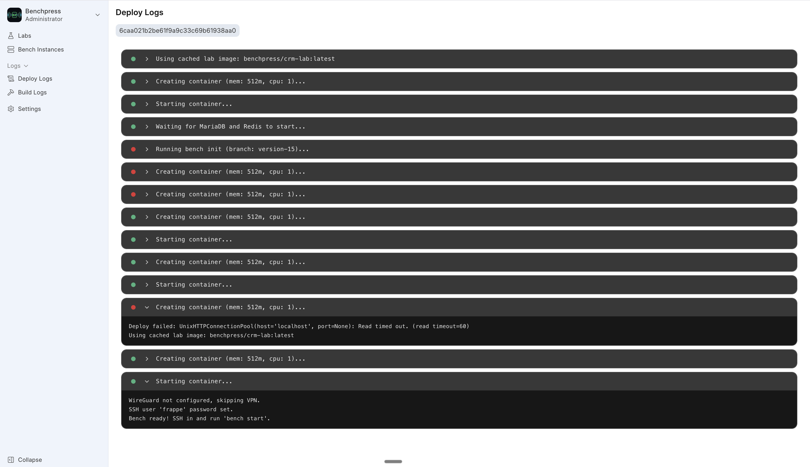
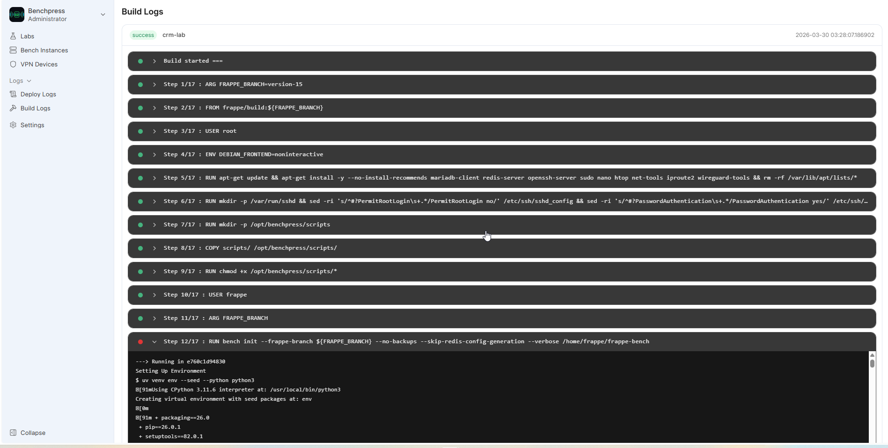
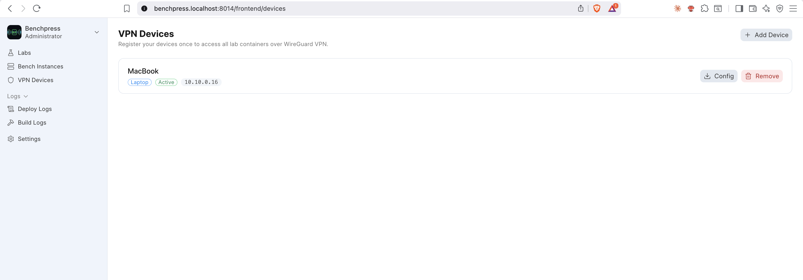
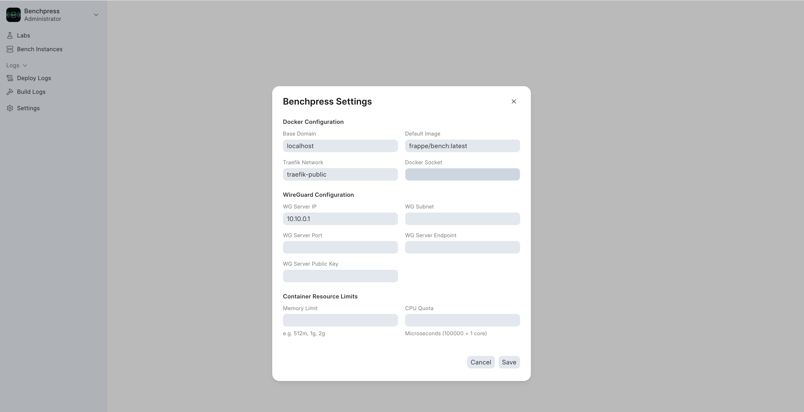

<div align="center">


# BenchPress

**Press a button. Get a Frappe bench. Self-hosted, Docker-powered, VPN-secured.**

[](https://opensource.org/licenses/MIT)
[](https://frappeframework.com)
[](https://fossunited.org)
[](https://python.org)
[](https://vuejs.org)
[](https://docker.com)
[](https://wireguard.com)

*A self-hosted alternative to Frappe Cloud, built entirely as a Frappe app.*

</div>

---

## What is BenchPress?

[](https://www.youtube.com/watch?v=DzTNwA39PqA)

---

## Table of Contents

- [What is BenchPress?](#what-is-benchpress)
- [The Problem](#the-problem)
- [The Solution](#the-solution)
- [Architecture](#architecture)
- [Tech Stack](#tech-stack)
- [Features](#features)
- [Screenshots](#screenshots)
- [Data Model](#data-model-doctypes)
- [API Reference](#api-reference)
- [Prerequisites](#prerequisites)
- [Installation](#installation)
- [Usage Workflow](#usage-workflow)
- [Development Setup](#development-setup)
- [Project Structure](#project-structure)
- [Real-Time Communication](#real-time-communication)
- [Networking](#networking)
- [Supported Frappe Apps](#supported-frappe-apps)
- [VPN Device Management](#vpn-device-management)
- [Configuration Reference](#configuration-reference)
- [Contributing](#contributing)
- [License](#license)

### Detailed Guides

- [Getting Started](docs/getting-started.md) -- Installation and first setup
- [Creating Labs & Deploying](docs/creating-labs.md) -- Labs, builds, and deployments
- [Connecting to Benches](docs/connecting-to-benches.md) -- SSH, VPN, and connection info
- [Logs & Monitoring](docs/logs-and-monitoring.md) -- Build logs, deploy logs, and stats
- [VPN Device Management](docs/device-management.md) -- Register devices for WireGuard access
- [WireGuard Setup](docs/wireguard-setup.md) -- Detailed WireGuard configuration

---

## The Problem

Setting up a Frappe/ERPNext development environment is painful:

1. **Manual setup** -- Install bench CLI, MariaDB, Redis, Node.js, wkhtmltopdf, and a dozen other dependencies
2. **Dependency conflicts** -- Different projects need different Frappe versions and your OS gets polluted
3. **No isolation** -- One broken bench can affect everything on your machine
4. **No remote access** -- Team members cannot SSH into each other's dev environments
5. **Repetitive work** -- Every new project means repeating the same 30-minute setup ritual

There is no simple way to say *"Give me a fresh Frappe bench with ERPNext and HRMS"* and have it running in minutes.

## The Solution

BenchPress is a **self-hosted Frappe Cloud alternative** built entirely as a Frappe app. It automates the entire bench lifecycle through a modern web UI:

1. **Create a Lab** -- Define a reusable template with your desired Frappe apps (CRM, ERPNext, HRMS, LMS, Helpdesk, Wiki, etc.), the Frappe version, and resource limits (CPU, memory)
2. **Build once** -- Docker image with all apps baked in via a 5-layer cached Dockerfile, rebuilt only when configuration changes
3. **Deploy in clicks** -- Each bench runs in its own Docker container with MariaDB, Redis, SSH, and all services included
4. **SSH via WireGuard** -- Secure kernel-level VPN access into any container, no exposed ports on the public internet
5. **Real-time logs** -- Watch Docker image builds and container deployments stream live in the browser via WebSocket
6. **Manage everything** -- Start, stop, restart, delete benches. Create multiple Frappe sites per bench. Monitor CPU and memory usage in real time.

---

## Architecture

```
                                +---------------------------+
                                |       User's Browser      |
                                |  Vue 3 SPA (frappe-ui)    |
                                +-------------+-------------+
                                              |
                                     HTTPS / WebSocket
                                              |
                                +-------------v-------------+
                                |      Frappe Web Server     |
                                |  (BenchPress Frappe App)   |
                                |                            |
                                |  api.py ---- REST API      |
                                |  hooks.py -- Scheduler     |
                                |  wg_manager -- WireGuard   |
                                +---+--------+----------+---+
                                    |        |          |
                     +--------------+   +----v----+  +--v--------------+
                     |                  |  Redis   |  | deploy_manager  |
                     |                  |  Queue   |  | (Background     |
                     |                  |  (RQ)    |  |  Workers)       |
                     |                  +----+-----+  +--+---------+---+
                     |                       |           |         |
              +------v------+         +------v------+    |   +-----v--------+
              |  WireGuard  |         |   Docker    |<---+   | stats_       |
              |  (wg0)      |         |   Engine    |        | collector    |
              |  10.10.0.0  |         |   (SDK)     |        | (cron 2min) |
              |  /24 subnet |         +------+------+        +--------------+
              +------+------+                |
                     |              +--------v---------+
                     |              |  benchpress       |
                     |              |  Docker Network   |
                     |              |  172.30.0.0/24    |
                     |              +---+-----+-----+--+
                     |                  |     |     |
                 DNAT Routing     +-----v-+ +-v---+ +v-------+   +------------------+
                 (iptables)       | Bench | |Bench| | Bench  |   | benchpress-      |
                 22,8000,9000     | Ctr 1 | |Ctr 2| | Ctr N  +-->| mariadb          |
                     |            |       | |     | |        |   | (shared MariaDB) |
                     +----------->| SSH   | |SSH  | | SSH    |   +------------------+
                                  | Frappe| |Frapp| | Frappe |
                                  +---+---+ +--+--+ +---+----+   +------------------+
                                      |        |        |         | benchpress-      |
                                      +--------+--------+-------->| redis            |
                                                                  | (shared Redis)   |
                                                                  +------------------+
```

### How the Pieces Fit Together

| Component | Role |
|-----------|------|
| **Frappe Web Server** | Hosts the BenchPress app, serves the Vue 3 SPA, handles REST API calls, and publishes real-time WebSocket events |
| **Redis Queue (RQ)** | Processes long-running background jobs: Docker image builds (up to 60 min) and container deployments |
| **Docker Engine** | Builds images from the 5-layer Dockerfile template, creates and manages containers with CPU/memory limits |
| **WireGuard (wg0)** | Kernel-level VPN on the host. Each bench gets a unique IP (10.10.0.X). iptables DNAT rules route ports 22, 8000, and 9000 from the WG IP to the container |
| **Shared MariaDB** | A `benchpress-mariadb` container shared across all benches, managed via `docker-compose.yml`. Each site gets its own database (named by SHA1 hash). Managed via the Database Server DocType |
| **Shared Redis** | A `benchpress-redis` container shared across all benches. DB 0 = cache, DB 1 = queue, DB 2 = socketio. Also managed via `docker-compose.yml` with `restart: always` |
| **Stats Collector** | Cron job running every 2 minutes that polls Docker stats API for all running containers and updates CPU/memory metrics |
| **Each Container** | A Frappe bench with SSH server and all pre-installed apps. MariaDB and Redis are provided by the shared containers. Users SSH in and run `bench start` |

---

## Container Lifecycle

```
  CREATE LAB            BUILD IMAGE              DEPLOY BENCH                ACCESS
  (Template)           (Docker Build)          (Container + VPN)          (SSH + Web)
 +-----------+     +------------------+     +---------------------+     +-------------+
 |           |     |                  |     |                     |     |             |
 | Lab ID    |     | Layer 1: apt     |     | 1. Check image      |     | WireGuard   |
 | Frappe v  +---->| Layer 2: SSH     +---->| 2. Ensure shared    +---->| client .conf|
 | Apps[]    |     | Layer 3: bench   |     |    MariaDB + Redis  |     |             |
 | CPU/Mem   |     | Layer 4: apps    |     | 3. Create container |     | ssh frappe@ |
 |           |     | Layer 5: site    |     | 4. Setup WireGuard  |     | 10.10.0.X   |
 |           |     |                  |     | 5. Set SSH password |     |             |
 +-----------+     +------------------+     +---------------------+     +-------------+
   Status:            Cached layers            Logs streamed via          Ports:
   Draft              rebuild only             WebSocket in               22   -> SSH
                      when config              real-time                  8000 -> Web
                      changes                                             9000 -> Socket.io
```

---

## Tech Stack

| Layer | Technology | Purpose |
|-------|-----------|---------|
| **Backend** | Python 3.14 + Frappe Framework v16 | REST API, background jobs, ORM, permissions |
| **Frontend** | Vue 3 + Vite + TailwindCSS + frappe-ui | Modern SPA dashboard with real-time updates |
| **Containers** | Docker Engine (Python SDK) | Image builds, container lifecycle, resource limits |
| **VPN** | WireGuard (kernel-level) | Secure SSH/web access to containers without exposed ports |
| **Database** | MariaDB (shared container) | Single `benchpress-mariadb` container shared across all benches via docker-compose |
| **Cache/Queue** | Redis (shared container) + RQ | Single `benchpress-redis` container shared across all benches; RQ for background jobs on host |
| **Real-time** | Socket.io via Frappe | Live log streaming during builds and deployments |
| **Routing** | iptables DNAT | Routes WireGuard peer IPs to container Docker IPs |
| **Linting** | Ruff (Python) + Biome (JS) | Code quality enforcement |

---

## Features

- **Lab Templates** -- Define reusable bench configurations with apps, Frappe version (v14, v15, v16, develop), and resource limits
- **5-Layer Cached Docker Builds** -- System deps, SSH config, bench init, app install, and site creation each cached separately. Only changed layers rebuild.
- **One-Click Deploy** -- Background job handles image build, container creation, WireGuard setup, SSH password, and site creation against the shared MariaDB. Admin password is `admin` for easy access
- **Live Build & Deploy Logs** -- GitHub Actions-style collapsible log viewer with status indicators (success/error/running), streamed in real-time via WebSocket
- **WireGuard VPN** -- Auto-generates keypair, allocates IP from 10.10.0.2-254 pool, adds peer to wg0, configures iptables DNAT routing
- **Resource Controls** -- CPU cores and memory limits per lab, enforced by Docker `--cpus` and `--memory` flags
- **Container Management** -- Start, stop, restart, redeploy, and delete benches from the dashboard
- **Multi-Site Support** -- Create multiple Frappe sites per bench container, each with its own set of installed apps
- **VPN Device Management** -- Register persistent devices (Laptop, Mobile, etc.), generate WireGuard configs per device, and manage device lifecycle from a dedicated page
- **Confirmation Dialogs** -- Destructive actions (deploy, stop, delete) require explicit confirmation before execution
- **Stats Monitoring** -- CPU and memory usage polled every 2 minutes from Docker stats API, displayed as progress bars
- **Connection Info Panel** -- Shows VPN IP, SSH command, username, and password with one-click copy to clipboard
- **Search & Filters** -- Filter labs by status, Frappe version, or search by lab ID, title, and app name
- **Dark Mode** -- Toggle between light and dark themes from the sidebar menu

---

## Screenshots

The frontend is a Vue 3 Single Page Application built with Vite, TailwindCSS, and the `frappe-ui` component library. It features a sidebar navigation with Lucide icons and a clean, professional design.

### Labs List (`/frontend/labs`)


Searchable, filterable list of all lab templates. Each row shows the Lab ID, title, Frappe version, status badge (Draft/Building/Ready/Error), memory limit, and CPU cores. Filter by status or Frappe version, or search by lab ID, title, or app name.

### New Lab (`/frontend/labs/new`)


Form to create a lab: set Lab ID, title, Frappe version, resource limits (memory, CPU cores), and dynamically add apps with their Git URL and branch.

### Lab Detail (`/frontend/labs/:labId`)


Tabbed view with three panels:
- **Dashboard** -- Lab info card, installed apps badges, connection info panel (VPN IP, SSH command, username, password with show/hide toggle and copy-to-clipboard), and container status card with CPU/memory progress bars
- **Sites** -- List of Frappe sites in the bench with create-site dialog (site name + app selection checkboxes)
- **Build Log** -- Collapsible step viewer (GitHub Actions-style) parsing Docker build output into expandable steps with success/error/running indicators

### Bench Instances (`/frontend/bench-instances`)


Table of all bench containers showing bench name, lab, Frappe version, status badge (colored: green=Running, orange=Deploying, red=Error/Stopped, gray=Draft), WireGuard IP address, CPU %, and memory %.

### Deploy Logs (`/frontend/deploy-logs`)



Select a bench to view its deployment log. Logs are parsed into collapsible phases (e.g., "Building lab image...", "Creating container...", "Configuring WireGuard VPN...") with step-by-step progress indicators.

### Build Logs (`/frontend/build-logs`)



Expandable list of image build logs. Click a log entry to reveal the full Docker build output parsed into collapsible steps, each with a colored status dot.

### Devices (`/frontend/devices`)



Device management page for registering and managing VPN devices. Users add devices (Laptop, Mobile, etc.) and download WireGuard configuration files per device. Each device gets a persistent VPN identity.

### Settings (`/frontend/settings`)



Modal dialog to configure Docker (socket path, base domain, default image, Traefik network), WireGuard (server IP, subnet, port, endpoint, public key), and container resource defaults (memory limit, CPU quota).

---

## Data Model (DocTypes)

BenchPress uses 11 DocTypes to model the complete bench lifecycle:

| DocType | Type | Purpose | Key Fields |
|---------|------|---------|------------|
| **Lab** | Document | Reusable bench template | `lab_id`, `title`, `frappe_version`, `status` (Draft/Building/Ready/Error), `image_tag`, `memory_limit`, `cpu_cores` |
| **Lab App** | Child Table | Apps to install in a Lab | `app_name`, `app_label`, `git_url`, `branch` |
| **Bench Instance** | Document | Running container | `bench_name`, `lab`, `status` (Draft/Deploying/Running/Stopped/Error), `container_id`, `wg_ip`, `wg_config`, `cpu_usage`, `memory_usage` |
| **Bench App** | Child Table | Apps installed in a Bench | `app_name`, `app_label`, `git_url`, `branch` |
| **Bench Site** | Document | Frappe site inside a bench | `site_name`, `bench`, `status` (Creating/Active/Inactive/Error), `full_domain`, `admin_password` |
| **Site App** | Child Table | Apps installed on a Site | `app_name`, `app_label` |
| **Database Server** | Document | Shared MariaDB container | `container_name`, `container_id`, `status`, `port`, `volume_name`, `image_tag`, `memory_limit` |
| **BenchPress Settings** | Single | Global configuration | `docker_socket`, `base_domain`, `wg_server_*` keys, `next_wg_ip`, `container_memory_limit`, `container_cpu_quota` |
| **Bench Device** | Document | Persistent VPN device | `device_name`, `device_type` (Laptop/Mobile/etc.), `user`, `wg_public_key`, `wg_private_key`, `wg_ip` |
| **Deploy Log** | Log | Deployment event log | `bench`, `message`, `log_type`, `timestamp` |
| **Build Log** | Log | Image build log | `lab`, `message`, `log_type`, `timestamp` |

### Entity Relationship

```
Lab (template)
 |-- Lab App[] (child table: apps to install)
 |
 +---> Bench Instance (deployed container)
        |-- Bench App[] (child table: installed apps)
        |-- Bench Site[] (linked: Frappe sites)
        |    |-- Site App[] (child table: apps on site)
        |-- Deploy Log[] (linked: deployment events)
        |
Lab ----> Build Log[] (linked: image build events)

BenchPress Settings (singleton: global config)

Bench Device (user's registered VPN devices)
```

---

## API Reference

All endpoints require authentication and use `@frappe.whitelist()`. Long-running operations are dispatched to background workers via `frappe.enqueue()` on the `"long"` queue.

### Lab Endpoints

| Endpoint | Method | Description |
|----------|--------|-------------|
| `benchpress.api.build_lab_image` | POST | Enqueue background Docker image build (queue: long, timeout: 3600s) |

> **Note:** Lab creation uses `createListResource.insert` from `frappe-ui` directly (no custom API endpoint needed).

### Bench Endpoints

| Endpoint | Method | Description |
|----------|--------|-------------|
| `benchpress.api.get_benches` | GET | List all benches with CPU/memory stats |
| `benchpress.api.create_bench` | POST | Create bench from lab template and enqueue deploy |
| `benchpress.api.bench_action` | POST | Execute action: `start`, `stop`, `restart`, `delete` |
| `benchpress.api.get_deploy_logs` | GET | Get last 20 deploy log entries for a bench |

### Site Endpoints

| Endpoint | Method | Description |
|----------|--------|-------------|
| `benchpress.api.create_site` | POST | Create a new site and enqueue setup inside the container |

### Device Endpoints

| Endpoint | Method | Description |
|----------|--------|-------------|
| `benchpress.api.add_device` | POST | Register a new VPN device (Laptop, Mobile, etc.) and generate WireGuard config |
| `benchpress.api.remove_device` | POST | Remove a registered VPN device and clean up WireGuard peer |
| `benchpress.api.list_devices` | GET | List all VPN devices for the current user |
| `benchpress.api.get_device_wg_config` | GET | Get WireGuard client config for a specific device |

### System Endpoints

| Endpoint | Method | Description |
|----------|--------|-------------|
| `benchpress.wg_manager.setup_wg_server` | POST | One-time WireGuard server initialization |

> **Note:** Settings are accessed via `createDocumentResource` from `frappe-ui` (no custom API endpoint needed). Labs, bench instances, sites, and build logs use `createListResource` / `createDocumentResource` for native Frappe data fetching.

### Bench Instance Document Methods

These are called via `frappe.client.run_doc_method` on a Bench Instance document:

| Method | Description |
|--------|-------------|
| `enqueue_deploy` | Enqueue deployment as background job (queue: long, timeout: 1800s) |
| `enqueue_stop` | Stop the container and clean up WireGuard routing |
| `enqueue_redeploy` | Stop, remove, and redeploy the container from scratch |
| `enqueue_start` | Start a stopped container |

---

## Prerequisites

Before installing BenchPress, ensure your host machine has:

| Requirement | Version | Purpose |
|------------|---------|---------|
| Frappe Bench | v16 | The bench environment to install BenchPress into |
| Python | 3.14+ | Backend runtime |
| Node.js | 24+ | Frontend build toolchain |
| Docker Engine | 20+ | Container management (must be running) |
| Docker Compose | v2+ | Manages shared MariaDB + Redis infrastructure |
| WireGuard | Any | VPN (`wg` and `wg-quick` commands available) |

> **Note:** MariaDB and Redis for bench containers are managed automatically via Docker Compose (`benchpress-mariadb` and `benchpress-redis` containers). You only need MariaDB and Redis on the host for Frappe itself.

### Required: Docker socket access

The bench user (e.g., `frappe`) must be in the `docker` group or you will get a `Permission denied` error when building images:

```bash
sudo usermod -aG docker frappe
# Log out and back in (or run: newgrp docker)

# Verify it works:
docker ps
```

> **Common error:** `PermissionError(13, 'Permission denied')` on the Docker socket means the user is not in the `docker` group. Fix the group membership and restart the bench.

### Required: IP forwarding

IP forwarding must be enabled for WireGuard VPN routing between the host and containers:

```bash
# Enable immediately
sudo sysctl -w net.ipv4.ip_forward=1

# Make it persistent across reboots
echo "net.ipv4.ip_forward = 1" | sudo tee /etc/sysctl.d/99-benchpress.conf
sudo sysctl -p /etc/sysctl.d/99-benchpress.conf
```

### Required: Passwordless sudo for WireGuard

The bench user needs passwordless sudo for WireGuard commands (used to add/remove VPN peers):

```bash
sudo tee /etc/sudoers.d/benchpress-wg > /dev/null <<EOF
frappe ALL=(ALL) NOPASSWD: /usr/bin/wg
frappe ALL=(ALL) NOPASSWD: /usr/bin/wg-quick
EOF
sudo chmod 0440 /etc/sudoers.d/benchpress-wg
```

---

## Installation

### Quick Setup (TL;DR)

```bash
cd /path/to/your/frappe-bench
bench get-app https://github.com/Venkateshvenki404224/benchpress --branch develop
bench pip install docker
bench --site your-site.localhost install-app benchpress
bench --site your-site.localhost migrate
bash apps/benchpress/setup.sh your-site.localhost
cd apps/benchpress/frontend && yarn install && yarn build
bench start
# Open http://your-site.localhost:8000/frontend
```

### Detailed Steps

### 1. Get the app and install dependencies

```bash
cd /path/to/your/frappe-bench

# Clone and install BenchPress
bench get-app https://github.com/Venkateshvenki404224/benchpress --branch develop

# Install the Docker Python SDK (required dependency)
bench pip install docker

# Install the app on your site
bench --site your-site.localhost install-app benchpress

# Run migrations to create DocTypes
bench --site your-site.localhost migrate
```

### 2. Run the setup script

BenchPress ships with a setup script that handles everything in 6 steps:

```bash
cd /path/to/your/frappe-bench
bash apps/benchpress/setup.sh your-site.localhost
```

The script is **idempotent** — safe to run multiple times. It will:

1. **Docker group** — Add your bench user to the `docker` group
2. **Shared infrastructure** — Start `benchpress-mariadb` and `benchpress-redis` containers via docker-compose (generates a random root password, creates the Docker network and volumes, waits for services to be ready)
3. **IP forwarding** — Enable via sysctl (runtime + persistent)
4. **Sudoers** — Write `/etc/sudoers.d/benchpress` for passwordless `wg` and `wg-quick`
5. **WireGuard tools** — Install `wireguard-tools` if missing
6. **WireGuard server** — Generate keys, write `wg0.conf`, bring up `wg0`

The script prints the **WireGuard Server Public Key** you need for BenchPress Settings.

> **After the script:** If the docker group was just added, log out and back in, then `bench start`.

### 3. Build the frontend

```bash
# Install frontend dependencies and build
cd apps/benchpress/frontend
yarn install
yarn build

# Or use bench build
cd /path/to/your/frappe-bench
bench build --app benchpress
```

### 4. Configure BenchPress Settings

1. Navigate to **BenchPress Settings** in the Frappe Desk (`/app/benchpress-settings`)
2. Set the **Docker Socket** path (default: `unix:///var/run/docker.sock`)
3. Set the **Base Domain** for your bench instances
4. Fill in WireGuard (values printed by the setup script):
   - **WG Server Public Key**: *(from setup script output)*
   - **WG Server Endpoint**: Your server's public IP (`curl -s ifconfig.me`)
   - **WG Server Port**: `51820`

### 5. Open firewall for WireGuard

```bash
sudo ufw allow 51820/udp
sudo ufw reload
```

Also open UDP 51820 in your cloud provider's security group / firewall if applicable.

For a full WireGuard reference and troubleshooting, see the **[WireGuard Setup Guide](docs/wireguard-setup.md)**.

**Quick start** (if you just want the minimum commands):

```bash
# Install WireGuard
sudo apt install -y wireguard wireguard-tools

# Allow bench user to run WireGuard/iptables without password
sudo visudo -f /etc/sudoers.d/benchpress
# Add: labs ALL=(ALL) NOPASSWD: /usr/sbin/iptables, /usr/bin/wg, /usr/bin/wg-quick, /sbin/sysctl

# Initialize WireGuard server from Frappe console
bench --site your-site.localhost console
>>> from benchpress.wg_manager import setup_wg_server
>>> setup_wg_server()

# Set your VPS public IP in BenchPress Settings
>>> s = frappe.get_doc("BenchPress Settings")
>>> s.wg_server_endpoint = "YOUR_VPS_PUBLIC_IP"  # run: curl -s ifconfig.me
>>> s.save()
>>> frappe.db.commit()

# Open the firewall port
sudo ufw allow 51820/udp
```

> **Note**: WireGuard is optional. If not configured, BenchPress still works — containers run normally but without VPN access. Users can connect via Docker bridge IPs on the local machine. See the [Local Development section](docs/wireguard-setup.md#local-development-no-vpn) in the guide.

### 5. Start BenchPress

```bash
bench start
```

Access the dashboard at: `http://your-site.localhost:8000/frontend`

---

## Usage Workflow

### Step 1: Create a Lab

Navigate to **Labs > New Lab** and configure:
- **Lab ID**: A unique slug (e.g., `crm-lab`)
- **Title**: Human-readable name
- **Frappe Version**: `version-14`, `version-15`, `version-16`, or `develop`
- **Resource Limits**: Memory (e.g., `512m`, `1g`) and CPU cores
- **Apps**: Add apps with their Git URL and branch (e.g., ERPNext from `https://github.com/frappe/erpnext`, branch `version-15`)

### Step 2: Build the Docker Image

From the Lab Detail page, the image will be built automatically on first deploy, or you can trigger a standalone build. The build uses a 5-layer cached Dockerfile:

1. **System deps** (apt: MariaDB, Redis, SSH, WireGuard tools) -- rarely changes
2. **Service config** (SSH hardening, sudoers) -- rarely changes
3. **bench init** (Frappe framework) -- changes only when Frappe version changes
4. **App install** (bench get-app for each app) -- changes when app list changes
5. **Site creation** (bench new-site + install-app) -- changes when site/apps change

Build logs stream to the browser in real-time via WebSocket.

### Step 3: Deploy a Bench Instance

Click **Deploy** on the Lab Detail page. The background worker will:

1. Verify or build the Docker image
2. Create a container with resource limits on the `benchpress` Docker network (172.30.0.0/24)
3. Start the container (MariaDB, Redis, and SSH start automatically via `entry.sh`)
4. Generate a WireGuard keypair, allocate a VPN IP (10.10.0.X), add the peer, and configure iptables DNAT routing
5. Set the SSH password for the `frappe` user inside the container
6. Mark the bench as **Running**

All deployment steps stream to the Deploy Logs page in real-time.

### Step 4: Connect via WireGuard

1. Copy the WireGuard client configuration from the Lab Detail page
2. Import it into your WireGuard client (available on macOS, Windows, Linux, iOS, Android)
3. Activate the VPN tunnel

### Step 5: SSH and Develop

```bash
# SSH into your bench
ssh frappe@10.10.0.X

# Start the Frappe development server
cd frappe-bench
bench start

# Access your Frappe site
# http://10.10.0.X:8000
```

### Step 6: Manage Sites

From the Lab Detail page's **Sites** tab, create additional Frappe sites inside the running bench. Select which apps to install on each site. Sites can be enabled, disabled, backed up, or dropped.

---

## Development Setup

### Clone and set up for development

```bash
cd /path/to/your/frappe-bench

# Get the app
bench get-app https://github.com/Venkateshvenki404224/benchpress --branch develop
bench pip install docker
bench --site your-site.localhost install-app benchpress
bench --site your-site.localhost migrate
```

### Frontend development (hot-reload)

```bash
cd apps/benchpress/frontend
yarn install
yarn dev
```

The Vite dev server starts with hot module replacement. The Vue SPA is served at `/frontend` via the website route rule in `hooks.py`.

### Backend development

```bash
# Clear cache after Python/DocType changes
bench --site your-site.localhost clear-cache

# Run migrations after DocType JSON changes
bench --site your-site.localhost migrate

# Run Python linters
cd apps/benchpress
python -m ruff check .
python -m ruff format .

# Run frontend linter
cd frontend
yarn lint
```

### Running tests

```bash
bench --site your-site.localhost run-tests --app benchpress
```

---

## Project Structure

```
benchpress/
+-- benchpress/
|   +-- api.py                    # REST API layer (~12 endpoints)
|   +-- deploy_manager.py         # Build & deploy orchestration (brain of BenchPress)
|   +-- docker_manager.py         # Docker SDK wrapper (build, create, exec, stats)
|   +-- wg_manager.py             # WireGuard VPN management (keys, peers, routing)
|   +-- device_manager.py         # VPN device registration and config generation
|   +-- stats_collector.py        # Cron job: poll Docker stats every 2 minutes
|   +-- hooks.py                  # App config: routes, scheduler, ignore_links_on_delete
|   +-- mariadb_manager.py        # Shared MariaDB + Redis lifecycle (docker compose)
|   +-- config/
|   |   +-- docker-compose.yml    # Shared infrastructure (MariaDB + Redis)
|   |   +-- mariadb.cnf           # MariaDB custom configuration
|   |   +-- redis.conf            # Redis custom configuration
|   |   +-- .env.example          # Environment variable template
|   |   +-- benchpress-infra.service  # Systemd unit for auto-start on boot
|   +-- lab-templates/
|   |   +-- Dockerfile            # 5-layer cached image build
|   |   +-- scripts/
|   |       +-- entry.sh          # Container entrypoint (starts MariaDB, Redis, SSH)
|   |       +-- install-apps.sh   # Install apps during Docker build
|   |       +-- create-site.sh    # Create site during Docker build
|   |       +-- setup-site.sh     # Create additional sites post-deploy
|   +-- benchpress/
|   |   +-- doctype/
|   |       +-- lab/              # Lab template DocType
|   |       +-- lab_app/          # Lab App child table
|   |       +-- bench_instance/   # Running container DocType
|   |       +-- bench_app/        # Bench App child table
|   |       +-- bench_site/       # Frappe site DocType
|   |       +-- site_app/         # Site App child table
|   |       +-- benchpress_settings/  # Global config singleton
|   |       +-- deploy_log/       # Deployment log DocType
|   |       +-- build_log/        # Build log DocType
|   +-- device_management/
|   |   +-- doctype/
|   |       +-- bench_device/     # VPN device DocType
|   +-- public/
|       +-- images/               # App logos, favicons, Frappe ecosystem app icons
+-- frontend/
    +-- src/
        +-- App.vue               # Root component with sidebar navigation
        +-- router.js             # Vue Router with 9 routes
        +-- socket.js             # Socket.io client for real-time events
        +-- main.js               # App bootstrap with frappe-ui plugins
        +-- theme.css             # Custom theme variables (light + dark)
        +-- pages/
        |   +-- Labs.vue          # Lab list with search, status/version filters
        |   +-- NewLab.vue        # Lab creation form
        |   +-- LabDetail.vue     # Tabbed view: Dashboard, Sites, Build Log
        |   +-- BenchInstances.vue # Bench instance table
        |   +-- DeployLogs.vue    # Deploy log viewer per bench
        |   +-- BuildLogs.vue     # Build log viewer with expandable entries
        |   +-- Devices.vue       # VPN device management page
        |   +-- Settings.vue      # Global settings dialog
        +-- components/
            +-- LogViewer.vue     # Parses logs into collapsible steps
            +-- LogStep.vue       # Single log step with status dot and auto-scroll
```

### Backend File Responsibilities

| File | Lines | What It Does |
|------|-------|--------------|
| `api.py` | ~300 | REST API layer with 12 endpoints. All `@frappe.whitelist()`. Long-running ops enqueued to `"long"` queue. Frontend uses `frappe-ui` native data fetching (`createDocumentResource`, `createListResource`) for most reads. |
| `deploy_manager.py` | ~300 | Orchestration brain. Coordinates image builds, container creation, WireGuard setup, SSH config, and real-time log streaming. |
| `docker_manager.py` | ~190 | Docker SDK wrapper. Builds images, creates/starts/stops containers, executes commands inside containers, collects stats. |
| `wg_manager.py` | ~210 | WireGuard VPN management. Generates keypairs, allocates IPs, manages peers, configures iptables DNAT routing for ports 22/8000/9000. |
| `device_manager.py` | ~110 | VPN device registration. Creates Bench Device docs, generates WireGuard keypairs, allocates IPs, and builds client configs. |
| `mariadb_manager.py` | ~400 | Shared MariaDB + Redis lifecycle via docker-compose. Setup, start, stop, health checks, backups, SQL execution. |
| `stats_collector.py` | ~35 | Cron job (every 2 min). Polls Docker stats for running containers, updates CPU/memory fields. |
| `hooks.py` | ~240 | App configuration: routes, scheduler events, `add_to_apps_screen`, `ignore_links_on_delete`. |

---

## Real-Time Communication

BenchPress uses Frappe's WebSocket system (`frappe.publish_realtime`) to stream logs to the frontend during long-running operations:

| Event | Trigger | Consumer |
|-------|---------|----------|
| `bench_deploy_log` | Each deployment step in `deploy_manager.py` | Deploy Logs page, Lab Detail page |
| `lab_build_log` | Each Docker build line in `deploy_manager.py` | Build Logs page, Lab Detail Build Log tab |

**Backend pattern:**
```python
frappe.publish_realtime("bench_deploy_log", message={
    "bench": bench_name,
    "log": "Starting container...",
    "type": "info"
}, user=frappe.session.user, after_commit=False)
```

**Frontend pattern:**
```javascript
socket.on("bench_deploy_log", (data) => {
    this.logs.push(data);
});
```

---

## Networking

> For complete WireGuard setup instructions, see the **[WireGuard Setup Guide](docs/wireguard-setup.md)**.

| Network | Subnet | Purpose |
|---------|--------|---------|
| `benchpress` (Docker bridge) | `172.30.0.0/24` | Internal communication between host and containers |
| WireGuard (`wg0`) | `10.10.0.0/24` | VPN subnet for user access (server: `10.10.0.1`, clients: `10.10.0.2`-`10.10.0.254`) |

### Inside-Container WireGuard VPN

Each container runs its own `wg0` WireGuard interface. On deploy, BenchPress:

1. Allocates a VPN IP (e.g., `10.10.0.5`) from the `10.10.0.0/24` subnet
2. Generates a key pair for the container
3. Adds the container as a peer on the host's WireGuard server
4. Writes `/etc/wireguard/wg0.conf` inside the container (peer config pointing back to host via Docker gateway `172.30.0.1`)
5. Runs `wg-quick up wg0` inside the container

The result: users connect to the VPN and access the container directly at its allocated IP — no iptables DNAT, no port mapping, no IP-change issues on container restart.

| Access | Address | Description |
|--------|---------|-------------|
| SSH | `ssh user@10.10.0.X` | Direct to container SSH server |
| Frappe Web | `http://10.10.0.X:8000` | Frappe development server |
| Socket.io | `http://10.10.0.X:9000` | Real-time events |

### Shared Infrastructure (Docker Compose)

Managed via `benchpress/config/docker-compose.yml` with `restart: always`:

| Container | Image | Purpose |
|-----------|-------|---------|
| `benchpress-mariadb` | `mariadb:10.6` | Shared database for all bench sites. Each site gets its own DB (SHA1-named) |
| `benchpress-redis` | `redis:7-alpine` | Shared cache (DB 0), queue (DB 1), and socketio (DB 2) for all benches |

### Container Internals

Each bench container connects to the shared infrastructure over the `benchpress` Docker network:

| Service | Port | Details |
|---------|------|---------|
| SSH Server | 22 | Started by `entry.sh` on boot |
| Frappe Web | 8000 | User runs `bench start` |
| Socket.io | 9000 | User runs `bench start` |
| MariaDB | -- | External: `benchpress-mariadb:3306` via Docker DNS |
| Redis | -- | External: `benchpress-redis:6379` via Docker DNS |

---

## Supported Frappe Apps

BenchPress works with **any Frappe app** -- there is no hardcoded app list. When creating a Lab, provide the Git URL and branch for each app you want to install (e.g., ERPNext, HRMS, CRM, LMS, Helpdesk, Wiki, Webshop, or your own custom app).

### Tested Configurations

| Frappe Version | Base Image | Python | Status |
|---------------|------------|--------|--------|
| `version-15` | `frappe/build:version-15` | 3.11 | Tested |
| `version-16` | `frappe/build:version-16` | 3.12+ | Planned |

**Tested v15 apps:** Frappe CRM (`frappe/crm`, branch `main`)

---

## VPN Device Management

BenchPress supports persistent VPN device registration so users can maintain stable WireGuard identities across sessions:

1. **Register a device** -- Navigate to `/frontend/devices` and add a device with a name and type (Laptop, Mobile, Tablet, Desktop, Other)
2. **Get WireGuard config** -- Each device receives a dedicated WireGuard configuration file with its own keypair and IP allocation
3. **Manage devices** -- View all registered devices, download configs, or remove devices when no longer needed

Device management uses the **Bench Device** DocType and is exposed through four API endpoints (`add_device`, `remove_device`, `list_devices`, `get_device_wg_config`).

---

## Configuration Reference

### BenchPress Settings (Singleton DocType)

| Field | Default | Description |
|-------|---------|-------------|
| `docker_socket` | `unix:///var/run/docker.sock` | Docker Engine socket URL |
| `default_image` | `frappe/bench:latest` | Base Docker image for lab builds |
| `base_domain` | *(required)* | Base domain for bench instances |
| `traefik_network` | `traefik-public` | Docker network for Traefik (if used) |
| `wg_server_ip` | `10.10.0.1` | WireGuard server IP address |
| `wg_subnet` | `10.10.0.0/24` | WireGuard VPN subnet |
| `wg_server_port` | `51820` | WireGuard listen port |
| `wg_server_endpoint` | *(required)* | Public IP/hostname for WireGuard clients to connect to |
| `wg_server_public_key` | Auto-generated | Server's WireGuard public key |
| `wg_server_private_key` | Auto-generated | Server's WireGuard private key (encrypted) |
| `next_wg_ip` | `2` | Next IP octet to allocate (auto-increments from 2 to 254) |
| `container_memory_limit` | `512m` | Default memory limit for containers |
| `container_cpu_quota` | `100000` | Default CPU quota in microseconds (100000 = 1 core) |

### Scheduler Jobs

| Schedule | Function | Description |
|----------|----------|-------------|
| Every 1 minute | `benchpress.stats_collector.collect_all_stats` | Polls Docker and WireGuard stats, updates CPU/memory metrics and VPN transfer counters |
| Every 5 minutes | `benchpress.mariadb_manager.scheduled_health_check` | Checks shared MariaDB health, attempts restart if down |
| Daily at 2 AM | `benchpress.mariadb_manager.scheduled_backup` | Full MariaDB backup with 7-day retention |

---

## Contributing

1. Fork the repository
2. Create a feature branch from `develop`: `git checkout -b feature/my-feature`
3. Make your changes following Frappe coding conventions
4. Run tests: `bench --site your-site.localhost run-tests --app benchpress`
5. Run linters: `cd apps/benchpress && python -m ruff check . && python -m ruff format .`
6. Commit using Conventional Commits: `feat(lab): add batch deploy support`
7. Push and open a Pull Request against `develop`

### Commit Format

```
type(scope): short description

feat(lab):     add multi-app selection to lab creation form
fix(deploy):   prevent duplicate container on rapid double-click
refactor(wg):  migrate iptables rules to nftables
test(api):     add tests for site creation endpoint
docs(readme):  add architecture diagram
chore(deps):   bump frappe-ui to 0.1.192
```

---

## License

MIT License. See [LICENSE](license.txt) for details.

---

<div align="center">

Built for **FOSS Hack 2026** by [Venkatesh](https://github.com/Venkateshvenki404224)

Powered by [Frappe Framework](https://frappeframework.com)

[GitHub Repository](https://github.com/Venkateshvenki404224/benchpress)

</div>
