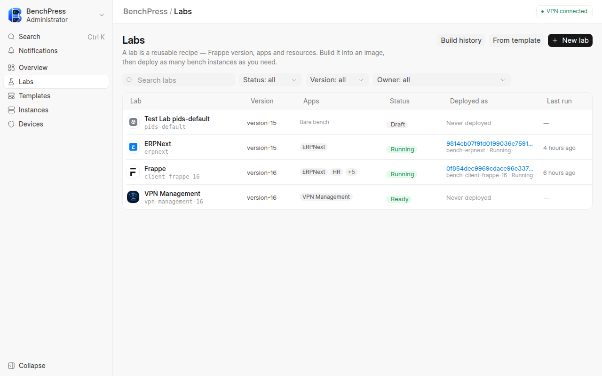
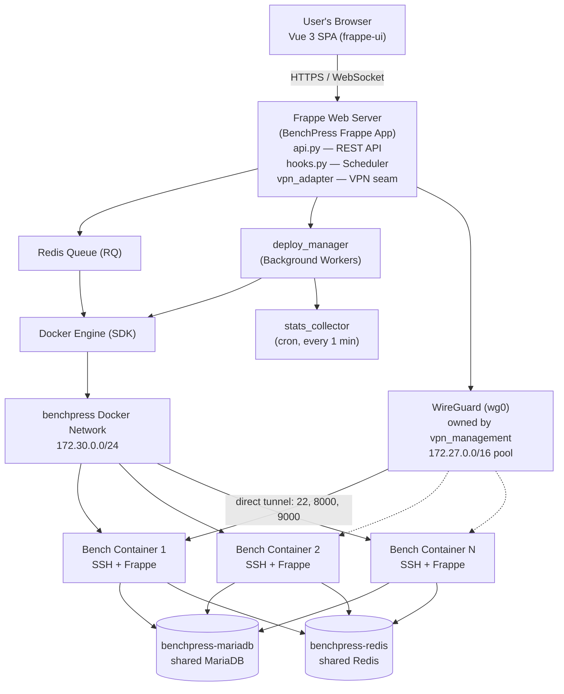
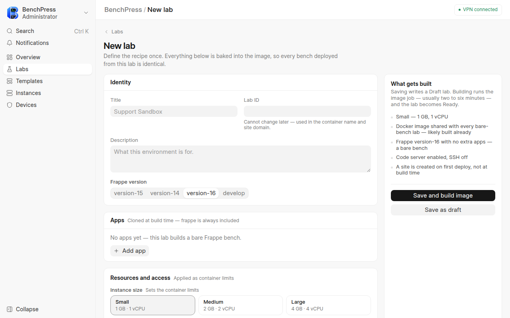
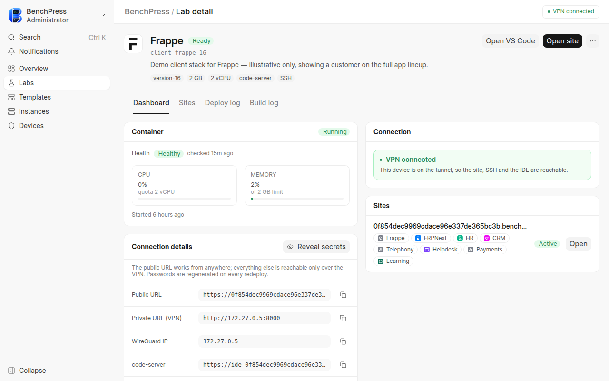
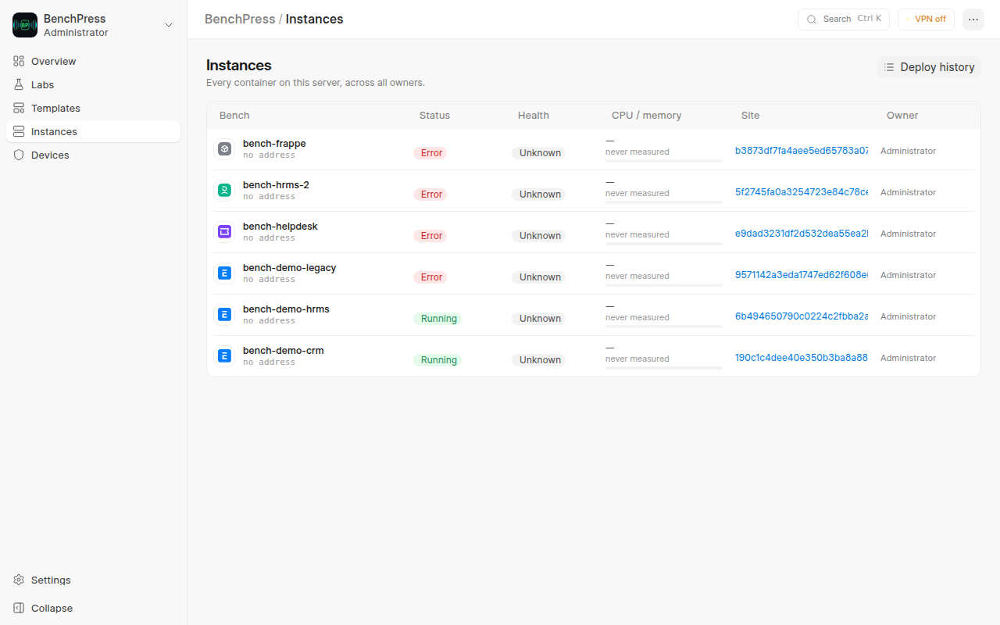
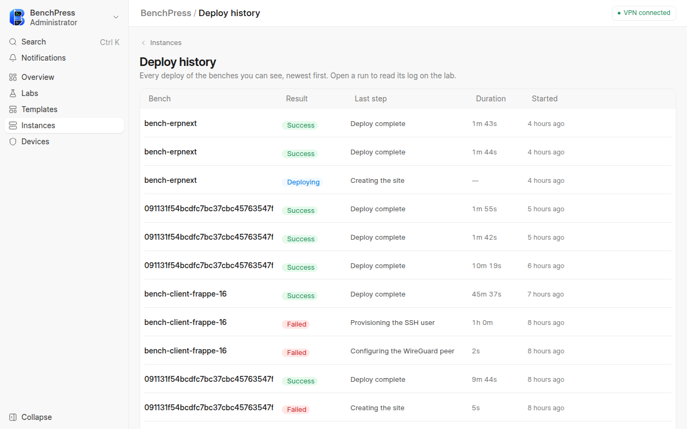
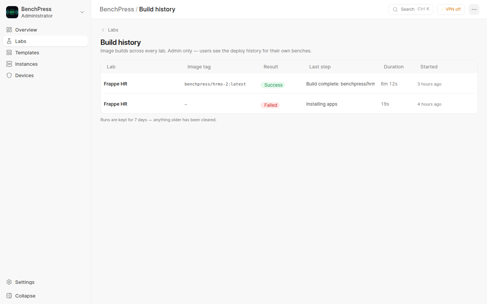
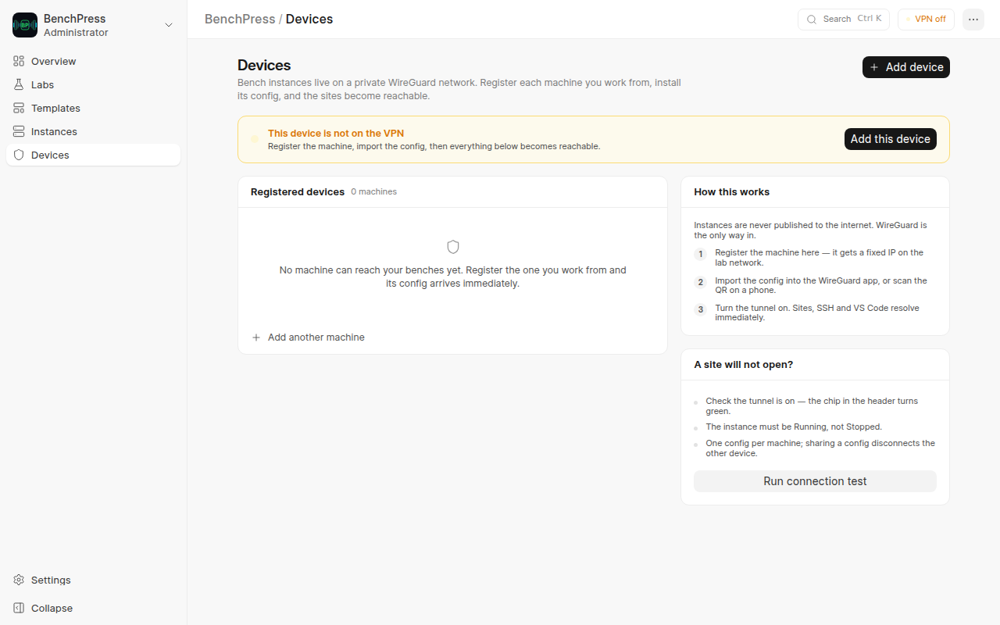

<div align="center">

<picture>
  <source media="(prefers-color-scheme: dark)" srcset="benchpress/public/images/logo/logo-dark.png">
  
</picture>

**Press a button. Get a Frappe bench. Self-hosted, Docker-powered, VPN-secured.**

[](https://github.com/Venkateshvenki404224/benchpress/actions/workflows/ci.yml)
[](https://github.com/Venkateshvenki404224/benchpress/actions/workflows/linter.yml)
[](license.txt)
[](https://frappeframework.com)
[](https://fossunited.org/hack/fosshack26/p/f5fk2d9gqd)
[](https://python.org)
[](https://vuejs.org)
[](https://docker.com)
[](https://wireguard.com)

*A self-hosted onboarding and dev-environment tool for teams running Frappe apps.*

</div>

---

## What is BenchPress?

Spinning up a Frappe bench to try an app, reproduce a bug, or hand a client a demo
usually takes an afternoon of Docker, nginx, and database setup. You repeat this
work for every new environment, on a machine you then have to keep tidy.

BenchPress turns that into a form. Describe a **Lab** — a Frappe version and the
list of apps you want. BenchPress then builds a Docker image, deploys a container,
and gives it a private WireGuard IP. You get back an SSH command and a working
site URL. When you finish with the environment, you delete it.

BenchPress solves a narrower, different problem than a hosting platform like
Frappe Cloud. It gives teams fast onboarding for Frappe-based projects: a lead
defines the app stack once, and a new developer or intern then gets a working
bench in one click, instead of losing a day to setup.

BenchPress is itself a Frappe app. It installs onto a bench you already run,
with a Vue 3 SPA on the front and `frappe.qb` and background jobs on the back.

**What you get per Lab:** a reproducible image, a running bench container, a
private VPN address reachable from your laptop, SSH access, code-server, and
per-site management. BenchPress streams build and deploy output live into the
browser.



> **Disposable sandboxes, not production hosting.** A Lab is a throwaway
> development environment, and its UI shows the credentials in plain text. See
> [Production Safety & Compatibility](docs/production-safety.md) before you
> point anything important at it.

---

## Quickstart

You need a Linux host with Docker, a Frappe v16 bench, and IP forwarding enabled —
the full list is under [Prerequisites](#prerequisites).

```bash
cd /path/to/your/frappe-bench

bench get-app https://github.com/Venkateshvenki404224/benchpress --branch develop
bench pip install docker
bench --site your-site.localhost install-app benchpress
bench --site your-site.localhost migrate
bash apps/benchpress/setup.sh your-site.localhost
bench build --app benchpress
```

Then open `http://your-site.localhost:8000/frontend` and create your first Lab.
[Installation](#installation) covers each step, and
[docs/getting-started.md](docs/getting-started.md) walks through it slowly.

---

## License Summary

BenchPress is free software under the **GNU Affero General Public License v3.0 only**.
If you run a modified version as a network service, the AGPL requires you to offer its
users the corresponding source. See [License](#license) for the notice, and
[TRADEMARKS.md](TRADEMARKS.md) for what the license does *not* cover.

---

## Table of Contents

- [What is BenchPress?](#what-is-benchpress)
- [Quickstart](#quickstart)
- [The Problem](#the-problem)
- [The Solution](#the-solution)
- [Architecture](#architecture)
- [Tech Stack](#tech-stack)
- [Features](#features)
- [Screenshots](#screenshots)
- [Data Model](#data-model-doctypes)
- [API Reference](#api-reference)
- [Prerequisites](#prerequisites)
- [Installation](#installation)
- [Usage Workflow](#usage-workflow)
- [Development Setup](#development-setup)
- [Project Structure](#project-structure)
- [Real-Time Communication](#real-time-communication)
- [Networking](#networking)
- [Supported Frappe Apps](#supported-frappe-apps)
- [VPN Device Management](#vpn-device-management)
- [Configuration Reference](#configuration-reference)
- [Credits & Shared Deployments (Optional)](#credits--shared-deployments-optional)
- [Contributing](#contributing)
- [License](#license)
- [Trademarks](TRADEMARKS.md)
- [Third-party notices](THIRD-PARTY-NOTICES.md)
- [Integration notices](docs/integration-notices.md)
- [Security policy](SECURITY.md)

### Detailed Guides

- [Getting Started](docs/getting-started.md) -- Installation and first setup
- [Production Safety & Compatibility](docs/production-safety.md) -- Readiness caveats, supported platforms, and version matrix
- [Creating Labs & Deploying](docs/creating-labs.md) -- Labs, builds, and deployments
- [Connecting to Benches](docs/connecting-to-benches.md) -- SSH, VPN, and connection info
- [Logs & Monitoring](docs/logs-and-monitoring.md) -- Build logs, deploy logs, and stats
- [VPN Device Management](docs/device-management.md) -- Register devices for WireGuard access
- [WireGuard Setup](docs/wireguard-setup.md) -- Detailed WireGuard configuration
- [Upgrading a BenchPress Install](docs/upgrading.md) -- Backup-gated upgrade and rollback runbook
- [Database Backup & Restore](docs/database-backup-restore.md) -- Where nightly MariaDB dumps live and the verified restore runbook
- [Changelog](CHANGELOG.md) -- Notable changes per release. Read it before a multi-release upgrade

---

## The Problem

Setting up a Frappe/ERPNext development environment is painful:

1. **Manual setup** -- Install bench CLI, MariaDB, Redis, Node.js, wkhtmltopdf, and a dozen other dependencies
2. **Dependency conflicts** -- Different projects need different Frappe versions and your OS gets polluted
3. **No isolation** -- One broken bench can affect everything on your machine
4. **No remote access** -- Team members cannot SSH into each other's dev environments
5. **Repetitive work** -- Every new project means repeating the same 30-minute setup ritual

There is no simple way to say *"Give me a fresh Frappe bench with ERPNext and HRMS"* and have it running in minutes.

## The Solution

BenchPress is a **self-hosted onboarding and dev-environment tool**, built
entirely as a Frappe app. It is not a Frappe Cloud alternative. It solves a
different, narrower problem: getting a new developer or intern a working bench
in minutes, instead of a day of manual setup. It automates the entire bench
lifecycle through a web UI:

1. **Create a Lab** -- Define a reusable template with your desired Frappe apps (CRM, ERPNext, HRMS, LMS, Helpdesk, Wiki, etc.), the Frappe version, and resource limits (CPU, memory)
2. **Build once** -- Docker image with all apps baked in via a 5-layer cached Dockerfile, rebuilt only when configuration changes
3. **Deploy in clicks** -- Each bench runs in its own Docker container with MariaDB, Redis, SSH, and all services included
4. **SSH via WireGuard** -- Secure kernel-level VPN access into any container, no exposed ports on the public internet
5. **Real-time logs** -- Watch Docker image builds and container deployments stream live in the browser via WebSocket
6. **Manage everything** -- Start, stop, restart, delete benches. Create multiple Frappe sites per bench. Monitor CPU and memory usage in real time.

---

## Architecture

The browser talks to the Frappe web server over HTTPS and WebSocket. The web
server dispatches builds and deploys to the Redis queue and `deploy_manager`,
which drive the Docker engine. WireGuard gives each bench container a direct,
routable tunnel, and every container shares the same MariaDB and Redis
containers.


```mermaid
flowchart TD
    Browser["User's Browser<br/>Vue 3 SPA (frappe-ui)"]
    Web["Frappe Web Server<br/>(BenchPress Frappe App)<br/>api.py — REST API<br/>hooks.py — Scheduler<br/>vpn_adapter — VPN seam"]
    RQ["Redis Queue (RQ)"]
    DM["deploy_manager<br/>(Background Workers)"]
    SC["stats_collector<br/>(cron, every 1 min)"]
    WG["WireGuard (wg0)<br/>owned by vpn_management<br/>172.27.0.0/16 pool"]
    Docker["Docker Engine (SDK)"]
    Net["benchpress Docker Network<br/>172.30.0.0/24"]
    C1["Bench Container 1<br/>SSH + Frappe"]
    C2["Bench Container 2<br/>SSH + Frappe"]
    CN["Bench Container N<br/>SSH + Frappe"]
    MariaDB[("benchpress-mariadb<br/>shared MariaDB")]
    Redis[("benchpress-redis<br/>shared Redis")]

    Browser -- "HTTPS / WebSocket" --> Web
    Web --> RQ
    Web --> DM
    Web --> WG
    RQ --> Docker
    DM --> Docker
    DM --> SC
    Docker --> Net
    Net --> C1
    Net --> C2
    Net --> CN
    WG -- "direct tunnel: 22, 8000, 9000" --> C1
    WG -.-> C2
    WG -.-> CN
    C1 --> MariaDB
    C2 --> MariaDB
    CN --> MariaDB
    C1 --> Redis
    C2 --> Redis
    CN --> Redis
```

### How the Pieces Fit Together

| Component | Role |
|-----------|------|
| **Frappe Web Server** | Hosts the BenchPress app, serves the Vue 3 SPA, handles REST API calls, and publishes real-time WebSocket events |
| **Redis Queue (RQ)** | Processes long-running background jobs: Docker image builds (up to 60 min) and container deployments |
| **Docker Engine** | Builds images from the 5-layer Dockerfile template, creates and manages containers with CPU/memory limits |
| **WireGuard (wg0)** | Kernel-level VPN owned by the **vpn_management** app (wg-agent sidecar, listen port 44556). Each bench claims a unique IP (172.27.0.X) from the network pool. Clients reach ports 22, 8000, and 9000 directly over the tunnel |
| **Shared MariaDB** | A `benchpress-mariadb` container shared across all benches, managed via `docker-compose.yml`. Each site gets its own database (named by SHA1 hash). Managed via the Database Server DocType |
| **Shared Redis** | A `benchpress-redis` container shared across all benches. DB 0 = cache, DB 1 = queue, DB 2 = socketio. Also managed via `docker-compose.yml` with `restart: always` |
| **Stats Collector** | Cron job running every minute that polls the Docker stats API for all running containers and updates CPU/memory/health metrics (VPN transfer stats are polled by vpn_management) |
| **Each Container** | A Frappe bench with SSH server and all pre-installed apps. MariaDB and Redis are provided by the shared containers. Users SSH in and run `bench start` |

---

## Container Lifecycle

A Lab moves through four stages: you define it, BenchPress builds its image,
BenchPress deploys it as a container with a VPN peer, and you connect over
SSH or the web.


```mermaid
flowchart LR
    subgraph CL["Create Lab<br/>(Template)"]
        direction TB
        CL1["Lab ID"]
        CL2["Frappe version"]
        CL3["Apps[]"]
        CL4["CPU / memory"]
    end

    subgraph BI["Build Image<br/>(Docker Build)"]
        direction TB
        BI1["Layer 1: apt"]
        BI2["Layer 2: SSH"]
        BI3["Layer 3: bench"]
        BI4["Layer 4: apps"]
        BI5["Layer 5: site"]
    end

    subgraph DEP["Deploy Bench<br/>(Container + VPN)"]
        direction TB
        DEP1["1. Check image"]
        DEP2["2. Start shared MariaDB + Redis"]
        DEP3["3. Create container"]
        DEP4["4. Register VPN peer"]
        DEP5["5. Set SSH password"]
    end

    subgraph ACC["Access<br/>(SSH + Web)"]
        direction TB
        ACC1["WireGuard client .conf"]
        ACC2["ssh frappe@172.27.0.X"]
        ACC3["Ports: 22 → SSH, 8000 → Web, 9000 → Socket.io"]
    end

    CL -- "Status: Draft" --> BI
    BI -- "Cached layers rebuild<br/>only when config changes" --> DEP
    DEP -- "Logs stream via<br/>WebSocket in real time" --> ACC
```

---

## Tech Stack

| Layer | Technology | Purpose |
|-------|-----------|---------|
| **Backend** | Python 3.14 + Frappe Framework v16 | REST API, background jobs, ORM, permissions |
| **Frontend** | Vue 3 + Vite + TailwindCSS + frappe-ui | Modern SPA dashboard with real-time updates |
| **Containers** | Docker Engine (Python SDK) | Image builds, container lifecycle, resource limits |
| **VPN** | WireGuard via the vpn_management app | Secure SSH/web access to containers without exposed ports (wg-agent sidecar, port 44556) |
| **Database** | MariaDB (shared container) | Single `benchpress-mariadb` container shared across all benches via docker-compose |
| **Cache/Queue** | Redis (shared container) + RQ | Single `benchpress-redis` container shared across all benches. RQ handles background jobs on the host |
| **Real-time** | Socket.io via Frappe | Live log streaming during builds and deployments |
| **Routing** | In-container WireGuard (`wg0`) | Direct tunnel to each container's VPN IP — no iptables DNAT or port mapping |
| **Linting** | Ruff (Python) + Biome (JS) | Code quality enforcement |

---

## Features

- **Lab Templates** -- Define reusable bench configurations with apps, Frappe version (v14, v15, v16, develop), and resource limits
- **5-Layer Cached Docker Builds** -- System deps, SSH config, bench init, app install, and site creation each cached separately. Only changed layers rebuild.
- **One-Click Deploy** -- Background job handles image build, container creation, VPN peer registration, SSH password, and site creation against the shared MariaDB. A random per-lab Admin password is generated and shown in the Connection Info panel
- **Live Build & Deploy Logs** -- GitHub Actions-style collapsible log viewer with status indicators (success/error/running), streamed in real-time via WebSocket
- **WireGuard VPN** -- Generates a keypair, claims an IP from the vpn_management network pool (172.27.0.0/16), and registers a VPN Peer
- **Resource Controls** -- CPU cores and memory limits per lab, enforced by Docker `--cpus` and `--memory` flags
- **Container Management** -- Start, stop, restart, redeploy, and delete benches from the dashboard
- **Automatic Site Provisioning** -- Each bench gets its Frappe site created automatically on deploy, with the lab's apps installed
- **Golden Images** -- A lab's build bakes the finished site's database into the lab's own image, so a deploy restores it instead of creating 281 tables through the ORM. Measured on a 2-vCPU host, a CRM lab's site step goes from **37.2 s to 9.1 s** and the whole deploy from 43.3 s to 13.3 s. Re-run it yourself with `python3 scripts/golden_drill.py --lab crm --runs 3 --i-know-this-is <your base domain>`, and add `--cold` for the control. A lab with no golden still deploys -- it is just slower
- **VPN Device Management** -- Register persistent devices (Laptop, Mobile, etc.), generate WireGuard configs per device, and manage device lifecycle from a dedicated page
- **Confirmation Dialogs** -- Destructive actions (deploy, stop, delete) require explicit confirmation before execution
- **Stats Monitoring** -- CPU and memory usage polled every minute from the Docker stats API, displayed as progress bars
- **Connection Info Panel** -- Shows VPN IP, SSH command, username, and password with one-click copy to clipboard
- **Search & Filters** -- Filter labs by status, Frappe version, or search by lab ID, title, and app name
- **Dark Mode** -- Toggle between light and dark themes from the sidebar menu

---

## Screenshots

The frontend is a Vue 3 Single Page Application built with Vite, TailwindCSS, and the `frappe-ui` component library. It has a sidebar navigation with Lucide icons.

### Labs List (`/frontend/labs`)


Searchable, filterable list of all lab templates. Each row shows the Lab ID, title, Frappe version, status badge (Draft/Building/Ready/Error), memory limit, and CPU cores. Filter by status or Frappe version, or search by lab ID, title, or app name.

### New Lab (`/frontend/labs/new`)



Form to create a lab: set Lab ID, title, Frappe version, resource limits (memory, CPU cores), and dynamically add apps with their Git URL and branch.

### Lab Detail (`/frontend/labs/:labId`)



Tabbed view with three panels:
- **Dashboard** -- Lab info card, installed apps badges, connection info panel (VPN IP, SSH command, username, password with show/hide toggle and copy-to-clipboard), and container status card with CPU/memory progress bars
- **Sites** -- The bench's site, its installed apps, and an Open button (disabled with a reason when the VPN tunnel or container is not reachable)
- **Build Log** -- Collapsible step viewer (GitHub Actions-style) parsing Docker build output into expandable steps with success/error/running indicators

### Bench Instances (`/frontend/bench-instances`)



Table of all bench containers showing bench name, lab, Frappe version, status badge (colored: green=Running, orange=Deploying, red=Error/Stopped, gray=Draft), WireGuard IP address, CPU %, and memory %.

### Deploy Logs (`/frontend/deploy-logs`)



Select a bench to view its deployment log. Logs are parsed into collapsible phases (e.g., "Building lab image...", "Creating container...", "Configuring WireGuard VPN...") with step-by-step progress indicators.

### Build Logs (`/frontend/build-logs`)



Expandable list of image build logs. Click a log entry to reveal the full Docker build output parsed into collapsible steps, each with a colored status dot.

### Devices (`/frontend/devices`)



Device management page for registering and managing VPN devices. Users add devices (Laptop, Mobile, etc.) and download WireGuard configuration files per device. Each device gets a persistent VPN identity.

### Settings (`/frontend/settings`)


Modal dialog to configure Docker (socket path, base domain, default image, Traefik network) and container resource defaults (memory limit, CPU quota). Admin VPN configuration lives in the vpn_management app's desk DocTypes (WireGuard Server, Network Pool).

---

## Data Model (DocTypes)

BenchPress uses 10 DocTypes to model the complete bench lifecycle (VPN DocTypes live in the vpn_management app). A further 7 DocTypes (Credit Account, Credit Ledger Entry, Credit Pack, Credit Settings, Instance Size, Lease Plan, Waitlist Entry) back the optional metering layer described in [Credits & Shared Deployments](#credits--shared-deployments-optional) and are omitted below since they do not apply to a plain self-hosted install:

| DocType | Type | Purpose | Key Fields |
|---------|------|---------|------------|
| **Lab** | Document | Reusable bench template | `lab_id`, `title`, `frappe_version`, `status` (Draft/Building/Ready/Error), `image_tag`, `memory_limit`, `cpu_cores` |
| **Lab App** | Child Table | Apps to install in a Lab | `app_name`, `app_label`, `git_url`, `branch` |
| **Bench Instance** | Document | Running container | `bench_name`, `lab`, `status` (Draft/Deploying/Running/Stopped/Error), `container_id`, `wg_ip`, `vpn_peer` (Link to VPN Peer), `cpu_usage`, `memory_usage` |
| **Bench App** | Child Table | Apps installed in a Bench | `app_name`, `app_label`, `git_url`, `branch` |
| **Bench Site** | Document | Frappe site inside a bench | `site_name`, `bench`, `status` (Creating/Active/Inactive/Error), `admin_password` |
| **Site App** | Child Table | Apps installed on a Site | `app_name`, `app_label` |
| **Database Server** | Document | Shared MariaDB container | `container_name`, `container_id`, `status`, `port`, `volume_name`, `image_tag`, `memory_limit` |
| **BenchPress Settings** | Single | Global configuration | `docker_socket`, `base_domain`, `container_memory_limit`, `container_cpu_quota` |
| **Deploy Log** | Log | Deployment event log | `bench`, `message`, `log_type`, `timestamp` |
| **Build Log** | Log | Image build log | `lab`, `message`, `log_type`, `timestamp` |

> **VPN identities** (for benches and user devices) are **VPN Peer** documents owned by the **vpn_management** app, alongside its WireGuard Server, Network Pool, and IP Allocation DocTypes. Bench Instance links to its peer via the `vpn_peer` field.

### Entity Relationship

```
Lab (template)
 |-- Lab App[] (child table: apps to install)
 |
 +---> Bench Instance (deployed container)
        |-- Bench App[] (child table: installed apps)
        |-- Bench Site[] (linked: Frappe sites)
        |    |-- Site App[] (child table: apps on site)
        |-- Deploy Log[] (linked: deployment events)
        |
Lab ----> Build Log[] (linked: image build events)

BenchPress Settings (singleton: global config)

VPN Peer (vpn_management: bench + user device VPN identities)
```

---

## API Reference

All endpoints require authentication and use `@frappe.whitelist()`. Long-running operations are dispatched to background workers via `frappe.enqueue()` on the `"long"` queue.

### Lab Endpoints

| Endpoint | Method | Description |
|----------|--------|-------------|
| `benchpress.api.get_labs` | GET | List all labs with app count and bench count |
| `benchpress.api.get_lab` | GET | Get single lab with full apps list |
| `benchpress.api.build_lab_image` | POST | Enqueue background Docker image build (queue: long, timeout: 3600s) |

> **Note:** Lab creation uses `createListResource.insert` from `frappe-ui` directly (no custom API endpoint needed).

### Bench Endpoints

| Endpoint | Method | Description |
|----------|--------|-------------|
| `benchpress.api.get_benches` | GET | List all benches with CPU/memory stats |
| `benchpress.api.create_bench` | POST | Create bench from lab template and enqueue deploy |
| `benchpress.api.bench_action` | POST | Execute action: `start`, `stop`, `restart`, `delete` |
| `benchpress.api.get_deploy_logs` | GET | Get last 20 deploy log entries for a bench |

> **Note:** A bench's site is created automatically during deploy (`deploy_manager.create_site_in_container`) — there is no separate site-creation endpoint.

### Device Endpoints

| Endpoint | Method | Description |
|----------|--------|-------------|
| `benchpress.api.add_device` | POST | Register a new VPN device (Laptop, Mobile, etc.) — thin wrapper that creates a vpn_management VPN Peer (device type encoded as a `[Laptop] ` prefix on the peer name) |
| `benchpress.api.remove_device` | POST | Remove a registered VPN device — deletes the underlying VPN Peer |
| `benchpress.api.list_devices` | GET | List the current user's device VPN Peers |
| `benchpress.api.get_device_wg_config` | GET | Get the WireGuard client config for a device (routes only the VPN pool subnet `172.27.0.0/16`) |

> **Note:** Settings are accessed via `createDocumentResource` from `frappe-ui` (no custom API endpoint needed). Labs, bench instances, sites, and build logs use `createListResource` / `createDocumentResource` for native Frappe data fetching.

### Bench Instance Document Methods

These are called via `frappe.client.run_doc_method` on a Bench Instance document:

| Method | Description |
|--------|-------------|
| `enqueue_deploy` | Enqueue deployment as background job (queue: long, timeout: 1800s) |
| `enqueue_stop` | Stop the container |
| `enqueue_redeploy` | Stop, remove, and redeploy the container from scratch |
| `enqueue_start` | Start a stopped container |

---

## Prerequisites

Before you install BenchPress, make sure your host machine has:

| Requirement | Version | Purpose |
|------------|---------|---------|
| Frappe Bench | v16 | The bench environment to install BenchPress into |
| Python | 3.14+ | Backend runtime |
| Node.js | 24+ | Frontend build toolchain |
| Docker Engine | 20+ | Container management (must be running) |
| Docker Compose | v2+ | Manages shared MariaDB + Redis infrastructure |
| WireGuard | Any | Handled by the vpn_management app (wg-agent sidecar). The Docker host only needs WireGuard kernel support |

> **Note:** MariaDB and Redis for bench containers are managed automatically via Docker Compose (`benchpress-mariadb` and `benchpress-redis` containers). You only need MariaDB and Redis on the host for Frappe itself.

### Required: Docker socket access

The bench user (e.g., `frappe`) must be in the `docker` group or you will get a `Permission denied` error when building images:

```bash
sudo usermod -aG docker frappe
# Log out and back in (or run: newgrp docker)

# Verify it works:
docker ps
```

> **Common error:** `PermissionError(13, 'Permission denied')` on the Docker socket means the user is not in the `docker` group. Fix the group membership and restart the bench.

### Required: IP forwarding

IP forwarding must be enabled for VPN routing between the host and containers:

```bash
# Enable immediately
sudo sysctl -w net.ipv4.ip_forward=1

# Make it persistent across reboots
echo "net.ipv4.ip_forward = 1" | sudo tee /etc/sysctl.d/99-benchpress.conf
sudo sysctl -p /etc/sysctl.d/99-benchpress.conf
```

> **No sudo for WireGuard needed.** All `wg` operations are performed by the vpn_management app's privileged **wg-agent** sidecar container — BenchPress never runs WireGuard commands on the host.

---

## Installation

### Quick Setup (TL;DR)

```bash
cd /path/to/your/frappe-bench
bench get-app https://github.com/Venkateshvenki404224/benchpress --branch develop
bench pip install docker
bench --site your-site.localhost install-app benchpress
bench --site your-site.localhost migrate
bash apps/benchpress/setup.sh your-site.localhost
cd apps/benchpress/frontend && yarn install && yarn build
bench start
# Open http://your-site.localhost:8000/frontend
```

### Detailed Steps

### 1. Get the app and install dependencies

```bash
cd /path/to/your/frappe-bench

# Clone and install BenchPress
bench get-app https://github.com/Venkateshvenki404224/benchpress --branch develop

# Install the Docker Python SDK (required dependency)
bench pip install docker

# Install the app on your site
bench --site your-site.localhost install-app benchpress

# Run migrations to create DocTypes
bench --site your-site.localhost migrate
```

> **Note:** BenchPress declares `required_apps = ["vpn_management"]` — the vpn_management app must be on the bench so it is installed alongside BenchPress. It owns everything VPN (WireGuard Server, Network Pool, VPN Peer, IP Allocation, and the wg-agent sidecar).

### 2. Run the setup script

BenchPress ships with a setup script that handles everything in 3 steps:

```bash
cd /path/to/your/frappe-bench
bash apps/benchpress/setup.sh your-site.localhost
```

The script is **idempotent** — safe to run multiple times. It will:

1. **Docker group** — Add your bench user to the `docker` group
2. **Shared infrastructure** — Start `benchpress-mariadb` and `benchpress-redis` containers via docker-compose (generates a random root password, creates the Docker network and volumes, waits for services to be ready)
3. **IP forwarding** — Enable via sysctl (runtime + persistent)

No WireGuard steps run on the host — the VPN is provisioned by the **vpn_management** app (wg-agent sidecar, WireGuard port 44556).

> **After the script:** If the docker group was just added, log out and back in, then `bench start`.

### 3. Build the frontend

```bash
# Install frontend dependencies and build
cd apps/benchpress/frontend
yarn install
yarn build

# Or use bench build
cd /path/to/your/frappe-bench
bench build --app benchpress
```

### 4. Configure BenchPress Settings

1. Navigate to **BenchPress Settings** in the Frappe Desk (`/app/benchpress-settings`)
2. Set the **Docker Socket** path (default: `unix:///var/run/docker.sock`)
3. Set the **Base Domain** for your bench instances

Admin VPN configuration (server endpoint, listen port, pool CIDR) lives in the **vpn_management** app's desk DocTypes — **WireGuard Server** (interface `wg0`, port `44556`) and **Network Pool** (`pool-wg0`, `172.27.0.0/16` in dev) — not in BenchPress Settings.

### 5. Open firewall for WireGuard

```bash
sudo ufw allow 44556/udp
sudo ufw reload
```

Also open UDP 44556 in your cloud provider's security group / firewall if applicable.

For a full WireGuard reference and troubleshooting, see the **[WireGuard Setup Guide](docs/wireguard-setup.md)**.

> **Note**: WireGuard is optional. If the VPN is not configured, BenchPress still works — containers run normally but without VPN access. Users can connect via Docker bridge IPs on the local machine. See the [Local Development section](docs/wireguard-setup.md#local-development-no-vpn) in the guide.

### 5. Start BenchPress

```bash
bench start
```

Access the dashboard at: `http://your-site.localhost:8000/frontend`

---

## Usage Workflow

### Step 1: Create a Lab

Navigate to **Labs > New Lab** and configure:
- **Lab ID**: A unique slug (e.g., `crm-lab`)
- **Title**: Human-readable name
- **Frappe Version**: `version-14`, `version-15`, `version-16`, or `develop`
- **Resource Limits**: Memory (e.g., `512m`, `1g`) and CPU cores
- **Apps**: Add apps with their Git URL and branch (e.g., ERPNext from `https://github.com/frappe/erpnext`, branch `version-15`)

### Step 2: Build the Docker Image

From the Lab Detail page, the image will be built automatically on first deploy, or you can trigger a standalone build. The build uses a 5-layer cached Dockerfile:

1. **System deps** (apt: MariaDB, Redis, SSH, WireGuard tools) -- rarely changes
2. **Service config** (SSH hardening, sudoers) -- rarely changes
3. **bench init** (Frappe framework) -- changes only when Frappe version changes
4. **App install** (bench get-app for each app) -- changes when app list changes
5. **Site creation** (bench new-site + install-app) -- changes when site/apps change

Build logs stream to the browser in real-time via WebSocket.

### Step 3: Deploy a Bench Instance

Click **Deploy** on the Lab Detail page. The background worker will:

1. Verify or build the Docker image
2. Create a container with resource limits on the `benchpress` Docker network (172.30.0.0/24)
3. Start the container (MariaDB, Redis, and SSH start automatically via `entry.sh`)
4. Generate a WireGuard keypair, register a VPN Peer with vpn_management (which claims a VPN IP from the `172.27.0.0/16` pool), write the config into the container, and bring up `wg0` inside it
5. Set the SSH password for the `frappe` user inside the container
6. Mark the bench as **Running**

All deployment steps stream to the Deploy Logs page in real-time.

### Step 4: Connect via WireGuard

1. Copy the WireGuard client configuration from the Lab Detail page
2. Import it into your WireGuard client (available on macOS, Windows, Linux, iOS, Android)
3. Activate the VPN tunnel

### Step 5: SSH and Develop

```bash
# SSH into your bench
ssh frappe@172.27.0.X

# Start the Frappe development server
cd frappe-bench
bench start

# Access your Frappe site
# http://172.27.0.X:8000
```

### Step 6: Check the Site

The Lab Detail page's **Sites** tab shows the bench's site, its installed apps, and an Open button — the site itself was already created and provisioned during deploy (Step 3).

---

## Development Setup

### Clone and set up for development

```bash
cd /path/to/your/frappe-bench

# Get the app
bench get-app https://github.com/Venkateshvenki404224/benchpress --branch develop
bench pip install docker
bench --site your-site.localhost install-app benchpress
bench --site your-site.localhost migrate
```

### Frontend development (hot-reload)

```bash
cd apps/benchpress/frontend
yarn install
yarn dev
```

The Vite dev server starts with hot module replacement. The Vue SPA is served at `/frontend` via the website route rule in `hooks.py`.

### Backend development

```bash
# Clear cache after Python/DocType changes
bench --site your-site.localhost clear-cache

# Run migrations after DocType JSON changes
bench --site your-site.localhost migrate

# Run Python linters
cd apps/benchpress
python -m ruff check .
python -m ruff format .

# Run frontend linter
cd frontend
yarn lint
```

### Running tests

```bash
bench --site your-site.localhost run-tests --app benchpress
```

---

## Project Structure

```
benchpress/
+-- benchpress/
|   +-- api.py                    # REST API layer (~12 endpoints)
|   +-- deploy_manager.py         # Build & deploy orchestration (brain of BenchPress)
|   +-- docker_manager.py         # Docker SDK wrapper (build, create, exec, stats)
|   +-- vpn_adapter.py            # Seam to the vpn_management VPN plane (bench peers, device wrappers)
|   +-- stats_collector.py        # Cron job: poll Docker stats every minute
|   +-- hooks.py                  # App config: routes, scheduler, ignore_links_on_delete
|   +-- mariadb_manager.py        # Shared MariaDB + Redis lifecycle (docker compose)
|   +-- config/
|   |   +-- docker-compose.yml    # Shared infrastructure (MariaDB + Redis), tuned by command flags
|   |   +-- .env.example          # Environment variable template
|   |   +-- benchpress-infra.service  # Systemd unit for auto-start on boot
|   +-- lab-templates/
|   |   +-- Dockerfile            # 5-layer cached image build
|   |   +-- scripts/
|   |       +-- entry.sh          # Container entrypoint (starts MariaDB, Redis, SSH)
|   |       +-- install-apps.sh   # Install apps during Docker build
|   |       +-- create-site.sh    # Create site during Docker build
|   |       +-- setup-site.sh     # Create additional sites post-deploy
|   +-- benchpress/
|   |   +-- doctype/
|   |       +-- lab/              # Lab template DocType
|   |       +-- lab_app/          # Lab App child table
|   |       +-- bench_instance/   # Running container DocType
|   |       +-- bench_app/        # Bench App child table
|   |       +-- bench_site/       # Frappe site DocType
|   |       +-- site_app/         # Site App child table
|   |       +-- benchpress_settings/  # Global config singleton
|   |       +-- deploy_log/       # Deployment log DocType
|   |       +-- build_log/        # Build log DocType
|   +-- public/
|       +-- images/               # App logos, favicons, Frappe ecosystem app icons
+-- frontend/
    +-- src/
        +-- App.vue               # Root component with sidebar navigation
        +-- router.js             # Vue Router with 9 routes
        +-- socket.js             # Socket.io client for real-time events
        +-- main.js               # App bootstrap with frappe-ui plugins
        +-- theme.css             # Custom theme variables (light + dark)
        +-- pages/
        |   +-- Labs.vue          # Lab list with search, status/version filters
        |   +-- NewLab.vue        # Lab creation form
        |   +-- LabDetail.vue     # Tabbed view: Dashboard, Sites, Build Log
        |   +-- BenchInstances.vue # Bench instance table
        |   +-- DeployLogs.vue    # Deploy log viewer per bench
        |   +-- BuildLogs.vue     # Build log viewer with expandable entries
        |   +-- Devices.vue       # VPN device management page
        |   +-- Settings.vue      # Global settings dialog
        +-- components/
            +-- LogViewer.vue     # Parses logs into collapsible steps
            +-- LogStep.vue       # Single log step with status dot and auto-scroll
```

### Backend File Responsibilities

| File | Lines | What It Does |
|------|-------|--------------|
| `api.py` | ~300 | REST API layer with 12 endpoints. All `@frappe.whitelist()`. Long-running ops enqueued to `"long"` queue. Frontend uses `frappe-ui` native data fetching (`createDocumentResource`, `createListResource`) for most reads. |
| `deploy_manager.py` | ~400 | Orchestration brain. Coordinates image builds, container creation, VPN peer registration (via `vpn_adapter`), SSH config, and real-time log streaming. |
| `docker_manager.py` | ~290 | Docker SDK wrapper. Builds images, creates/starts/stops containers, executes commands inside containers, collects stats. |
| `vpn_adapter.py` | ~210 | Seam to the vpn_management app. Registers/removes bench VPN Peers, writes WireGuard config into containers, and wraps the device APIs over VPN Peer docs. |
| `mariadb_manager.py` | ~400 | Shared MariaDB + Redis lifecycle via docker-compose. Setup, start, stop, health checks, backups, SQL execution. |
| `stats_collector.py` | ~50 | Cron job (every minute). Polls Docker stats for running containers, updates CPU/memory/health fields. |
| `hooks.py` | ~240 | App configuration: routes, scheduler events, `add_to_apps_screen`, `ignore_links_on_delete`. |

---

## Real-Time Communication

BenchPress uses Frappe's WebSocket system (`frappe.publish_realtime`) to stream logs to the frontend during long-running operations:

| Event | Trigger | Consumer |
|-------|---------|----------|
| `bench_deploy_log` | Each deployment step in `deploy_manager.py` | Deploy Logs page, Lab Detail page |
| `lab_build_log` | Each Docker build line in `deploy_manager.py` | Build Logs page, Lab Detail Build Log tab |

**Backend pattern:**
```python
frappe.publish_realtime("bench_deploy_log", message={
    "bench": bench_name,
    "log": "Starting container...",
    "type": "info"
}, user=frappe.session.user, after_commit=False)
```

**Frontend pattern:**
```javascript
socket.on("bench_deploy_log", (data) => {
    this.logs.push(data);
});
```

---

## Networking

> For complete WireGuard setup instructions, see the **[WireGuard Setup Guide](docs/wireguard-setup.md)**.

| Network | Subnet | Purpose |
|---------|--------|---------|
| `benchpress` (Docker bridge) | `172.30.0.0/24` | Internal communication between host and containers |
| WireGuard (`wg0`) | `172.27.0.0/16` | VPN pool for user and bench access, owned by the vpn_management app (Network Pool `pool-wg0`, listen port `44556`) |

### Inside-Container WireGuard VPN

Each container runs its own `wg0` WireGuard interface. On deploy, BenchPress (via `vpn_adapter`):

1. Generates a key pair for the container (the private key is never persisted)
2. Registers a VPN Peer with vpn_management — the peer insert atomically claims an IP (e.g., `172.27.0.5`) from the `172.27.0.0/16` network pool
3. vpn_management's wg-agent sidecar syncs the peer onto the server's `wg0`
4. Writes `/etc/wireguard/wg0.conf` inside the container (peer config pointing back to host via Docker gateway `172.30.0.1`)
5. Runs `wg-quick up wg0` inside the container

The result: users connect to the VPN and access the container directly at its allocated IP — no iptables DNAT, no port mapping, no IP-change issues on container restart.

| Access | Address | Description |
|--------|---------|-------------|
| SSH | `ssh user@172.27.0.X` | Direct to container SSH server |
| Frappe Web | `http://172.27.0.X:8000` | Frappe development server |
| Socket.io | `http://172.27.0.X:9000` | Real-time events |

### Shared Infrastructure (Docker Compose)

Managed via `benchpress/config/docker-compose.yml` with `restart: always`:

| Container | Image | Purpose |
|-----------|-------|---------|
| `benchpress-mariadb` | `mariadb:10.6` | Shared database for all bench sites. Each site gets its own DB (SHA1-named) |
| `benchpress-redis` | `redis:7-alpine` | Shared cache (DB 0), queue (DB 1), and socketio (DB 2) for all benches |

### Container Internals

Each bench container connects to the shared infrastructure over the `benchpress` Docker network:

| Service | Port | Details |
|---------|------|---------|
| SSH Server | 22 | Started by `entry.sh` on boot |
| Frappe Web | 8000 | User runs `bench start` |
| Socket.io | 9000 | User runs `bench start` |
| MariaDB | -- | External: `benchpress-mariadb:3306` via Docker DNS |
| Redis | -- | External: `benchpress-redis:6379` via Docker DNS |

---

## Supported Frappe Apps

BenchPress works with **any Frappe app** -- there is no hardcoded app list. When creating a Lab, provide the Git URL and branch for each app you want to install (e.g., ERPNext, HRMS, CRM, LMS, Helpdesk, Wiki, Webshop, or your own custom app).

### Tested Configurations

| Frappe Version | Base Image | Python | Status |
|---------------|------------|--------|--------|
| `version-15` | `frappe/build:version-15` | 3.11 | Tested |
| `version-16` | `frappe/build:version-16` | 3.12+ | Planned |

**Tested v15 apps:** Frappe CRM (`frappe/crm`, branch `main`)

---

## VPN Device Management

BenchPress supports persistent VPN device registration so users can maintain stable WireGuard identities across sessions:

1. **Register a device** -- Navigate to `/frontend/devices` and add a device with a name and type (Laptop, Mobile, Tablet, Desktop, Other)
2. **Get WireGuard config** -- Each device receives a dedicated WireGuard configuration file with its own keypair and IP allocation. Device configs route only the VPN pool subnet (`AllowedIPs = 172.27.0.0/16`), not all traffic
3. **Manage devices** -- View all registered devices, download configs, or remove devices when no longer needed

Device management is backed by the **VPN Peer** DocType in the vpn_management app (the device type is encoded as a `[Laptop] ` prefix on the peer name) and is exposed through four API endpoints (`add_device`, `remove_device`, `list_devices`, `get_device_wg_config`), all thin wrappers in `vpn_adapter.py`. Device rx/tx stats are updated by vpn_management's own `poll_status` cron job.

---

## Configuration Reference

### BenchPress Settings (Singleton DocType)

| Field | Default | Description |
|-------|---------|-------------|
| `docker_socket` | `unix:///var/run/docker.sock` | Docker Engine socket URL |
| `default_image` | `frappe/bench:latest` | Base Docker image for lab builds |
| `base_domain` | *(required)* | Base domain for bench instances |
| `traefik_network` | `traefik-public` | Docker network for Traefik (if used) |
| `container_memory_limit` | `512m` | Default memory limit for containers |
| `container_cpu_quota` | `100000` | Default CPU quota in microseconds (100000 = 1 core) |

> WireGuard configuration (server endpoint, listen port `44556`, pool CIDR `172.27.0.0/16`) lives in the **vpn_management** app's DocTypes: **WireGuard Server** and **Network Pool**.

### Scheduler Jobs

| Schedule | Function | Description |
|----------|----------|-------------|
| Every 1 minute | `benchpress.stats_collector.enqueue_stats_sweep` | Enqueues `collect_bench_stats`, which polls Docker CPU/memory/health for running containers (VPN transfer counters are updated by vpn_management's own `poll_status` job) |
| Every 5 minutes | `benchpress.mariadb_manager.enqueue_health_check` | Enqueues `scheduled_health_check`: shared MariaDB health, restart if down, and logs any live setting that disagrees with the declared flags |
| Daily at 2 AM | `benchpress.mariadb_manager.enqueue_backup` | Enqueues `scheduled_backup`: full MariaDB backup with 7-day retention |

Every entry here is an enqueuer, not the work itself. Scheduled jobs land on the `default` queue,
which `queue-short` consumes without a Docker socket — see the rule above `scheduler_events` in
`benchpress/hooks.py`.

---

## Credits & Shared Deployments (Optional)

A single self-hosted install needs none of this — skip the section. It exists for the case where
one BenchPress instance is shared across a larger team or the public, and something has to decide
how many labs a given person can run at once.

The whole layer is off by default: `BenchPress Settings.enable_credits` is unchecked on a fresh
site, and every check in `benchpress.credits.guard.requires_credits` short-circuits to a no-op
while it is off. Turning it on unlocks the following, all configured in the **Credit Settings** singleton:

- **Signup grants** -- new accounts start with a configurable number of free credits
- **Leased runtime** -- a deploy spends credits and buys a fixed window from the **Lease Plan**
  catalog, 30 minutes to a week. The bench stops when the window closes and Renew buys more.
  BenchPress refuses a deploy the balance cannot pay for
- **Concurrency and build caps** -- separate limits for free vs. paid accounts, plus a daily build
  cap and a max-devices cap (`0` means unlimited on any of these)
- **Auto-reap** -- idle instances past `Reap After Days` are cleaned up automatically
- **Credit Packs** -- purchasable top-ups (label, price, credit amount)
- **Waitlist-gated signup** -- optionally require an invite before self-serve signup opens

None of this changes what a self-hosted install does out of the box: unmetered, unlimited, no
account required beyond your own Frappe login.

---

## Contributing

Contributions are welcome. [CONTRIBUTING.md](CONTRIBUTING.md) is the full guide —
setup, the verification commands CI actually runs, and the dependency policy.

1. Fork the repository
2. Create a feature branch from `develop`: `git checkout -b feature/my-feature`
3. Make your changes following Frappe coding conventions
4. Run tests: `bench --site your-site.localhost run-tests --app benchpress`
5. Run every linter and formatter: `uvx pre-commit@4.3.0 run --all-files`
6. Commit using Conventional Commits: `feat(lab): add batch deploy support`
7. Push and open a Pull Request against `develop`
8. Sign the [Contributor License Agreement](.github/CLA.md) when the bot asks —
   once, and it covers everything you contribute afterwards

Security issues go through [SECURITY.md](SECURITY.md), never a public issue.

### Commit Format

```
type(scope): short description

feat(lab):     add multi-app selection to lab creation form
fix(deploy):   prevent duplicate container on rapid double-click
refactor(vpn): delegate peer lifecycle to vpn_management
test(api):     add tests for site creation endpoint
docs(readme):  add architecture diagram
chore(deps):   bump frappe-ui to 0.1.192
```

---

## License

```
Copyright (C) 2026 Venkatesh

This program is free software: you can redistribute it and/or modify it under
the terms of the GNU Affero General Public License as published by the Free
Software Foundation, version 3.

This program is distributed in the hope that it will be useful, but WITHOUT ANY
WARRANTY; without even the implied warranty of MERCHANTABILITY or FITNESS FOR A
PARTICULAR PURPOSE. See the GNU Affero General Public License for more details.

You should have received a copy of the GNU Affero General Public License along
with this program. If not, see <https://www.gnu.org/licenses/>.
```

The full text is in [license.txt](license.txt). The SPDX identifier is
`AGPL-3.0-only`.

**What the AGPL means here in practice.** You may run, study, modify, and
redistribute BenchPress freely. Section 13 adds one obligation beyond the GPL: if
you modify BenchPress and let other people use it over a network, you must offer
those users the corresponding source of your modified version. Running an
unmodified copy, or a modified copy only you use, triggers nothing.

Benches that BenchPress provisions are **not** derivative works of BenchPress.
Whatever you build inside a Lab is yours, under whatever license you choose.

The VPN plane lives in
[vpn_management](https://github.com/Venkateshvenki404224/vpn_management), a required
dependency, under the same license.

Third-party components are listed in
[THIRD-PARTY-NOTICES.md](THIRD-PARTY-NOTICES.md), each under its own license, and the
Frappe apps BenchPress integrates with in
[docs/integration-notices.md](docs/integration-notices.md). The
BenchPress name and logo are trademarks and are **not** covered by the AGPL grant —
see [TRADEMARKS.md](TRADEMARKS.md).

---

<div align="center">

🏆 Winner of [**FOSS Hack 2026**](https://fossunited.org/hack/fosshack26/p/f5fk2d9gqd), built by [Venkatesh](https://github.com/Venkateshvenki404224)

Powered by [Frappe Framework](https://frappeframework.com)

[GitHub Repository](https://github.com/Venkateshvenki404224/benchpress)

</div>
