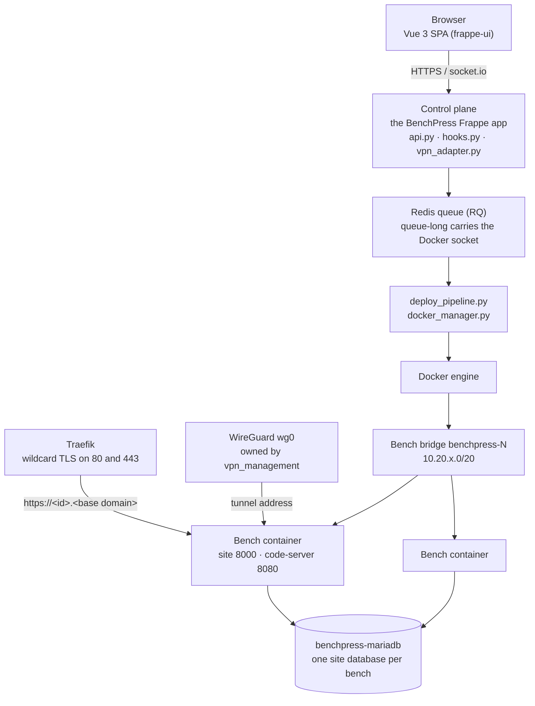

<div align="center">

<picture>
  <source media="(prefers-color-scheme: dark)" srcset="benchpress/public/images/logo/logo-dark.png">
  
</picture>

**Press a button. Get a Frappe bench. Self-hosted, Docker-powered, VPN-secured.**

[](https://github.com/Venkateshvenki404224/benchpress/actions/workflows/ci.yml?query=branch%3Aversion-16)
[](https://github.com/Venkateshvenki404224/benchpress/actions/workflows/linter.yml?query=branch%3Aversion-16)
[](license.txt)
[](https://frappeframework.com)
[](https://fossunited.org/hack/fosshack26/p/f5fk2d9gqd)
[](https://python.org)
[](https://vuejs.org)
[](https://docker.com)
[](https://wireguard.com)

*A self-hosted onboarding and dev-environment tool for teams running Frappe apps.*

**[Read the documentation](docs/index.mdx)**

[Use a bench](docs/user/quick-tour.mdx) · [Run the server](docs/operator/index.mdx) · [Read the internals](docs/reference/index.mdx) · [Install](docs/operator/install.mdx)

</div>

---

## What is BenchPress?

A Frappe bench for a demo, a bug report, or a new hire costs an afternoon of
Docker, database and network setup. The work repeats for every environment, on
a machine somebody then has to keep tidy.

BenchPress turns that afternoon into a form. Describe a **lab** once — a Frappe
version and a list of apps. BenchPress builds an image, deploys a container,
gives it a private WireGuard address and a public HTTPS address, and hands back
an SSH command and a working site. Delete the bench when the task is done.

That is the whole loop: define once, deploy in a click, tear down.

BenchPress solves a narrower problem than a hosting platform such as Frappe
Cloud, and it does not replace one. A lead defines the app stack for a project.
A new developer then deploys it and starts work in minutes.

BenchPress is itself a Frappe app. It installs into a bench you already run. A
Vue 3 single-page app sits on the front. `frappe.qb` queries and background jobs
sit on the back.

> **BenchPress is alpha software. Do not run it on a host you cannot afford to
> lose.**
>
> It takes host-level privilege. `setup.sh` adds your user to the `docker`
> group, starts the shared MariaDB and Redis containers, and enables IP
> forwarding under `/etc/sysctl.d`. A lab user holds root inside their bench,
> and without a user namespace that is host root. A lab is a throwaway
> development environment, and its screens show credentials in plain text.
> Database backups are automatic; restore is manual. Quotas, rate limits and
> audit trails are still in progress.
>
> Run it on a dedicated dev box, a VM, or a cloud instance you can rebuild. Not
> on your daily-driver workstation, and not on a shared production server. Read
> [Production safety](docs/operator/production-safety.mdx) first.

---

## The Problem

Setting up a Frappe or ERPNext development environment costs a day, and the day
repeats.

1. **Manual setup.** Install the bench CLI, MariaDB, Redis, Node.js, wkhtmltopdf
   and a dozen more dependencies.
2. **Version conflicts.** Two projects want two Frappe versions, and the host
   operating system ends up carrying both.
3. **No isolation.** One broken bench reaches everything else on the machine.
4. **No remote access.** A teammate cannot open the environment where the bug
   reproduces.
5. **Repetition.** Every new project and every new person pays the same setup
   cost again.

Nothing lets a team say *"give me a Frappe bench with ERPNext and HRMS"* and get
one in minutes.

---

## The Solution

BenchPress automates the bench lifecycle behind a web interface. It is not a
Frappe Cloud alternative. It gets a developer or an intern a working bench in
minutes rather than a day.

1. **Define a lab.** Pick the Frappe version, the apps and the resource limits,
   or start from one of the ready-made catalog templates.
2. **Build once.** A layer-cached Docker build produces one image for each lab.
   Only the layers below a change rebuild.
3. **Deploy in a click.** Each bench is a container with its own SSH server,
   its own site and a browser VS Code session.
4. **Reach it privately.** Every bench gets a WireGuard address. No bench port
   is published on the public internet.
5. **Watch it happen.** The eleven deploy steps and the raw build output stream
   into the browser over socket.io.
6. **Manage it.** Start, stop, restart, redeploy and delete from the dashboard,
   with CPU and memory sampled for every running bench.

---

## Architecture

The browser calls the control plane over HTTPS and socket.io. The control plane
puts slow work on a Redis queue. A worker drives the Docker engine. Traefik
terminates TLS for the public address of a bench. WireGuard carries the private
one. Every bench keeps its site database in one shared MariaDB.


```mermaid
flowchart TD
    Browser["Browser<br/>Vue 3 SPA (frappe-ui)"]
    Web["Control plane<br/>the BenchPress Frappe app<br/>api.py · hooks.py · vpn_adapter.py"]
    RQ["Redis queue (RQ)<br/>queue-long carries the Docker socket"]
    DM["deploy_pipeline.py<br/>docker_manager.py"]
    Docker["Docker engine"]
    Traefik["Traefik<br/>wildcard TLS on 80 and 443"]
    WG["WireGuard wg0<br/>owned by vpn_management"]
    Bridge["Bench bridge benchpress-N<br/>10.20.x.0/20"]
    C1["Bench container<br/>site 8000 · code-server 8080"]
    C2["Bench container"]
    MariaDB[("benchpress-mariadb<br/>one site database per bench")]

    Browser -- "HTTPS / socket.io" --> Web
    Web --> RQ
    RQ --> DM
    DM --> Docker
    Docker --> Bridge
    Bridge --> C1
    Bridge --> C2
    Traefik -- "https://&lt;id&gt;.&lt;base domain&gt;" --> C1
    WG -- "tunnel address" --> C1
    C1 --> MariaDB
    C2 --> MariaDB
```

### How the pieces fit together

| Component | Role |
|---|---|
| **Control plane** | The BenchPress app in its own bench. It serves the SPA, answers the whitelisted API, and never runs a bench's code |
| **Redis queue** | Carries image builds and deploys. Only `backend` and `queue-long` hold the Docker socket, so a deploy must run on `queue-long` |
| **Docker engine** | Builds one image for each lab, then creates and destroys containers under CPU and memory limits |
| **Traefik** | Terminates TLS for `<instance id>.<base domain>` and `ide-<instance id>.<base domain>`, from a flat route directory with one file per bench |
| **WireGuard** | The tunnel plane, owned by the [vpn_management](https://github.com/Venkateshvenki404224/vpn_management) app. Each bench and each registered device claims one address |
| **Shared MariaDB** | One `benchpress-mariadb` container holds every bench site's database. Backed up nightly |
| **Bench container** | A Frappe bench with an SSH server, the lab's apps, its site on port 8000 and code-server on port 8080 |

A bench answers on up to four addresses at once. [Networking](docs/reference/networking.mdx)
names all four and says who can reach each one.
[Architecture](docs/reference/architecture.mdx) lists every module and what it owns.

---

## Features

- **Lab templates.** A catalog of ready-made stacks, plus a form for a stack the
  catalog does not carry. See [Deploy from a template](docs/user/deploy-from-template.mdx).
- **Layer-cached image builds.** System packages, SSH, the bench, the apps and
  the site each cache separately. Only the layers below a change rebuild.
- **Golden images.** A lab's finished site is baked into the lab image as a
  database dump, so a deploy restores it instead of creating the tables again.
  Measured on a 2-vCPU host, the site step falls from 37.2 s to 9.1 s and the
  whole deploy from 43.3 s to 13.3 s. See [Golden images](docs/operator/golden-images.mdx).
- **Live build and deploy logs.** A collapsible step viewer streams the eleven
  deploy steps and the raw Docker output over socket.io.
- **WireGuard access.** Every bench claims a tunnel address. Nothing about a
  bench is published on a port of the host.
- **Browser VS Code.** Each bench runs code-server on port 8080. Hand a teammate
  a live session instead of describing the bug.
- **VPN devices.** Register a laptop or a phone, download its WireGuard config,
  and run a connection test when a site does not open.
- **Resource limits.** CPU cores and memory for each lab, enforced by Docker.
- **Lifecycle actions.** Start, stop, restart, redeploy and delete, each stating
  what it keeps and what it destroys.
- **Stats and health.** CPU, memory and container health sampled for every
  running bench, with twelve read-only host checks beside them.
- **Two roles.** BenchPress Admin and BenchPress User. Ownership, not the role,
  decides which benches a person sees.
- **Optional metering.** Credits, leases, concurrency caps and self-serve signup
  are all off by default and do not apply to a plain install.

---

## Screenshots

Four screens, in the order a new user meets them. Every screen is described in
full on its own documentation page.

**The Overview dashboard** counts what you own and how long a deploy has been
taking. It is the screen a login lands on.


**A deploy in progress** shows the eleven pipeline steps as they complete, each
with its own duration.


**A running bench** reports its container status, its health, its resource use
and the site the deploy created.


**code-server** puts a VS Code window on the bench in the browser, rooted at the
bench directory.


---

## Documentation

The documentation is the source of truth. This page is a map into it. Start at
[docs/index.mdx](docs/index.mdx), or pick a track below.

An agent working in a clone should read [AGENTS.md](AGENTS.md) instead, which
points at the flattened copy in `docs-bundle/`.

### User track — you were handed a login

| Page | What it covers |
|---|---|
| [Quick tour](docs/user/quick-tour.mdx) | The five screens in the sidebar, and every number the Overview dashboard reports |
| [Deploy from a template](docs/user/deploy-from-template.mdx) | Turn a catalog template into a running bench, and read the eleven pipeline steps while they run |
| [Create a lab](docs/user/create-a-lab.mdx) | Fill in the New lab form when no catalog template matches the app list you need |
| [Read a lab page](docs/user/lab-detail.mdx) | Every field on the lab page, and why container status and container health can disagree |
| [Start, stop and redeploy](docs/user/lifecycle.mdx) | The five actions on a running bench, which destroy work, and which are admin-only |
| [Register a VPN device](docs/user/vpn-devices.mdx) | Put a laptop or a phone on the WireGuard network, and run the connection test |
| [Open the bench site](docs/user/open-your-site.mdx) | The Sites card, the three states of its Open button, and signing in to the site |
| [Connect over SSH and the VPN](docs/user/connect-ssh-vpn.mdx) | Two addresses, the SSH command, the three passwords, and which work without the tunnel |
| [Use code-server](docs/user/code-server.mdx) | The browser VS Code session, its password, and handing it to a teammate |
| [Read logs and container stats](docs/user/logs-and-monitoring.mdx) | The deploy stepper, the raw log, the build log, and the CPU and memory bars |
| [Leases and credits](docs/user/leases-and-credits.mdx) | The countdown, the renew dialog, the meter, the ledger and the payment handoff |
| [Troubleshooting](docs/user/troubleshooting.mdx) | Every user-facing symptom, its cause, and the page that fixes it |

### Operator track — you run the box

| Page | What it covers |
|---|---|
| [Operator track](docs/operator/index.mdx) | Where to start when the machine is yours |
| [Prerequisites](docs/operator/prerequisites.mdx) | Platforms, versions, Docker socket access, IP forwarding, sysbox and the measured CPU sizing |
| [Install](docs/operator/install.mdx) | `bench get-app`, `setup.sh`, the frontend build, the base domain, and the first screen |
| [WireGuard and the VPN plane](docs/operator/wireguard-setup.mdx) | Who owns the tunnel, what BenchPress asks of it, and why userns-remap matters |
| [Settings reference](docs/operator/settings-reference.mdx) | Every field on both settings documents, measured on a live host |
| [The shared database server](docs/operator/database-server.mdx) | The one MariaDB every bench site lives in, and what drift detection watches |
| [Backup and restore](docs/operator/backup-and-restore.mdx) | Where the nightly dumps land, how long they are kept, and both restore paths |
| [Golden images](docs/operator/golden-images.mdx) | Why a deploy takes 13 seconds instead of 43, and why a golden gets refused |
| [The image cache](docs/operator/image-cache.mdx) | What lab images cost on disk, and what is safe to prune |
| [Users and roles](docs/operator/users-and-roles.mdx) | The two roles, and why ownership rather than a role decides who sees a bench |
| [Upgrading](docs/operator/upgrading.mdx) | The backup gate, the five steps, the scripted path and the rollback |
| [Production safety](docs/operator/production-safety.mdx) | The alpha verdict, the privilege boundary, and the release checklist |
| [Diagnostics](docs/operator/diagnostics.mdx) | The twelve read-only checks, and the four things they do not cover |
| [Credits and billing](docs/operator/credits-and-billing.mdx) | Optional, off by default. Leases, balances, the ledger and the Razorpay handoff |
| [Admission and limits](docs/operator/admission-and-limits.mdx) | Optional, off by default. Concurrency caps, size ceilings and quotas |
| [Self-serve signup](docs/operator/hosted-signup.mdx) | Optional, off by default. Retire the waitlist |

### Reference track — you call it or change it

| Page | What it covers |
|---|---|
| [Reference track](docs/reference/index.mdx) | The counts every other reference page is held to |
| [Architecture](docs/reference/architecture.mdx) | Every module in the package, and the concern it owns |
| [Data model](docs/reference/data-model.mdx) | All 20 DocTypes, their fields, and the permission rule that scopes each one |
| [API](docs/reference/api.mdx) | Every whitelisted endpoint, and the check each one makes for itself |
| [Deploy pipeline](docs/reference/deploy-pipeline.mdx) | The eleven deploy steps, the function behind each, and the log line it writes |
| [Lifecycle and events](docs/reference/lifecycle-and-events.mdx) | The bench states, the Docker event listener, and the eleven scheduled jobs |
| [Networking](docs/reference/networking.mdx) | The four addresses, the bench bridges, and the Traefik route files |
| [Realtime](docs/reference/realtime.mdx) | The six socket.io events, their payloads, and who receives each one |
| [Configuration](docs/reference/configuration.mdx) | Which change needs a rebuild, which needs a restart, and which applies on save |
| [CLI and scripts](docs/reference/cli-and-scripts.mdx) | Every command that drives BenchPress from a shell |
| [Glossary](docs/reference/glossary.mdx) | What each term means here, including the words that mean something else elsewhere |

### Repository documents

[CONTRIBUTING.md](CONTRIBUTING.md) ·
[CHANGELOG.md](CHANGELOG.md) ·
[SECURITY.md](SECURITY.md) ·
[TRADEMARKS.md](TRADEMARKS.md) ·
[THIRD-PARTY-NOTICES.md](THIRD-PARTY-NOTICES.md) ·
[Integration notices](docs/integration-notices.md)

---

## Contributing

Contributions are welcome. [CONTRIBUTING.md](CONTRIBUTING.md) is the full guide.
It covers setup, the commands CI runs, and the dependency policy.

`version-16` is the trunk. It is the default branch on GitHub and it carries the
`v0.1.0` tag. Branch from it and merge back into it. `main` and `develop` are
legacy branches left at the 0.1.0 release point and are not updated.

1. Fork the repository.
2. Create a work branch from `version-16`.
3. Follow the Frappe coding conventions in the code you touch.
4. Run the tests: `bench --site your-site.localhost run-tests --app benchpress`.
5. Run every linter: `uvx pre-commit@4.3.0 run --all-files`.
6. Commit with Conventional Commits, such as `feat(lab): add batch deploy`.
7. Open a pull request against `version-16`.
8. Sign the [Contributor License Agreement](.github/CLA.md) on your first pull
   request. You sign once, and it covers everything you contribute afterwards.

Report a security issue through [SECURITY.md](SECURITY.md), never a public issue.

Documentation lives in `docs/` as MDX and is compiled by
[leadtype](https://www.npmjs.com/package/leadtype). Edit the `.mdx` source, then
run `npm run docs:build`, `npm run docs:lint` and `npm run docs:score`. Never
edit anything under `docs-site/` or `docs-bundle/`, because both are generated.

---

## License

```
Copyright (C) 2026 Venkatesh

This program is free software: you can redistribute it and/or modify it under
the terms of the GNU Affero General Public License as published by the Free
Software Foundation, version 3.

This program is distributed in the hope that it will be useful, but WITHOUT ANY
WARRANTY; without even the implied warranty of MERCHANTABILITY or FITNESS FOR A
PARTICULAR PURPOSE. See the GNU Affero General Public License for more details.

You should have received a copy of the GNU Affero General Public License along
with this program. If not, see <https://www.gnu.org/licenses/>.
```

The full text is in [license.txt](license.txt). The SPDX identifier is
`AGPL-3.0-only`.

**What the AGPL means here in practice.** You may run, study, modify and
redistribute BenchPress freely. Section 13 adds one duty beyond the GPL. If you
modify BenchPress and let other people use it over a network, you must offer
those users the source of your modified version. Running an unmodified copy
triggers nothing. Running a modified copy only you use triggers nothing.

Benches that BenchPress provisions are **not** derivative works of BenchPress.
Whatever you build inside a lab is yours, under whatever license you choose.

The VPN plane lives in
[vpn_management](https://github.com/Venkateshvenki404224/vpn_management), a
required dependency, under the same license.

Third-party components are listed in
[THIRD-PARTY-NOTICES.md](THIRD-PARTY-NOTICES.md), each under its own license.
The Frappe apps BenchPress integrates with are listed in
[integration notices](docs/integration-notices.md). The BenchPress name and logo
are trademarks and are **not** covered by the AGPL grant. See
[TRADEMARKS.md](TRADEMARKS.md).

---

<div align="center">

🏆 Winner of [**FOSS Hack 2026**](https://fossunited.org/hack/fosshack26/p/f5fk2d9gqd), built by [Venkatesh](https://github.com/Venkateshvenki404224)

Powered by [Frappe Framework](https://frappeframework.com)

[GitHub Repository](https://github.com/Venkateshvenki404224/benchpress)

</div>
