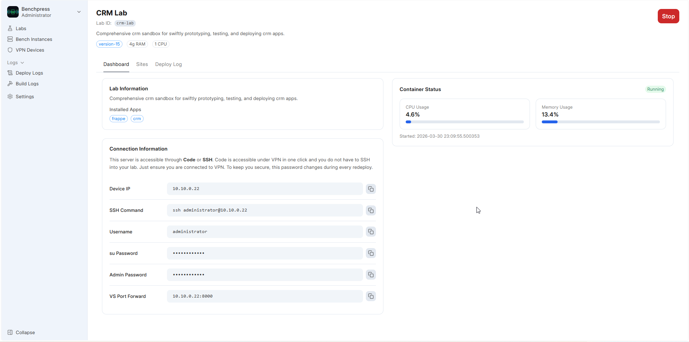

# Connecting to Benches

Once a bench is deployed and running, BenchPress provides all the information you need to connect via SSH, access the Frappe web interface, and set up VS Code remote development.

---

## Connection Information Panel

After deploying a bench, the **Dashboard** tab on the Lab Detail page shows a **Connection Information** card with everything you need:



### Available connection details

| Field | Description | Example |
|-------|-------------|---------|
| **Device IP** | WireGuard VPN IP of the container | `10.10.0.5` |
| **SSH Command** | Full SSH command to connect | `ssh frappe@10.10.0.5` |
| **Username** | SSH username (derived from your email) | `john` |
| **Su Password** | SSH password for the user | `a1b2c3d4e5f6` |
| **Admin Password** | Frappe admin password for the site | `admin` |
| **VS Port Forward** | Port forward command for VS Code remote | `10.10.0.5:8000` |

Each field has a **copy button** that copies the value to your clipboard with a "Copied to clipboard" confirmation.

> The Connection Information panel only appears when the bench status is **Running**.

---

## Connecting via SSH

### 1. Set up WireGuard VPN (first time only)

Before you can SSH into a bench, you need a WireGuard tunnel. See [VPN Device Management](device-management.md) to register a device and get your WireGuard config.

### 2. Activate your VPN tunnel

Import the `.conf` file into your WireGuard client and activate the tunnel:

- **macOS/Windows/Mobile**: Use the WireGuard app, import the tunnel file
- **Linux**: `sudo wg-quick up ./benchpress.conf`

### 3. SSH into the bench

Copy the SSH command from the Connection Information panel:

```bash
ssh frappe@10.10.0.5
# Enter the Su Password when prompted
```

### 4. Start developing

Once inside the container:

```bash
cd frappe-bench
bench start
```

Your Frappe site is now accessible at `http://10.10.0.5:8000` from any device on the VPN.

---

## Accessing the Frappe Web Interface

After running `bench start` inside the container:

| Service | URL | Description |
|---------|-----|-------------|
| **Frappe Desk** | `http://10.10.0.5:8000` | Main ERP/app interface |
| **Socket.io** | `http://10.10.0.5:9000` | Real-time updates |

Log in with:
- **Username**: `Administrator`
- **Password**: `admin` (the Admin Password shown in Connection Info)

---

## VS Code Remote Development

BenchPress supports VS Code Remote SSH for a full IDE experience inside the container.

### Option 1: VS Code Remote SSH extension

1. Install the **Remote - SSH** extension in VS Code
2. Press `Ctrl+Shift+P` → "Remote-SSH: Connect to Host..."
3. Enter the SSH command from Connection Info: `frappe@10.10.0.5`
4. Enter the Su Password when prompted
5. Open the `/home/frappe/frappe-bench` folder

### Option 2: Port forwarding

Use the VS Port Forward command from Connection Info to forward port 8000:

```bash
ssh -L 8000:localhost:8000 frappe@10.10.0.5
```

Then access the Frappe site at `http://localhost:8000` on your local machine.

---

## Connection Without VPN (Local Only)

If WireGuard is not configured, containers are still accessible via their Docker bridge IP on the host machine:

```bash
# Find the container IP
docker inspect <container_id> --format '{{range .NetworkSettings.Networks}}{{.IPAddress}}{{end}}'

# SSH using the Docker IP (only works from the host)
ssh frappe@172.30.0.X
```

> This only works from the host machine. For remote access, set up WireGuard VPN.

---

## Troubleshooting

### "Connection refused" when SSHing

1. Check that your WireGuard tunnel is active: `sudo wg show`
2. Verify the bench status is **Running** in the dashboard
3. Try pinging the VPN IP: `ping 10.10.0.5`

### "Permission denied" on SSH

1. Make sure you're using the correct username (shown in Connection Info)
2. Copy-paste the Su Password exactly (it's auto-generated)

### Frappe site not loading at port 8000

1. SSH into the bench first
2. Run `bench start` inside the container
3. Wait a few seconds for gunicorn to start
4. Access `http://10.10.0.5:8000`

### Cannot reach the container from another machine

1. Both machines must be on the same WireGuard VPN
2. Each machine needs its own registered device (see [Device Management](device-management.md))
3. Verify the WireGuard tunnel is active on both machines

---

## Next Steps

- [VPN Device Management](device-management.md) — Register devices for persistent VPN access
- [Logs and Monitoring](logs-and-monitoring.md) — Monitor container health and logs
