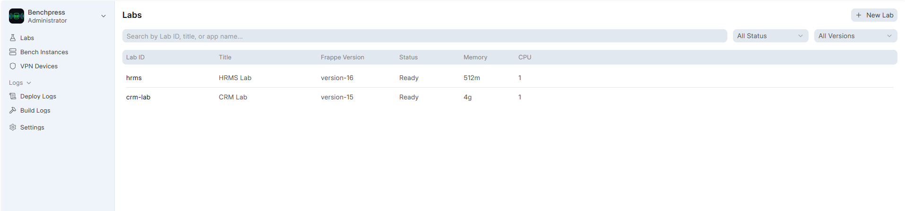
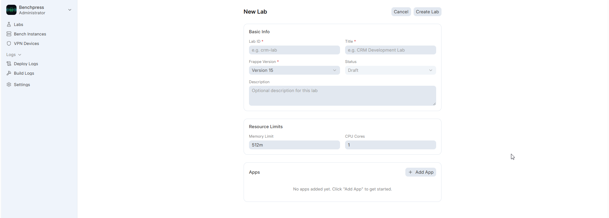
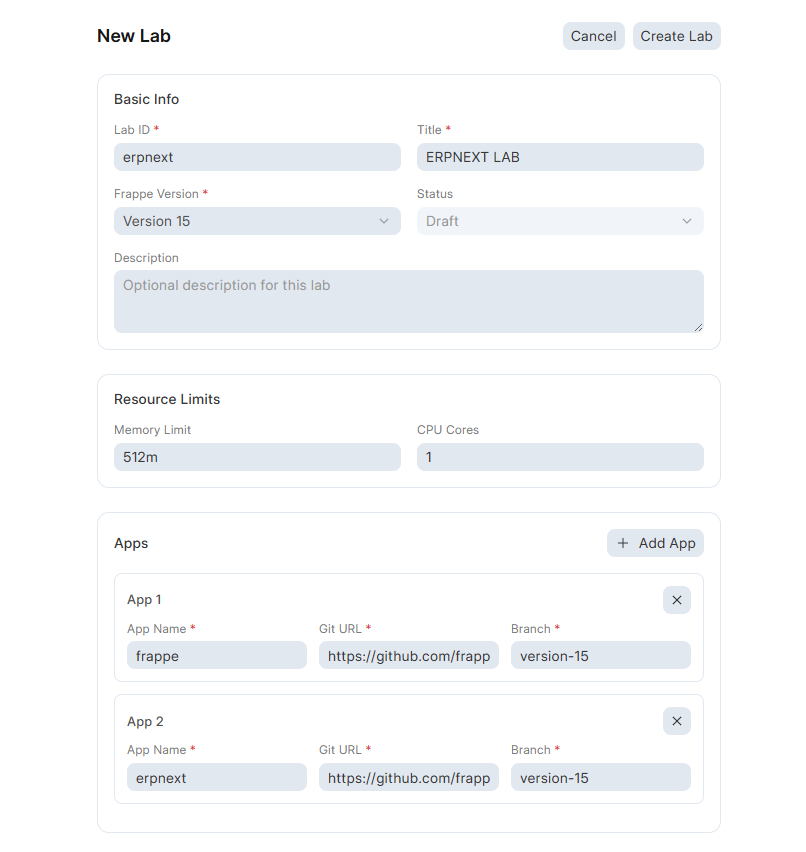
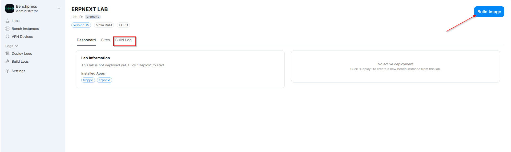
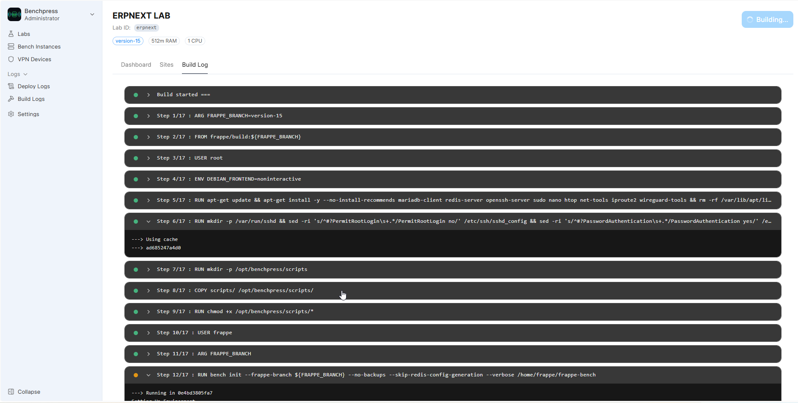
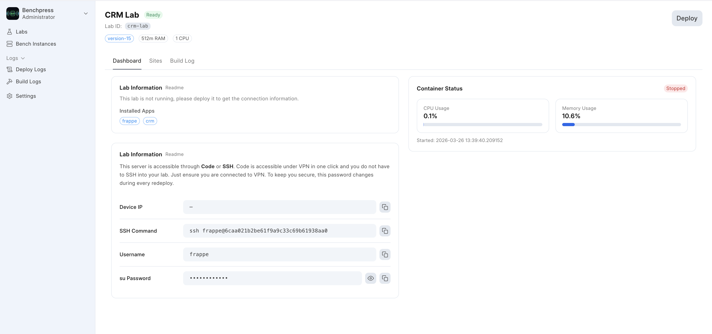
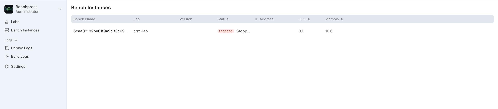

# Creating Labs and Deploying Benches

Labs are reusable templates that define what goes into a bench — the Frappe version, installed apps, and resource limits. Once a lab is created and its Docker image is built, you can deploy as many bench instances from it as you need.

---

## Understanding the Workflow

```
Create Lab  -->  Build Image  -->  Deploy Bench  -->  Connect & Develop
(template)      (Docker build)    (container)        (SSH / web)
```

1. **Lab** = a template (Frappe version + apps + resource limits)
2. **Build** = a Docker image created from the lab template (cached, only rebuilds when config changes)
3. **Bench Instance** = a running container created from the built image
4. **Site** = a Frappe site inside the bench (one bench can have multiple sites)

---

## Creating a New Lab

### Navigate to the Labs page

From the sidebar, click **Labs**. You'll see the list of all existing labs.



### Click "New Lab"

Click the **New Lab** button in the top-right corner (visible to admin users only).



### Fill in the lab details

| Field | Required | Description | Example |
|-------|----------|-------------|---------|
| **Lab ID** | Yes | Unique slug identifier | `crm-lab` |
| **Title** | Yes | Human-readable name | `CRM Development Lab` |
| **Frappe Version** | Yes | Base framework version | Version 14, 15, 16, or Develop |
| **Description** | No | Notes about this lab | `Lab for Frappe CRM development` |
| **Memory Limit** | No | RAM allocation for containers | `512m`, `1g`, `2g` |
| **CPU Cores** | No | CPU cores allocated | `1`, `2` |

### Add apps

In the **Apps** section, click **Add App** for each Frappe app you want to install:

| Field | Required | Description | Example |
|-------|----------|-------------|---------|
| **App Name** | Yes | The Frappe app name | `erpnext` |
| **Git URL** | Yes | Repository URL | `https://github.com/frappe/erpnext` |
| **Branch** | Yes | Git branch to install | `version-15` |

You can add multiple apps. Common combinations:

| Use Case | Apps |
|----------|------|
| ERPNext | `erpnext` + `hrms` |
| CRM | `crm` |
| LMS | `lms` |
| Helpdesk | `helpdesk` |
| Custom | Your own app's Git URL |

> Frappe itself is always included — you don't need to add it as an app.

### Click "Create Lab"

The lab is created in **Draft** status. You can now build its Docker image and deploy bench instances.



---

## Building the Docker Image

### From the Lab Detail page

Navigate to your lab's detail page by clicking on it in the Labs list.

Click the **Build Image** button. The build uses a 5-layer cached Dockerfile:

1. **System deps** — apt packages (MariaDB client, Redis, SSH, WireGuard tools)
2. **Service config** — SSH hardening, sudoers
3. **bench init** — Frappe framework installation
4. **App install** — `bench get-app` for each app
5. **Site creation** — `bench new-site` + `install-app`

Only changed layers rebuild — if you only change an app's branch, layers 1-3 are cached.

### Watching the build

Switch to the **Build Log** tab to watch the Docker build output stream in real-time.



The build log shows:
- Each Docker layer as a collapsible step
- Green dot = step completed
- Spinning indicator = step in progress
- Red dot = step failed

> First builds take 5-15 minutes depending on the number of apps. Subsequent builds are much faster due to Docker layer caching.

### Build status

| Status | Meaning |
|--------|---------|
| **Draft** | Lab created, no image built yet |
| **Building** | Docker image build in progress |
| **Ready** | Image built successfully, ready to deploy |
| **Error** | Build failed — check the Build Log tab for details |

---

## Deploying a Bench Instance

### Click "Deploy"

Once the lab status is **Ready**, the **Deploy** button appears (green). Click it.

A confirmation dialog appears:

> "This will create a container and set up a Frappe bench. Continue?"

Click **Deploy** to confirm.

### What happens during deployment

The deploy runs as a background job and streams progress to the **Deploy Log** tab:

1. Verifies the Docker image exists (or triggers a build)
2. Ensures shared MariaDB and Redis are running
3. Creates a container on the `benchpress` Docker network
4. Starts the container
5. Configures WireGuard VPN (generates keypair, allocates IP, adds peer)
6. Writes `common_site_config.json` with shared MariaDB + Redis URLs
7. Creates the Frappe site with your selected apps
8. Builds frontend assets (`bench build`)
9. Provisions SSH user and sets password
10. Marks the bench as **Running**



### Bench status

| Status | Meaning |
|--------|---------|
| **Draft** | Not yet deployed |
| **Deploying** | Container creation and setup in progress |
| **Running** | Container is up and accessible |
| **Stopped** | Container stopped (can be restarted) |
| **Error** | Deployment failed — check Deploy Log for details |

---

## Managing Bench Instances

### From the Lab Detail page



The **Dashboard** tab shows the container status card with:
- Current status badge
- CPU usage (percentage + progress bar)
- Memory usage (percentage + progress bar)
- Started timestamp

### Actions

| Button | When visible | What it does |
|--------|-------------|--------------|
| **Deploy** | Lab is Ready, no running bench | Creates and starts a new container |
| **Stop** | Bench is Running | Stops the container (with confirmation) |
| **Build Image** | Lab not Ready, admin only | Triggers Docker image build |

### Bench Instances page

From the sidebar, click **Bench Instances** to see all deployed benches across all labs:



---

## Creating Sites

Each bench can host multiple Frappe sites. From the Lab Detail page:

1. Switch to the **Sites** tab
2. Click **New Site**
3. Enter a site name
4. Select which apps to install (checkboxes)
5. Click **Create Site**

The site is created inside the running container against the shared MariaDB. Each site gets its own database.

---

## Redeploying

If you need a fresh start (e.g., after changing lab apps), you can redeploy. This will:

1. Stop and remove the existing container
2. Delete the data volume
3. Drop the site database from shared MariaDB
4. Deploy a completely fresh bench

> Redeploying is destructive — all data in the bench is lost. Make sure to back up any work first.

---

## Next Steps

- [Connecting to Benches](connecting-to-benches.md) — How to SSH in and access your Frappe site
- [Logs and Monitoring](logs-and-monitoring.md) — Understanding build and deploy logs
