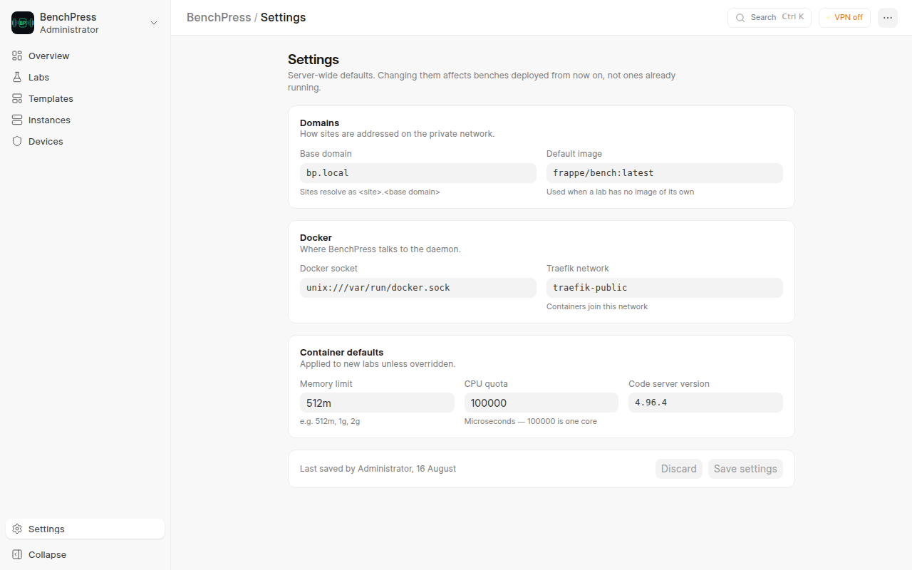

# Getting Started with BenchPress

This guide walks you through your first BenchPress setup — from installation to deploying your first Frappe bench.

---

## Prerequisites

Before installing BenchPress, ensure your host machine has:

| Requirement | Version | Purpose |
|------------|---------|---------|
| Frappe Bench | v16 | The bench environment to install BenchPress into |
| Docker Engine | 20+ | Container management |
| Docker Compose | v2+ | Manages shared MariaDB + Redis infrastructure |
| vpn_management app | version-16 | VPN control plane (required app — provides the wg-agent and VPN DocTypes) |

> MariaDB and Redis for bench containers are managed automatically via Docker Compose. You only need them on the host for Frappe itself.

---

## Installation

### Step 1: Install the app

```bash
cd /path/to/your/frappe-bench

bench get-app https://github.com/Venkateshvenki404224/benchpress --branch main
bench pip install docker
bench --site your-site.localhost install-app benchpress
bench --site your-site.localhost migrate
```

### Step 2: Run the setup script

```bash
bash apps/benchpress/setup.sh your-site.localhost
```

The setup script is idempotent (safe to run multiple times) and handles three steps:

1. **Docker group** — Adds your user to the `docker` group
2. **Shared infrastructure** — Starts `benchpress-mariadb` and `benchpress-redis` via docker-compose
3. **IP forwarding** — Enables kernel IP forwarding for VPN routing

> VPN (the WireGuard interface, peers, and IPs) is provisioned by the
> **vpn_management** app and its wg-agent — see [WireGuard Setup](wireguard-setup.md).

> If the Docker group was just added, log out and back in before starting bench.

### Step 3: Build the frontend

```bash
cd apps/benchpress/frontend
yarn install
yarn build
```

### Step 4: Configure BenchPress Settings



1. Start the bench: `bench start`
2. Open **Settings** in the BenchPress sidebar: `/frontend/settings`
3. Set the **Base domain** — it is required, and sites are addressed under it — then review the
   Docker group and the container defaults. Both a System Manager and a BenchPress Admin can
   save this screen.

VPN configuration (server, pool, peers) lives in the vpn_management
DocTypes in Desk — see [WireGuard Setup](wireguard-setup.md).

### Step 5: Open firewall

```bash
sudo ufw allow 44556/udp
```

### Step 6: Access the dashboard

Open your browser to:

```text
http://your-site.localhost:8000/frontend
```

The first screen is the **Overview**: what BenchPress is for, which of your environments are
running, broken or building, and — when you have none — three steps to your first one.

The sidebar is five items: Overview, Labs, Templates, Instances and Devices, with Settings at
the bottom for admins. Build history and deploy history are not in the sidebar; they are
reached from Labs and Instances respectively.

---

## Your First Lab and Bench

The fastest route is **Templates** — pick a recipe and BenchPress creates the lab and deploys
it in one click. To define an environment yourself, follow the
[Creating Labs](creating-labs.md) guide.

---

## What's Next?

| Guide | Description |
|-------|-------------|
| [Creating Labs](creating-labs.md) | Create lab templates and deploy bench instances |
| [Connecting to Benches](connecting-to-benches.md) | SSH access, VPN setup, and connection info |
| [Logs and Monitoring](logs-and-monitoring.md) | Build logs, deploy logs, and container stats |
| [VPN Device Management](device-management.md) | Register devices for persistent WireGuard access |
| [WireGuard Setup](wireguard-setup.md) | How the vpn_management app runs the VPN plane |
| [Upgrading a BenchPress Install](upgrading.md) | Backup-gated upgrade and rollback runbook |
