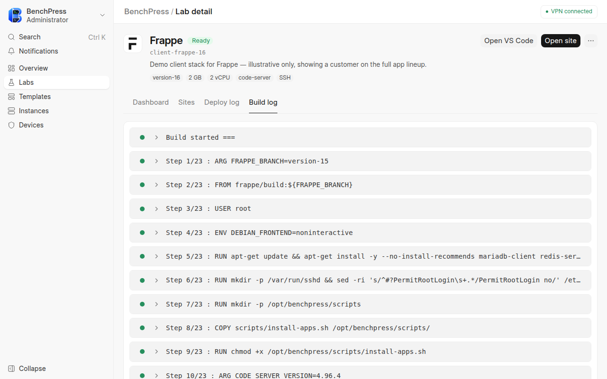
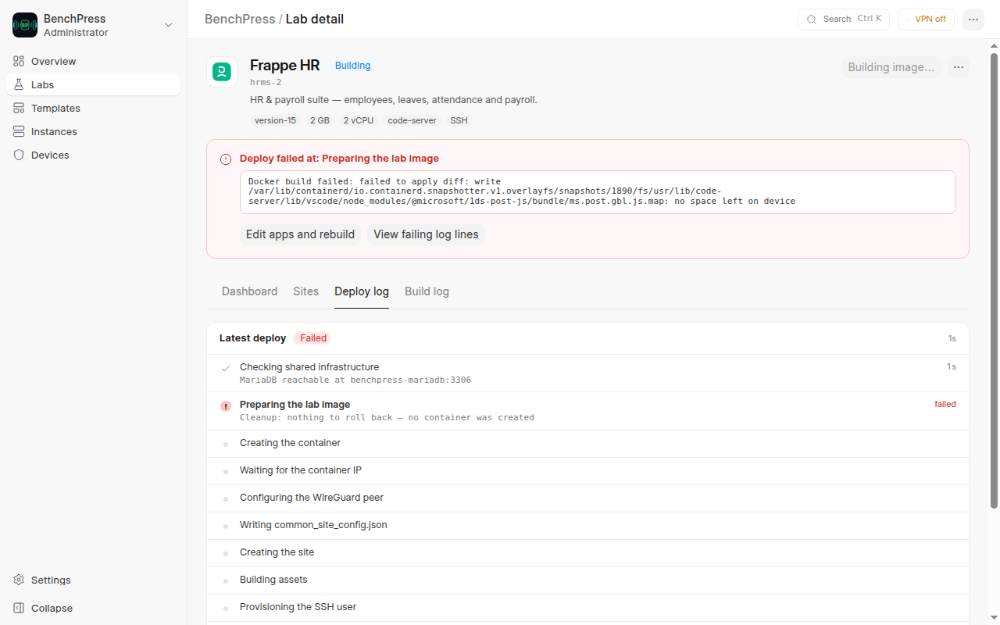

# Logs and Monitoring

BenchPress provides real-time log streaming for builds and deployments, plus container stats monitoring. This guide explains where to find logs and how to interpret them.

---

## Build Logs

Build logs capture the Docker image build process for a lab.

### Where to find them

**Option 1: Lab Detail page > Build Log tab**

When building an image, switch to the **Build Log** tab on the Lab Detail page. Logs stream in real-time via WebSocket.



**Option 2: Build history**

Build history is reached from the Labs page — **Build history**, next to "New lab" — not from
the sidebar. It is admin-only. Each row shows:
- The lab and the image tag the run built
- A result badge — Success, Failed or Building
- The last step the run opened, and how long the run took
- When it started

Clicking a row opens the lab. Runs are kept for seven days; the table says so, because nothing
older survives the log-clearing job.


### Understanding build steps

The Docker build uses 5 cached layers. Each layer appears as a collapsible step:

| Step | What it does | When it rebuilds |
|------|-------------|-----------------|
| **Layer 1: System deps** | `apt-get install` for MariaDB client, wkhtmltopdf, etc. | Rarely (base image change) |
| **Layer 2: SSH config** | SSH server setup, sudoers | Rarely |
| **Layer 3: bench init** | `bench init` with Frappe framework | When Frappe version changes |
| **Layer 4: App install** | `bench get-app` for each app | When app list or branches change |
| **Layer 5: Site creation** | `bench new-site` + `install-app` | When site config changes |

### Build failures

If a build fails:
1. Expand the failed step (marked with a red dot)
2. Scroll to the bottom of that step's output
3. The error message indicates what went wrong

Common build failures:

| Error | Cause | Fix |
|-------|-------|-----|
| `Could not find a version that satisfies` | Python package conflict | Check app compatibility with the Frappe version |
| `fatal: repository not found` | Wrong Git URL | Verify the app's Git URL in the lab config |
| `fatal: Remote branch not found` | Wrong branch name | Check the correct branch name on GitHub |
| `COPY failed: file not found` | Docker context issue | Rebuild with `bench build --app benchpress` first |

---

## Deploy Logs

Deploy logs capture the bench container creation and setup process.

### Where to find them

**Option 1: Lab Detail page > Deploy Log tab**

When deploying a bench, switch to the **Deploy Log** tab. Logs stream in real-time.



**Option 2: Deploy history**

Deploy history is reached from the Instances page — **Deploy history** — not from the sidebar.
It shows the deploys of the benches you can see: your own, or everyone's if you are an admin.
Each row shows:
- The bench, named after its lab
- A result badge — Success, Failed, Skipped or Deploying
- The last step the run opened, and how long the run took
- When it started

A run recorded before the pipeline emitted step markers has no last step and no measured
duration; the table shows an em-dash rather than guessing. Runs are kept for seven days.


### Understanding deployment steps

A typical deployment log shows these phases:

Every deploy emits eleven numbered steps, in this order. Each marker carries how far into the
run it opened, so a step's duration is the gap to the next one — readable from a finished log
months later, not only while it streams.

| # | Step | What happens |
|---|------|-------------|
| 1 | **Checking shared infrastructure** | Shared MariaDB and Redis containers verified |
| 2 | **Preparing the lab image** | The image is built, or a cached one is adopted |
| 3 | **Creating the container** | Container created from the lab image |
| 4 | **Waiting for the container IP** | Container reports an address |
| 5 | **Configuring the WireGuard peer** | Peer registered, IP claimed from the pool, tunnel up |
| 6 | **Writing common_site_config.json** | Database and Redis connection config written |
| 7 | **Creating the site** | `bench new-site` run inside the container |
| 8 | **Building assets** | `bench build` for frontend assets |
| 9 | **Provisioning the SSH user** | User created, password set |
| 10 | **Provisioning code-server** | Browser IDE installed, or skipped for a lab without it |
| 11 | **Deploy complete** | Bench marked as Running |

### Deployment failures

If a deployment fails:
1. Check the Deploy Log for the step that failed
2. The error message is at the end of the log

Common deployment failures:

| Error | Cause | Fix |
|-------|-------|-----|
| `MariaDB not ready after 60s` | Shared MariaDB container is down | Check `docker ps` for `benchpress-mariadb` |
| `bench new-site failed` | Site creation issue | Check if the database already exists (redeploy to clean up) |
| `linkuser.sh failed` | SSH user provisioning issue | Check container logs: `docker logs <container_id>` |
| `docker compose up failed` | Infrastructure issue | Run `docker compose -f benchpress/config/docker-compose.yml up -d` manually |

---

## Container Stats Monitoring

BenchPress polls Docker stats every minute and displays them on the dashboard.

### Where to see stats

**Lab Detail page > Dashboard tab > Container Status card:**

The card shows:
- **Status** — Color-coded badge (green = Running, red = Error/Stopped)
- **CPU Usage** — Percentage with progress bar
- **Memory Usage** — Percentage with progress bar
- **Started** — Timestamp when the container was started

**Bench Instances page:**

The table shows CPU % and Memory % columns for all benches at a glance.


### How stats are collected

The `stats_collector` cron job runs every minute and:
1. Queries the Docker stats API for all running containers with the `benchpress.managed` label
2. Calculates CPU percentage, memory percentage, and container health
3. Updates the `cpu_usage` and `memory_usage` fields on the Bench Instance doc

It collects Docker CPU/memory/health only. Device and bench VPN rx/tx counters are updated by the vpn_management app's own `poll_status` job (every 2 minutes).

---

## Shared Infrastructure Health

The shared MariaDB and Redis containers are monitored by a health check cron job that runs every 5 minutes.

### Checking infrastructure status

```bash
# Check container status
docker ps --filter "name=benchpress-"

# Check MariaDB health
docker exec benchpress-mariadb mariadb -u root -p'<password>' -e "SELECT 1"

# Check Redis health
docker exec benchpress-redis redis-cli ping
```

### Health check behavior

| Scenario | Action |
|----------|--------|
| MariaDB healthy | No action |
| MariaDB down | Attempts restart via `docker compose start mariadb` |
| Restart fails | Sets Database Server status to Error, publishes realtime alert |

### Backups

MariaDB is backed up automatically every night at 2 AM:
- Full `mariadb-dump` of all databases, gzipped
- Stored inside the MariaDB container at `/var/lib/mysql/backups/`
- 7-day retention (older backups are automatically cleaned up)

---

## Docker Container Logs

For low-level debugging, you can access raw Docker container logs:

```bash
# MariaDB logs
docker logs benchpress-mariadb --tail 50

# Redis logs
docker logs benchpress-redis --tail 50

# Bench container logs
docker logs <container_id> --tail 50
```

You can also view MariaDB logs from the Database Server DocType in Frappe Desk using the **Get Logs** action button.

---

## Next Steps

- [Deploy from a template](user/deploy-from-template.mdx) — Create and deploy benches
- [Connecting to Benches](connecting-to-benches.md) — SSH and web access
- [VPN Device Management](device-management.md) — Register VPN devices
