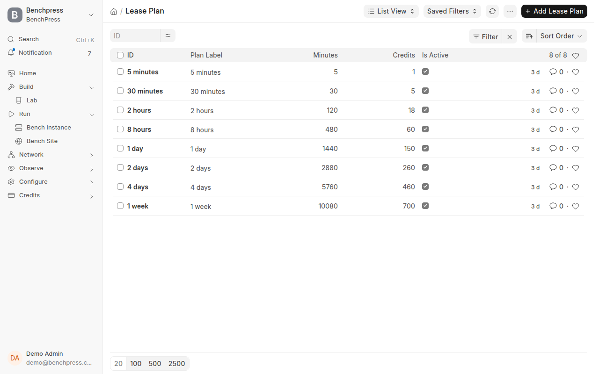

# Credits and billing

**Optional, and off by default.** `enable_credits` ships as `0`, and nothing
on this page runs until you change it.

**Who this is for.** Somebody running BenchPress for a team, who needs a bench
to stop by itself rather than run for a week.

**Before you start.** Read this line before the rest of the page. BenchPress
is a dev-environment and onboarding tool, not a hosting platform. If you are
the only person on the box, or if everyone using it is trusted to stop their
own benches, skip this page and
[Admission and limits](/docs/operator/admission-and-limits). Neither is part
of the self-hosted path.

## What switching it on changes

With `enable_credits = 1`:

- Every user gets a `Credit Account`, opened with the signup grant.
- A deploy buys a **lease** — a fixed window of time — and is charged for it.
- A bench stops when its lease expires.
- Concurrency is capped. See
  [Admission and limits](/docs/operator/admission-and-limits).
- The **Credits** page appears in the app, and the sidebar grows a balance
  meter.

With `enable_credits = 0`, none of it runs. Every function in the credits
package checks the switch first, so there are no accounts, no ledger rows and
no extra queries. `/frontend/credits` redirects back to Labs.

**Do not switch this on to try it and leave it on.** Every user without a
`Credit Account` and a balance is refused a deploy from the next request, and
that is an outage for everybody else on the host.

## Steps

1. **Read the current state before changing anything.**

   ```bash
   bench --site <site> execute frappe.client.get_value \
     --kwargs "{'doctype':'BenchPress Settings','fieldname':'enable_credits'}"
   ```

2. **Price time.** Open `/app/lease-plan` in Desk. A plan is a duration and a
   price, and one of them is the default.

   

   Eight plans ship, and all eight are active on this host:

   | Plan | Minutes | Credits |
   |---|---:|---:|
   | 5 minutes | 5 | 1 |
   | 30 minutes | 30 | 5 |
   | 2 hours | 120 | 18 |
   | 8 hours | 480 | 60 |
   | 1 day | 1,440 | 150 |
   | 2 days | 2,880 | 260 |
   | 4 days | 5,760 | 460 |
   | 1 week | 10,080 | 700 |

   `default_lease_plan` is **30 minutes** — the plan a deploy buys when the
   caller names none. The price a user actually pays is the plan's credits
   times the `Instance Size.price_multiplier`, so a larger bench costs more
   for the same wall-clock time.

3. **Price credits, if you are selling them.** Open `/app/credit-pack`.

   | Pack | Price | Credits | Highlighted |
   |---|---:|---:|---|
   | Starter | ₹499 | 200 | no |
   | Regular | ₹1,999 | 1,000 | yes |
   | Heavy | ₹6,999 | 4,000 | no |

4. **Set the grant.** `Credit Settings.signup_grant_credits` is `40` — posted
   once, ever, when an account is opened. Forty credits buys eight 30-minute
   leases at the Small size.

5. **Switch it on.** Set `BenchPress Settings.enable_credits` to `1`, in Desk
   or in the app's Settings dialog.

6. **Switch it back off** the moment you have finished evaluating, unless you
   meant to keep it.

## Verify

Read the flag back in a fresh process. A Single is cached, and the form you
just saved is not evidence.

```bash
bench --site <site> execute frappe.client.get_value \
  --kwargs "{'doctype':'BenchPress Settings','fieldname':'enable_credits'}"
```

Then confirm the app agrees: with credits on, `/frontend/credits` renders and
the sidebar shows a meter. With credits off, that route redirects to Labs.

## The accounting model

There is no meter and no accrual. A balance is a stored number, and the live
check is a read rather than a sum over the ledger.

| Entry type | Written when |
|---|---|
| `Grant` | an account is opened, or an operator gives credits away |
| `Purchase` | a payment settles |
| `Usage` | a lease is bought or renewed |
| `Refund` | a purchase is reversed |
| `Adjustment` | an operator corrects a balance by hand |

Four properties are worth an operator's attention.

- **Every mutation runs under a row lock** on the account. Two parallel
  deploys cannot both read the same balance, so there is no double-spend.
- **Spendable is not the same as the balance.** Credits an admitted deploy is
  already holding are committed. A renewal that spent them would overdraw the
  account the moment that deploy reached `Running`, so the guard compares
  against the unreserved figure.
- **Amounts carry six decimal places.** A price multiplier can put a lease at
  7.333333 credits, and rounding at every debit would leak the difference.
- **`has_purchased` reads the `Purchase` row, not the balance.** A refund
  clears the number, not the fact that the account paid.

This host holds **21 credit accounts and 109 ledger entries**, of which 18
accounts have a zero balance. That distribution is the reason the warning
above matters: switching the flag on here would refuse almost everyone.

## Moving a balance by hand

An adjustment is the one entry type no rule produced, so a year later it is
the only record of why a balance is what it is. It **requires a reason** and
refuses without one.

```bash
bench --site <site> execute benchpress.credits.account.adjust \
  --kwargs "{'user':'someone@example.com','credits':100,'reason':'Onboarding top-up, ticket 412'}"
```

Pass a negative number to take credits away. The call throws if credits are
off.

## Taking money

The payment gateway is an **optional app**. `razorpay_frappe` is deliberately
absent from `required_apps` and must stay absent — nobody running BenchPress
on their own hardware should have to install a payment processor to use it.
Every entry point checks first and refuses with a sentence rather than an
import error.

Three properties define the design:

- **Settlement is once-ever.** Razorpay retries webhooks, `on_update` fires on
  every save, and an operator pressing **Sync Status** in Desk is a third
  delivery of the same payment. The guard checks the order reference under the
  same row lock that applies the credit.
- **The amount is never taken from the caller.** `razorpay_frappe` exposes an
  open endpoint on which any logged-in user names their own amount, so a paid
  order is not evidence of what was bought. Settlement re-reads the price from
  the `Credit Pack` the order points at and credits nothing unless the rupees
  paid match it.
- **Orders only.** No payment links, no subscriptions, no auto-renewal, no
  dunning, no proration. Money buys credits, and credits buy time, so somebody
  who wants longer renews a lease rather than holding a plan.

On this host `Razorpay Settings.key_id` is empty, so a purchase reaches the
gateway handoff and stops there with a missing-password error. Nothing is
charged. That is the correct state for a host that is not selling anything.

## Troubleshooting

| Symptom | Cause | Fix |
|---|---|---|
| Every user is suddenly refused a deploy | Credits were switched on and most accounts hold nothing | Set `enable_credits` back to `0`, or grant balances |
| The Credits page is missing | Credits are off | Expected. `/frontend/credits` redirects to Labs |
| A refusal names less than the balance shows | Credits are reserved against a running deploy | Stop an instance, or top the account up |
| A purchase fails at the gateway | No gateway keys on this site | Expected with `key_id` empty. Nothing was charged |
| A deploy is charged twice | It is not — settlement and charging are both once-ever under a row lock | Read the ledger. Two `Usage` rows mean two leases |
| A bench outlived its lease | The sweep that stops expired leases is not running | See [Diagnostics](/docs/operator/diagnostics) |
| `adjust` throws `An adjustment needs a reason` | The reason was empty | Pass one. It is the whole value of the row |

## Reference

Measured on this host.

| Setting | Value | Meaning |
|---|---|---|
| `enable_credits` | `0` | the master switch |
| `signup_grant_credits` | `40` | posted once, ever |
| `custom_build_credits` | `40` | flat charge for a custom image build |
| `low_balance_warn_percent` | `20` | warn below this share of the balance |
| `default_lease_plan` | `30 minutes` | bought when the caller names no plan |
| `reap_after_days` | `7` | days a stopped instance is kept |
| `lease_sweep_batch` | `200` | expired leases one sweep may claim |
| `lease_reclaim_seconds` | `60` | before an unfinished stop is reclaimed |
| `lease_max_attempts` | `0`, falling back to `5` | failed stops before a lease parks |

| Schedule | Job |
|---|---|
| Every 5 minutes | `benchpress.credits.sweep.enforce_limits` |
| Every 5 minutes | `benchpress.credits.drain.sweep_expired_leases` |
| Every 5 minutes | `benchpress.credits.admission_repair.reconcile_admissions` |
| Daily | `benchpress.credits.reaper.reap_stopped_instances` |

## Related

- [Admission and limits](/docs/operator/admission-and-limits) — the caps this switch engages.
- [Self-serve signup](/docs/operator/hosted-signup) — the third optional page, and the one that hands out grants.
- [Leases and credits](/docs/user/leases-and-credits) — the same machinery, from a user's side.
- [Settings reference](/docs/operator/settings-reference) — every field above, in one table.
