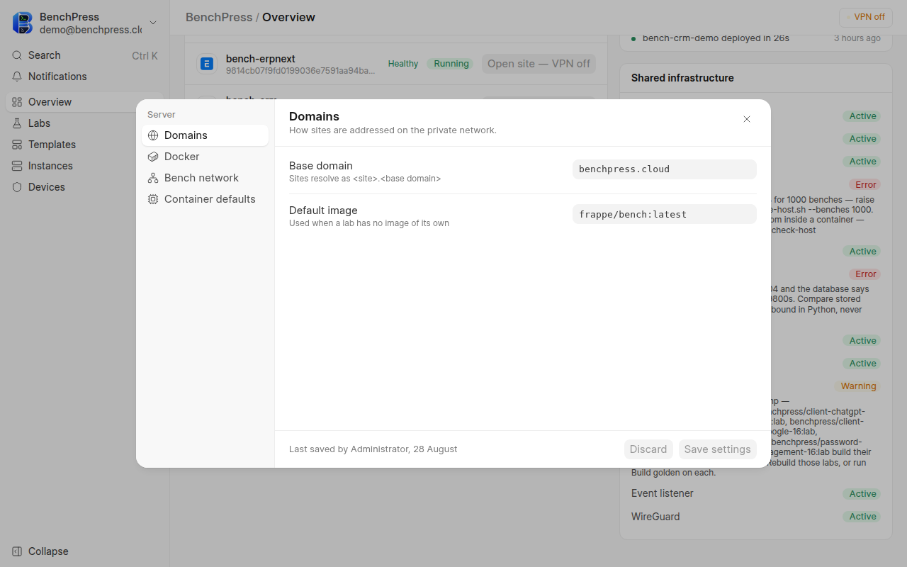
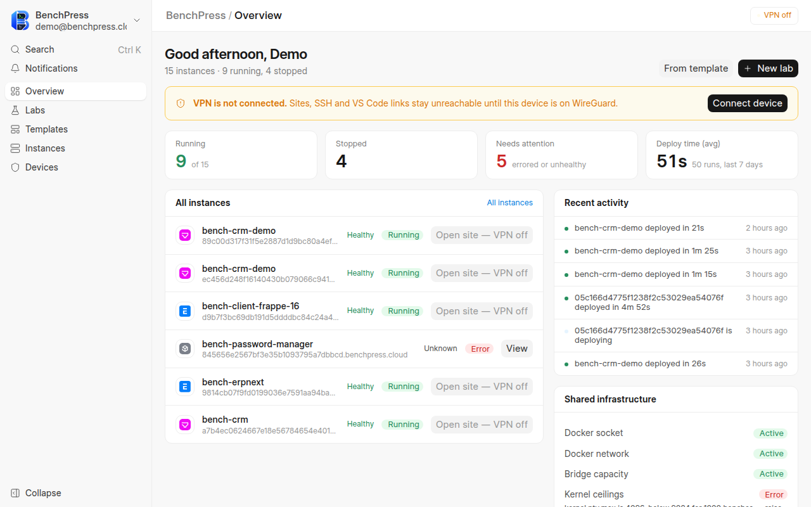

# Install

From a prepared host to the BenchPress Overview, in six steps.

**Who this is for.** Whoever owns the host.

**Before you start.** Every check on
[Prerequisites](/docs/operator/prerequisites) must pass. You need a Frappe v16
bench, a site name, and a shell in the bench directory — the one that holds
`apps/`, `sites/` and `env/`.

Throughout, replace `<site>` with your real site name.

## Steps

1. **Install the app into the bench.**

   ```bash
   cd /path/to/your/frappe-bench
   bench get-app https://github.com/Venkateshvenki404224/benchpress --branch version-16
   bench pip install docker
   bench --site <site> install-app benchpress
   bench --site <site> migrate
   ```

   `benchpress` declares `vpn_management` as a required app, so Frappe
   installs that first. It refuses to install without `vpn_endpoint_host` in
   `common_site_config.json` and without a reachable wg-agent socket. See
   [WireGuard and the VPN plane](/docs/operator/wireguard-setup).

2. **Run the setup script.**

   ```bash
   bash apps/benchpress/setup.sh <site>
   ```

   It is idempotent, so a second run reports what is already correct and
   changes nothing. Four steps:

   | Step | What it does | Skipped when |
   |---|---|---|
   | 1 of 4 | Adds the bench user to the `docker` group | the user is already a member |
   | 2 of 4 | Checks Docker `userns-remap` or rootless mode | never — it only warns |
   | 3 of 4 | Starts `benchpress-mariadb` and `benchpress-redis`, and creates the `benchpress` network and the data volume | the containers are already up |
   | 4 of 4 | Writes `net.ipv4.ip_forward = 1` under `/etc/sysctl.d` | forwarding is already on |

   Step 2 warns and continues by default. On a host that will carry anything
   you care about, run it as `bash apps/benchpress/setup.sh <site> --strict`
   instead, which exits non-zero rather than warning. See
   [Production safety](/docs/operator/production-safety).

3. **Build the frontend.** The dashboard is a Vue single-page app and ships as
   source.

   ```bash
   cd apps/benchpress/frontend
   yarn install
   yarn build
   cd -
   bench build --app benchpress
   ```

4. **Open the firewall for WireGuard.**

   ```bash
   sudo ufw allow 44556/udp
   ```

   Open the same port on any cloud firewall or security group in front of the
   host. `ufw` cannot see that layer.

5. **Set the base domain.** Open `/frontend`, then **Settings** from the
   account menu.

   

   `base_domain` is the only required field on the form, because sites are
   addressed under it as `<site>.<base domain>`. On this host it is
   `benchpress.cloud`, and `default_image` is `frappe/bench:latest`. Both a
   System Manager and a BenchPress Admin can save this screen. Every other
   field has a working default — see
   [Settings reference](/docs/operator/settings-reference).

6. **Open the dashboard.**

   ```text
   http://<site>:8000/frontend
   ```

   

   The first screen is the **Overview**: how many environments are running,
   stopped or broken, the average deploy time over the last seven days, and a
   **Shared infrastructure** panel reporting eleven checks. Seven days is not
   a choice — deploy logs are cleared on that schedule, so no longer window
   has data behind it.

   On this host the four tiles read **Running 9 of 15**, **Stopped 4**,
   **Needs attention 5**, and **Deploy time (avg) 51s** over 50 runs. A banner
   above them says the VPN is not connected, which is why every **Open site**
   button reads `Open site — VPN off`. See
   [Register a VPN device](/docs/user/vpn-devices).

   The sidebar is five items — Overview, Labs, Templates, Instances and
   Devices — with Settings in the account menu for admins. Build history and
   deploy history are not in the sidebar. They are reached from Labs and
   Instances.

## Verify

```bash
curl -s -o /dev/null -w '%{http_code}\n' http://<site>:8000/frontend    # 200
bench --site <site> list-apps | grep benchpress                          # present
docker ps --format '{{.Names}}' | grep benchpress-                       # mariadb, redis
```

Then run the app's own check, which is the honest one — it asks Docker, the
database and the kernel rather than asking the configuration:

```bash
bench --site <site> execute benchpress.diagnostics.run_diagnostics
```

Every row should read `pass`. A `fail` row names the fix. See
[Diagnostics](/docs/operator/diagnostics) for what each check means.

## Your first bench

The fastest route is **Templates**: pick a recipe and BenchPress creates the
lab and deploys it in one action. See
[Deploy from a template](/docs/user/deploy-from-template). To describe an
environment yourself, see [Create a lab](/docs/user/create-a-lab).

The first deploy of a template with no cached image builds one, and that takes
tens of minutes and several gigabytes. Every deploy after it restores from
that image in seconds. See [The image cache](/docs/operator/image-cache).

## Troubleshooting

| Symptom | Cause | Fix |
|---|---|---|
| `install-app` fails naming `vpn_management` | The required app is missing or refuses to install | Install `vpn_management` first and set `vpn_endpoint_host` |
| The dashboard is blank or unstyled | The frontend was never built | Step 3, then `bench --site <site> clear-cache` |
| Settings will not save | `base_domain` is empty, and it is required | Fill it. Sites are addressed under it |
| Every deploy fails on a Docker call | The bench started before the group change took effect | Log out, log back in, restart the bench |
| `setup.sh` warns about `userns-remap` | Container root maps to host root | See [Production safety](/docs/operator/production-safety) before running anything real |
| The Overview shows `Kernel ceilings Error` | Host-wide sysctl limits are below what a dense fleet needs | `sudo scripts/tune-host.sh`, from the `benchpress_devops` checkout |

## Reference

| Item | Value |
|---|---|
| App branch | `version-16` |
| Setup script | `bash apps/benchpress/setup.sh <site> [--strict]` |
| Shared containers | `benchpress-mariadb`, `benchpress-redis` |
| Docker network | `benchpress` |
| Data volume | `benchpress-mariadb-data` |
| WireGuard port | 44556/UDP |
| Dashboard route | `/frontend` |
| Required setting | `base_domain` |

## Related

- [Prerequisites](/docs/operator/prerequisites) — everything this page assumes.
- [Settings reference](/docs/operator/settings-reference) — every field and its measured default.
- [WireGuard and the VPN plane](/docs/operator/wireguard-setup) — the app that owns the tunnel.
- [Quick tour](/docs/user/quick-tour) — the screens you just installed.
