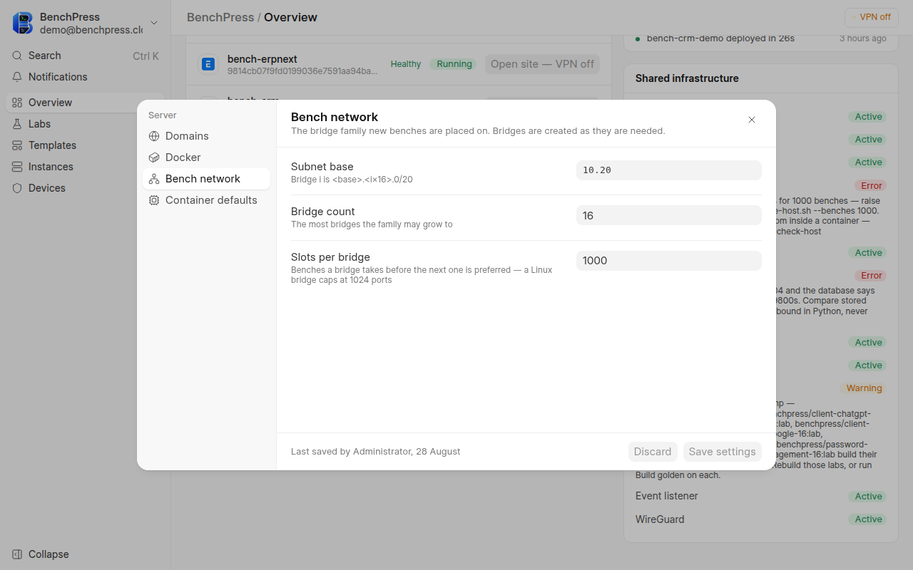

# Settings reference

Every field on the two settings documents, what it controls, and what it reads
on a running host.

**Who this is for.** Whoever changes how benches are built and placed.

**Before you start.** Read the values here as **measured**, not as documented.
Every number below was read off a live site with the command in
[How these values were read](#how-these-values-were-read). A defaults table
copied out of a JSON file is wrong the first time somebody edits one in Desk.

## The two documents, and the two places they are edited

BenchPress has two settings Singles. Neither is fully exposed in the app.

| Document | Holds | Edited in |
|---|---|---|
| `BenchPress Settings` | Docker, addressing, the bench network, container defaults, health probes, reconciliation, and the credits master switch | the app's Settings dialog (10 fields) and Desk (all 26) |
| `Credit Settings` | grants, charges, leases, caps, and self-serve signup | Desk only |

The app's Settings dialog is deliberately a subset — the ten fields an
operator changes while setting a host up. Everything else is a Desk form at
`/app/benchpress-settings` and `/app/credit-settings`.



The dialog groups its ten fields into four panels — Domains, Docker, Bench
network and Container defaults — and prints who saved last and when at the
bottom. The Bench network panel above holds `bench_subnet_base` `10.20`,
`bench_bridge_count` `16` and `bench_slots_per_bridge` `1000`.

## Steps

1. Open `/app/benchpress-settings` in Desk for the full form, or **Settings**
   in the app's account menu for the ten common fields.
2. Change one field.
3. Save.
4. Read [What a change costs](#what-a-change-costs) — some fields apply to the
   next deploy, and some apply immediately to running benches.

## Verify

Read the value back from the server rather than from the form you just saved.
A cached Single is the usual reason a change looks like it did not take.

```bash
bench --site <site> execute frappe.client.get_value \
  --kwargs "{'doctype':'BenchPress Settings','fieldname':'bench_bridge_count'}"
```

## BenchPress Settings

### Docker configuration

| Field | On this host | Ships as | What it does |
|---|---|---|---|
| `docker_socket` | `unix:///var/run/docker.sock` | same | Where BenchPress reaches the daemon |
| `default_image` | `frappe/bench:latest` | same | The image a lab with no image of its own falls back to |
| `default_bench_runtime` | `sysbox` | same | The container runtime for a new bench. `sysbox` gives the bench its own kernel view, so a lab user holds root inside it without holding root on the host |
| `enable_golden_images` | `1` | same | Whether a build bakes the finished site's database into the lab image |
| `restore_from_golden` | `1` | same | Whether a deploy restores that dump instead of creating the site through the ORM |
| `base_domain` | `benchpress.cloud` | *(none — required)* | Sites resolve as `<site>.<base domain>`. The one field with no default, because no default could be right |
| `traefik_network` | `traefik-public` | same | The Docker network bench containers join so the router can reach them |

### The bench network

Bridge `i` is `<subnet base>.<i × 16>.0/20`. Bridges are created as they are
needed, not up front.

| Field | On this host | Ships as | What it does |
|---|---|---|---|
| `bench_subnet_base` | `10.20` | same | The first two octets of the bridge family |
| `bench_bridge_count` | `16` | same | The most bridges the family may grow to |
| `bench_slots_per_bridge` | `1000` | same | Benches a bridge takes before the next is preferred. A Linux bridge caps at 1024 ports, so 1000 leaves headroom |

On this host that arithmetic gives 15,985 free bench slots across three
created bridges — the number [Diagnostics](/docs/operator/diagnostics) reports
as `bridge_capacity`.

### Health probes

These configure the Docker healthcheck written into each bench container.

| Field | On this host | Ships as | What it does |
|---|---|---|---|
| `enable_bench_healthcheck` | `1` | same | Whether a bench container carries a healthcheck at all |
| `bench_health_interval_seconds` | `30` | same | Seconds between probes |
| `bench_health_timeout_seconds` | `5` | same | Seconds a probe may take before it counts as failed |
| `bench_health_retries` | `3` | same | Consecutive failures before the verdict turns unhealthy |
| `bench_health_start_period_seconds` | `600` | same | Grace after start. Failures inside it do not count against the retries |
| `traefik_health_interval_seconds` | `10` | same | Seconds between router health probes |
| `traefik_health_timeout_seconds` | `3` | same | Seconds a router probe may take |

Ten minutes of start period is not caution. A first deploy runs migrations
inside the container, and a shorter grace marks a healthy bench unhealthy
while it is still working.

### Container defaults

Applied to a new lab unless the lab overrides them.

| Field | On this host | Ships as | What it does |
|---|---|---|---|
| `container_memory_limit` | `512m` | same | Memory ceiling for a bench container |
| `container_cpu_quota` | `100000` | same | CPU quota in microseconds. `100000` is one core |
| `code_server_version` | `4.96.4` | same | The browser VS Code build installed into a bench |
| `stop_grace_seconds` | `5` | same | Seconds a container gets to exit cleanly before it is killed |

### Reconciliation and events

Three fields on this host read `0`, and `0` does not mean zero. Each is read
as `cint(value) or DEFAULT`, so a stored `0` means "use the built-in", and the
built-in is the number in the **Falls back to** column.

| Field | On this host | Falls back to | What it does |
|---|---|---:|---|
| `bench_event_settle_seconds` | `0` | `15` | Seconds the Docker event listener waits for a container to settle before acting on it |
| `orphan_grace_minutes` | `0` | `15` | Minutes a container with no matching row is left alone before reconciliation treats it as an orphan |
| `deploy_log_cap` | `0` | `50` | Deploy Log rows kept per bench |
| `stats_poll_max_benches` | `50` | *(used as-is)* | Benches one stats sweep will poll. The sweep spends about two seconds per container on the Docker socket |

That fallback pattern is worth knowing before you clear a field to "turn it
off". Clearing it restores the built-in instead.

### Credits

| Field | On this host | Ships as | What it does |
|---|---|---|---|
| `enable_credits` | `0` | `0` | The master switch for the whole optional metering half. See [Credits and billing](/docs/operator/credits-and-billing) |

**Leave this at `0` unless you are running BenchPress for a team.** With it
on, every deploy is charged against a balance and capped by concurrency, and
users who have no `Credit Account` are refused. Nothing on the self-hosted
path needs it.

## Credit Settings

Every field here is inert while `enable_credits` is `0`. Each function in the
credits package checks the switch before it does anything, so with credits off
there are no accounts, no ledger rows and no extra queries.

### Grants and charges

| Field | On this host | Ships as | What it does |
|---|---|---:|---|
| `signup_grant_credits` | `40` | `40` | Credits posted once, ever, when an account is opened |
| `custom_build_credits` | `40` | `40` | Flat charge for building a custom lab image |
| `low_balance_warn_percent` | `20` | `20` | Balance percentage below which the account is warned |

### Instance lifecycle

| Field | On this host | Ships as | What it does |
|---|---|---:|---|
| `reap_after_days` | `7` | `7` | Days a stopped instance is kept before it is torn down. The **Lab survives** — its apps, branches, version and size are intact, so a reaped instance is one action to rebuild |

An email goes out two days before the teardown, so nobody loses work to a rule
they had forgotten.

### Leases

| Field | On this host | Falls back to | What it does |
|---|---|---:|---|
| `default_lease_plan` | `30 minutes` | *(none)* | The plan a deploy buys when the caller names none |
| `lease_sweep_batch` | `200` | `200` | Expired leases one sweep may claim. This caps the stop queue, not the query |
| `lease_reclaim_seconds` | `60` | `300` | Seconds before a claimed but unfinished stop is reclaimed by another sweep |
| `lease_max_attempts` | `0` | `5` | Failed stops before a lease parks. Docker being down must not re-queue a job for a week |

`lease_reclaim_seconds` reads `60` here against a shipped `300`, and
`lease_max_attempts` reads `0`, which falls back to `5`. Both are examples of
why this table is measured rather than copied.

### Free but capped

| Field | On this host | Ships as | What it does |
|---|---|---:|---|
| `max_concurrent_free` | `2` | `2` | Instances at once for an account that has never purchased |
| `max_concurrent_paid` | `5` | `5` | Instances at once once the account has any `Purchase` ledger row |
| `max_concurrent_uncredited` | `0` | `0` | Instances at once **while credits are off**. `0` means unlimited |
| `max_devices` | `5` | `5` | VPN devices one account may register |
| `max_builds_per_day` | `3` | `3` | Custom image builds per lab owner per day |
| `max_size_free` | *(empty)* | *(empty)* | Largest `Instance Size` a never-purchased account may deploy at. Empty means no ceiling |

`max_concurrent_uncredited` is the field most often read backwards. It applies
**only while `enable_credits` is `0`**, and `0` there means unlimited, not
zero. Turning credits on does not engage it — the cap becomes
`max_concurrent_free` or `max_concurrent_paid` instead. See
[Admission and limits](/docs/operator/admission-and-limits).

### Self-serve signup

| Field | On this host | Ships as | What it does |
|---|---|---|---|
| `waitlist_open` | `1` | `1` | On, the landing page collects waitlist entries. Off, it sends people to signup |
| `blocked_email_domains` | *(empty)* | *(empty)* | One domain per line, refused on the email signup path |

See [Self-serve signup](/docs/operator/hosted-signup).

## What a change costs

| Change | Applies to | Running benches |
|---|---|---|
| `base_domain` | new site addresses | existing addresses do not move |
| `default_bench_runtime` | the next deploy | untouched until redeployed |
| `enable_golden_images` | the next **build** | existing images keep the golden they already carry |
| `restore_from_golden` | the next deploy | untouched |
| `container_memory_limit`, `container_cpu_quota` | new labs | untouched. A lab that copied the old value keeps it |
| `bench_subnet_base`, `bench_bridge_count` | bridges created after the change | existing bridges and the benches on them stay |
| health probe fields | the next deploy, which writes a new healthcheck | untouched |
| `enable_credits` | immediately | every deploy, renewal and device add is gated from the next request |
| `reap_after_days` | the next daily sweep | a stopped instance already past the new figure is reaped on that sweep |

## How these values were read

Off the live site, from the document rather than from the DocType JSON:

```bash
bench --site <site> execute frappe.client.get_value \
  --kwargs "{'doctype':'BenchPress Settings','fieldname':'default_bench_runtime'}"
```

To dump every field with its stored value and its shipped default at once, use
`bench console`:

```python
import frappe
d = frappe.get_cached_doc("BenchPress Settings")
for f in frappe.get_meta("BenchPress Settings").fields:
    if f.fieldtype not in ("Section Break", "Column Break", "Tab Break", "HTML"):
        print(f.fieldname, "=", d.get(f.fieldname), "| ships as", f.default)
```

A multi-line block fed to `bench console` on a pipe is truncated at the first
blank line, and it fails silently. Type it into an interactive console, or
wrap it in a single `exec()` call.

## Troubleshooting

| Symptom | Cause | Fix |
|---|---|---|
| A saved change has no effect | The Single is cached in another process | `bench --site <site> clear-cache`, then restart the workers |
| Settings will not save | `base_domain` is empty | It is required. Sites are addressed under it |
| A field you cleared behaved as before | `0` falls back to the built-in for that field | See [Reconciliation and events](#reconciliation-and-events). Set the number you want |
| Every user is refused a deploy | `enable_credits` was switched on and nobody has an account | Switch it back to `0`, or read [Credits and billing](/docs/operator/credits-and-billing) |
| The Settings dialog does not show a field you read about | The dialog carries 10 of 26 fields | Edit it at `/app/benchpress-settings` |
| The Settings item is missing from the account menu | The screen is admin-only | See [Users and roles](/docs/operator/users-and-roles) |

## Related

- [Diagnostics](/docs/operator/diagnostics) — checks that read the host, not the settings.
- [Admission and limits](/docs/operator/admission-and-limits) — what the caps do when credits are on.
- [Credits and billing](/docs/operator/credits-and-billing) — the switch this page keeps telling you to leave alone.
- [Golden images](/docs/operator/golden-images) — the two settings that decide deploy speed.
