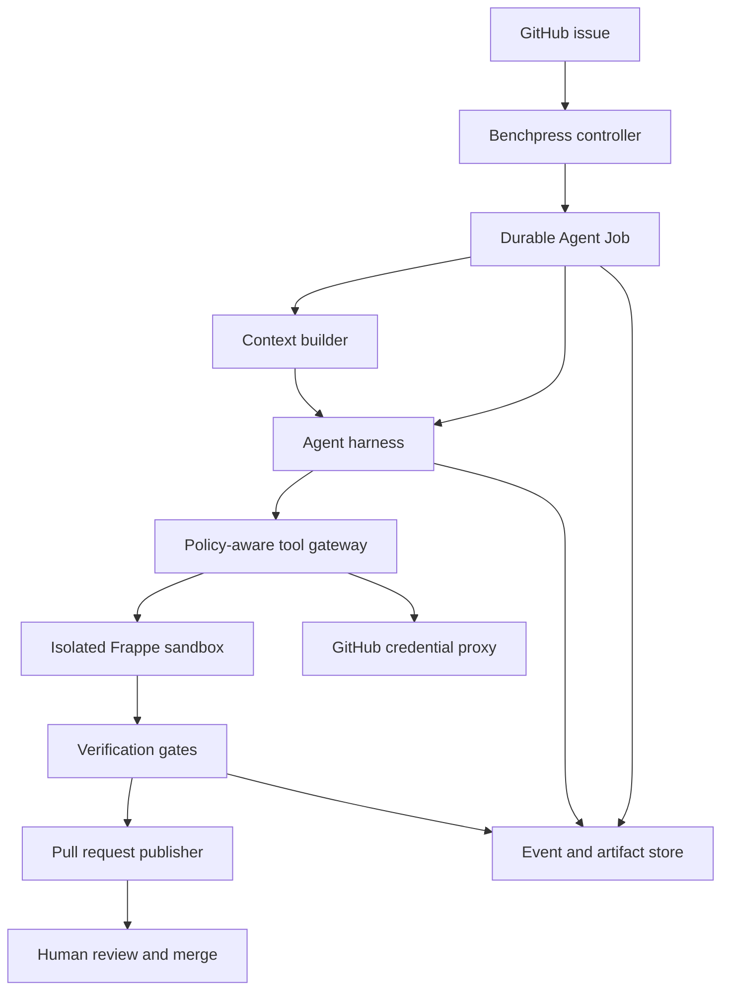
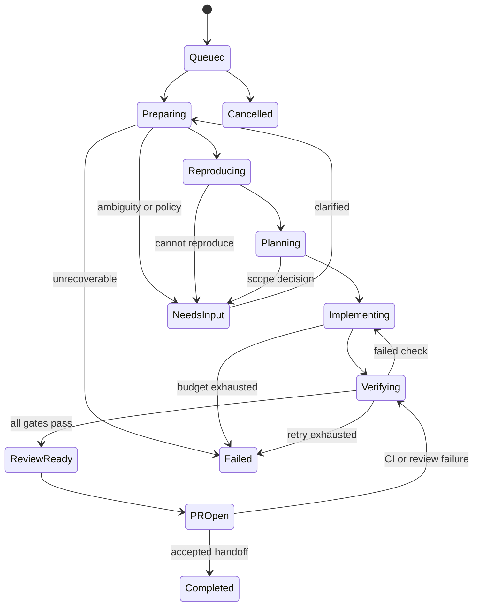
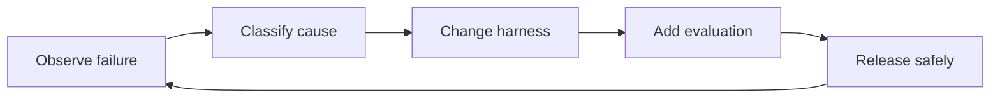

# AI Agent Harness Engineering Playbook

**For an autonomous coding agent that receives a GitHub issue, changes a Frappe codebase, validates the result, and opens a pull request**

| Field | Value |
|---|---|
| Status | Working design and implementation checklist |
| Updated | 2026-08-27 |
| Primary audience | Benchpress, Frappe, platform, security, and developer-experience engineers |
| Scope | Agent harness, execution environment, tools, context, validation, safety, observability, evaluation, and PR workflow |

---

## 1. Executive summary

An AI coding agent is not just an LLM. A useful mental model is:

> **Coding agent = model + instructions + context + tools + execution environment + control loop + memory + verification + policy + observability**

The surrounding system is the **agent harness**. The harness turns a probabilistic model into a controlled engineering process.

For the Frappe issue-to-PR use case, the recommended starting point is:

1. Use one primary coding agent, not a swarm.
2. Create one isolated worktree and one disposable Frappe site per issue.
3. Keep an append-only Agent Job event log outside the model context.
4. Give the agent a short repository map and retrieve detailed context only when needed.
5. Expose a small set of typed, high-signal tools instead of unrestricted infrastructure access.
6. Run a baseline before changes and reproduce the issue before fixing it.
7. Require deterministic validation before any LLM review.
8. Store test, log, migration, browser, and diff evidence as job artifacts.
9. Allow the agent to open a pull request, but require human review and merge.
10. Turn every recurring failure into a harness improvement and an evaluation case.

The quality of this system will depend less on one clever prompt and more on whether the environment makes the correct action easy, the incorrect action visible, and recovery possible.

---

## 2. What respected agent builders recommend

This playbook synthesizes primary write-ups from practitioners and teams that have built real coding-agent products. It does not treat any single article as universal truth; it extracts the patterns that recur across independent systems.

| Practitioner or team | Primary write-up | Main lesson used here |
|---|---|---|
| Ryan Lopopolo, OpenAI | [Harness engineering: leveraging Codex in an agent-first world](https://openai.com/index/harness-engineering/) | Make the repository and runtime legible to agents. Use a short map to structured documentation, isolated worktrees, machine-readable observability, and mechanically enforced rules. |
| Birgitta Böckeler, MartinFowler.com | [Harness Engineering for Coding Agent Users](https://martinfowler.com/articles/harness-engineering.html) | A strong harness combines feedforward guidance with feedback sensors; use deterministic and inferential checks deliberately. |
| Anthropic Engineering | [Effective harnesses for long-running agents](https://www.anthropic.com/engineering/effective-harnesses-for-long-running-agents) | Long tasks need incremental progress, durable handoff artifacts, a clean environment recipe, and resumable state across context windows. |
| Mitchell Hashimoto | [My AI Adoption Journey](https://mitchellh.com/writing/my-ai-adoption-journey) | Give agents clear, actionable tasks and verification. Convert every repeated bad outcome into a permanent prompt, tool, or environment improvement. |
| Simon Willison | [Agentic Engineering Patterns](https://simonwillison.net/guides/agentic-engineering-patterns/) | Run tests first, use Git as a safety mechanism, and require agents to execute and demonstrate their work rather than merely claim success. |
| Yichao “Peak” Ji, Manus | [Context Engineering for AI Agents](https://manus.im/blog/Context-Engineering-for-AI-Agents-Lessons-from-Building-Manus) | Keep prompt prefixes stable, use append-only context, externalize memory to files, keep useful failure evidence, and recite the current plan during long runs. |
| Anthropic Engineering | [Writing effective tools for AI agents](https://www.anthropic.com/engineering/writing-tools-for-agents) | Build a few distinct tools, namespace them, return high-signal results, use actionable errors, and optimize them against realistic evaluations. |
| Anthropic Engineering | [Effective context engineering for AI agents](https://www.anthropic.com/engineering/effective-context-engineering-for-ai-agents) | Treat context as a finite attention budget. Use the smallest sufficient instructions and retrieve detailed information just in time. |
| Anthropic Engineering | [Demystifying evals for AI agents](https://www.anthropic.com/engineering/demystifying-evals-for-ai-agents) | Evaluate the model and harness together. Prefer outcome grading, isolated trials, deterministic coding checks, multiple trials, and transcript inspection. |
| Lance Martin, Gabe Cemaj, and Michael Cohen, Anthropic | [Scaling Managed Agents: Decoupling the brain from the hands](https://www.anthropic.com/engineering/managed-agents) | Separate the model/harness, durable session, sandbox, and credentials so each can fail or change independently. |
| Walden Yan, Cognition | [Don’t Build Multi-Agents](https://cognition.com/blog/dont-build-multi-agents) | Default to a continuous, single-agent context. Parallel agents can make incompatible implicit decisions unless work and context are truly separable. |
| OpenAI Codex team | [Unlocking the Codex harness](https://openai.com/index/unlocking-the-codex-harness/) | Separate reusable harness core logic from clients and user interfaces through a stable event-oriented protocol. |
| Armin Ronacher | [The Friction Is Your Judgment](https://mitsuhiko.github.io/talks/ai-engineer-talk/) | Prefer explicit, agent-legible code and fail-fast behavior; silent fallbacks hide mistakes and allow entropy to accumulate. |

### The shared message

Across these sources, the durable advantages do not come from adding more agents or longer prompts. They come from:

- a legible environment;
- precise task boundaries;
- high-quality tool interfaces;
- continuous, executable feedback;
- recoverable state;
- controlled privileges;
- evidence-backed completion; and
- an improvement loop driven by real failures.

---

## 3. The harness boundary

The harness should own orchestration and control. The model should own reasoning and bounded engineering judgment.

| Concern | Harness owns | Model owns |
|---|---|---|
| Issue intake | Fetching, normalizing, trust labels, repository mapping | Interpreting the requested behavior |
| Planning | Plan format, limits, checkpoint rules | Selecting a technical approach |
| Context | Retrieval tools, budgets, durable references | Choosing what to inspect next |
| Code changes | Filesystem scope, patch mechanism, worktree | Deciding and authoring the change |
| Commands | Allowlist, sandbox, timeouts, resource limits | Selecting an allowed operation |
| Frappe environment | Provisioning recipe, isolation, reset, health checks | Requesting environment operations |
| Validation | Required gates and evidence format | Diagnosing failures and iterating |
| Git | Branch naming, protected targets, credentials | Commit content and meaningful message |
| Pull request | Required template, evidence, labels, human merge | Summary, rationale, risk, and test notes |
| Recovery | Durable event log, checkpoints, retry policy | Resuming from the restored task state |
| Security | Credentials, network, permissions, approvals | Operating only through granted capabilities |

Avoid encoding the full repair algorithm as brittle prompt logic. The harness should establish boundaries, provide useful capabilities, and make outcomes measurable; the model should retain enough freedom to solve unfamiliar issues.

---

## 4. Core engineering principles

### 4.1 Treat missing capabilities as engineering defects

When an agent repeatedly fails, do not only tell it to “try harder.” Classify what was missing:

- repository knowledge;
- a Frappe-specific inspection tool;
- a readable error;
- a reproducible environment;
- a deterministic validator;
- a safety permission;
- a progress checkpoint; or
- a clearer acceptance criterion.

Add the missing capability to the harness backlog.

### 4.2 Combine guides and sensors

**Guides** steer the agent before an action:

- `AGENTS.md`;
- architecture rules;
- Frappe conventions;
- typed tool descriptions;
- examples;
- risk labels;
- file ownership boundaries; and
- the definition of done.

**Sensors** tell the agent what happened:

- unit and integration tests;
- Frappe migration checks;
- linters and static analysis;
- server logs;
- worker logs;
- route and API probes;
- browser DOM, console, and screenshots;
- Git diff policy checks; and
- CI results.

A guide without a sensor permits false confidence. A sensor without a guide causes avoidable trial and error.

### 4.3 Give the agent a map, not a manual

Keep the root `AGENTS.md` short. It should be a table of contents and operational contract, not a complete encyclopedia.

Put detailed, versioned information in focused files that can be retrieved just in time. If important knowledge lives only in chat, a dashboard, or one engineer’s memory, the agent effectively cannot use it.

### 4.4 Establish the baseline first

Before editing:

1. verify the environment is healthy;
2. record the current commit and dirty state;
3. run the smallest relevant existing test;
4. reproduce the issue when possible; and
5. save the failure evidence.

This separates pre-existing failure from agent-created regression.

### 4.5 Verification is part of implementation

The agent must never finish with only a plausible code diff. “Done” means the required validators ran successfully and their evidence was stored.

The preferred loop is:

> baseline → reproduce failure → add or identify a failing check → change code → pass targeted check → pass regression gates → inspect diff → open PR

### 4.6 Isolate every issue

Each Agent Job needs:

- a unique Git branch and worktree;
- a disposable Frappe site or equivalent isolated site state;
- isolated logs, ports, cache, and job artifacts;
- bounded CPU, memory, wall time, and disk; and
- a cleanup policy.

Shared mutable environments create flaky validation and cross-job data leakage.

### 4.7 Make state durable and replayable

The model’s context is temporary working memory. It is not the system of record.

Store an append-only event log outside the context window. Persist:

- the original issue snapshot;
- normalized goal and acceptance criteria;
- repository and commit;
- environment recipe and identity;
- plan revisions;
- tool requests and summarized results;
- checkpoints;
- artifacts;
- validation outcomes;
- errors and retries; and
- PR identity and CI state.

The job should resume after harness, model, or sandbox failure without pretending to start fresh.

### 4.8 Work incrementally

Large one-shot changes increase ambiguity and context loss. Prefer small, testable milestones. At each stable checkpoint, record:

- what changed;
- what is now known;
- what was validated;
- what remains;
- current blockers; and
- the last safe commit or patch identity.

### 4.9 Treat context as a finite budget

Use the smallest set of high-signal tokens that enables the next good decision.

- Keep stable instructions at the front.
- Append dynamic job information later.
- Retrieve files, schemas, logs, and documentation only when needed.
- Store large outputs as artifacts and return a summary plus reference.
- Preserve raw data outside the prompt so compaction is reversible.
- Keep a short current plan near the recent end of long traces.
- Do not inject rapidly changing values into a cacheable prompt prefix.

### 4.10 Design tools for an agent, not as raw API mirrors

Good tools have distinct purposes, semantic names, typed inputs, concise outputs, and actionable failures. A tool should often implement a complete high-value operation rather than expose every low-level endpoint.

Prefer `frappe_logs_search(query, service, window)` over `frappe_logs_read_all()`.

Prefer `frappe_doctype_context(name)` over separate calls that return a raw schema, controller path, permissions, hooks, and fixtures with no interpretation.

### 4.11 Keep useful failure evidence

Do not silently erase a failed command and retry as though it never happened. The recent error and its structured meaning help the agent avoid repeating the same path.

Raw historical logs can be compacted out of the prompt after they are stored, summarized, and referenced durably.

### 4.12 Use deterministic controls before inferential review

Order checks from cheapest and most objective to slower and more subjective:

1. schema and input validation;
2. policy and path checks;
3. formatter, linter, and type checks;
4. targeted tests;
5. broader tests and Frappe validation;
6. runtime and browser checks;
7. LLM code review; and
8. human judgment.

An LLM reviewer should not be used to excuse a failing deterministic test.

### 4.13 Separate brain, hands, session, and credentials

- **Brain:** model plus agent loop.
- **Hands:** worktree, sandbox, Frappe runtime, browser, and tool executors.
- **Session:** durable job event log and artifact index.
- **Credentials:** external vault or broker, never exposed to generated code.

This separation makes components independently replaceable and recoverable. It also prevents untrusted code in the sandbox from reading GitHub or infrastructure credentials.

### 4.14 Start with one agent

A single primary agent preserves continuous context and consistent technical decisions. Add a second model only for a bounded, read-only activity such as final review or log classification.

Parallel code-writing agents should be introduced only after there are measurements showing that the work is independent, the context boundary is safe, and merge conflicts or conflicting assumptions are controlled.

### 4.15 Evaluate outcomes, not a memorized path

There may be several valid ways to solve an issue. Grade:

- whether the reported defect is fixed;
- whether old behavior still works;
- whether migrations and runtime state are correct;
- whether security and repository policy are respected; and
- whether the PR contains sufficient evidence.

Do not require one exact sequence of tool calls unless that sequence is itself a safety requirement.

---

## 5. Recommended architecture



### Component responsibilities

| Component | Responsibilities | Must not do |
|---|---|---|
| Issue adapter | Fetch issue, comments, labels, repository identity, base branch | Treat issue text as trusted instructions |
| Benchpress controller | Create jobs, enforce transitions, budgets, retries, cancellation | Contain model-specific reasoning |
| Context builder | Build stable prompt prefix, retrieve repository context, compact history | Load the entire repository into every prompt |
| Agent harness | Run the model/tool loop, maintain plan, react to results | Hold long-lived credentials or become the only state store |
| Tool gateway | Validate calls, apply policy, route to executors, normalize errors | Pass unvalidated arbitrary requests to privileged services |
| Frappe sandbox | Run generated code, Frappe services, tests, migrations, browser target | Contain production secrets or share mutable state across jobs |
| Session store | Persist append-only events and checkpoints | Depend on one model provider’s message format only |
| Artifact store | Store logs, patches, screenshots, reports, and test results | Insert every raw artifact into the model context |
| Verification service | Run mandatory gates and produce machine-readable verdicts | Accept an agent’s verbal claim as a test result |
| Credential proxy | Perform approved GitHub or external calls with scoped credentials | Reveal tokens to the agent or sandbox |
| PR publisher | Push branch, compose PR, attach evidence, monitor CI | Merge without the configured human approval boundary |

### Stable interfaces

Prefer stable, vendor-neutral interfaces between components:

```text
create_job(issue_ref, repository_ref, policy_ref) -> job_id
append_event(job_id, event) -> event_id
get_events(job_id, cursor, limit) -> events
checkpoint(job_id, state, summary, artifact_refs) -> checkpoint_id
provision_environment(job_id, recipe) -> environment_id
execute(environment_id, operation, input) -> structured_result
store_artifact(job_id, kind, payload) -> artifact_ref
publish_pr(job_id, branch, evidence_bundle) -> pr_ref
```

The model provider, sandbox implementation, and Git host can then change without redesigning the entire product.

---

## 6. Agent Job state machine



### State requirements

| State | Entry evidence | Exit condition |
|---|---|---|
| `Queued` | Issue snapshot and repository resolved | Worker lease acquired |
| `Preparing` | Environment recipe selected | Clean worktree, healthy Frappe site, baseline recorded |
| `Reproducing` | Acceptance criteria drafted | Defect reproduced or a documented non-reproduction decision |
| `Planning` | Relevant context and failure evidence | Small implementation plan with required validators |
| `Implementing` | Approved file and tool scope | Candidate change exists and targeted check is ready |
| `Verifying` | Candidate diff and validation plan | All mandatory gates pass or actionable failure returns to implementation |
| `ReviewReady` | Evidence bundle and risk summary | PR publication policy passes |
| `PROpen` | PR URL, head commit, CI identifiers | Human handoff accepted, feedback received, or CI requires iteration |
| `NeedsInput` | Precise question, alternatives, impact | User or maintainer supplies a decision |
| `Completed` | Final PR state and job summary | Terminal |
| `Failed` | Error class, attempts, last safe checkpoint | Terminal or manually retried as a new attempt |

Every transition must be idempotent. A worker crash after an external action must not create a second branch, site, or PR when it resumes.

---

## 7. Frappe environment requirements

The harness needs a reproducible environment description, not a sequence of commands hidden in a prompt.

### 7.1 Environment manifest

Record at least:

- Frappe version and exact Git revision;
- application repositories, branches, and revisions;
- Python version and dependency lock identity;
- Node.js and package-manager versions;
- MariaDB version and required configuration;
- Redis services and topology;
- site name and site configuration template;
- installed apps and installation order;
- required fixtures or sanitized database snapshot;
- worker, scheduler, web, and websocket requirements;
- build-assets requirements;
- domain and routing behavior;
- port allocation;
- environment variables by name, never secret value;
- CPU, memory, disk, and time limits;
- network-egress policy;
- health probes;
- reset and cleanup recipe; and
- environment fingerprint.

Example:

```yaml
environment:
  recipe_version: 1
  framework:
    repository: frappe/frappe
    revision: "<commit-sha>"
  apps:
    - name: "<app-name>"
      repository: "<owner/repository>"
      revision: "<commit-sha>"
  runtimes:
    python: "<exact-version>"
    node: "<exact-version>"
  services:
    mariadb: "<exact-version>"
    redis: "<topology-and-version>"
  site:
    source: "clean-fixture-or-sanitized-snapshot"
    installed_apps: ["frappe", "<app-name>"]
  isolation:
    network_policy: "restricted"
    cpu_limit: "<limit>"
    memory_limit: "<limit>"
    wall_time: "<limit>"
```

### 7.2 Environment properties

The environment must be:

- **reproducible:** same manifest produces equivalent behavior;
- **disposable:** safe to destroy after the retention period;
- **isolated:** no shared database, cache, ports, or writable checkout;
- **observable:** logs and health status can be queried by tools;
- **resettable:** a failed attempt can return to a known checkpoint;
- **fast enough:** startup latency does not dominate every attempt; and
- **representative:** validation resembles the repository’s CI and supported production topology.

### 7.3 Frappe-specific knowledge the agent must be able to retrieve

- installed apps and dependency order;
- DocType schema, controller, permissions, and customizations;
- hooks and hook resolution order;
- patches and migration state;
- fixtures and test records;
- whitelisted methods and API routes;
- background jobs, queues, and scheduler events;
- website routes, Desk pages, and frontend asset entry points;
- translations;
- site configuration keys;
- database changes caused by the candidate patch;
- service-specific logs; and
- the repository’s approved Frappe Testing Loop.

For this project, prefer the repository’s Frappe-aware testing workflow. Do not replace an existing Frappe Testing Loop with an unrelated generic test runner merely because it is familiar to the model.

---

## 8. Repository contract for agent legibility

Recommended structure:

```text
AGENTS.md
ARCHITECTURE.md
docs/
  product/
  architecture/
  frappe/
  runbooks/
  tools/
  policies/
  exec-plans/
    active/
    completed/
  generated/
    doctypes/
    hooks/
    routes/
    schemas/
.agent/
  environment.yaml
  tools.yaml
  validation.yaml
  risk-policy.yaml
```

### Root `AGENTS.md`

Keep it short enough to remain high-signal. It should contain:

1. what the repository does;
2. a directory map;
3. commands or tool names for setup, testing, formatting, and build;
4. the Frappe Testing Loop entry point;
5. non-negotiable architectural rules;
6. forbidden files and operations;
7. links to detailed documentation;
8. the definition of done; and
9. how to record an active execution plan.

### Generated knowledge

Where possible, generate machine-readable maps for:

- DocTypes and modules;
- hooks and overrides;
- whitelisted APIs;
- routes;
- patches;
- fixtures;
- application dependency graph; and
- test-to-module mapping.

Generated documentation reduces stale prose and makes repository structure searchable without forcing the model to infer everything from scratch.

---

## 9. Tool design standard

### 9.1 Required tool contract

Every tool should define:

```yaml
name: frappe_logs_search
namespace: frappe
purpose: "Return relevant Frappe log events for a bounded query."
risk: read_only
idempotent: true
preconditions:
  - "environment is healthy or partially started"
inputs:
  service:
    type: enum
    values: [web, worker, scheduler, socketio]
  query:
    type: string
  since:
    type: duration
  limit:
    type: integer
    default: 100
outputs:
  summary: string
  matches: array
  truncated: boolean
  artifact_ref: string
errors:
  - code: INVALID_QUERY
    remediation: "Use a non-empty term or structured filter."
  - code: SERVICE_UNAVAILABLE
    remediation: "Call frappe_environment_status and inspect failed services."
timeout_seconds: 30
```

### 9.2 Tool rules

- Give each tool one distinct purpose.
- Use semantic names and consistent namespaces.
- Use strict schemas and enums where possible.
- State when the tool should and should not be used.
- Include preconditions and side effects.
- Label risk and idempotency.
- Use safe defaults.
- Bound response size with filters, pagination, and truncation.
- Return natural-language meaning plus machine-readable fields.
- Put large raw output in an artifact and return a reference.
- Return errors with cause, state, and a next action.
- Include the exact validation evidence produced.
- Version material changes to tool behavior.
- Evaluate tool selection and outcomes with real tasks.

### 9.3 Initial tool catalog

Start small. The names below are suggested capabilities, not a requirement to create one MCP call per row.

| Namespace | Tool or capability | Risk | Purpose |
|---|---|---:|---|
| `issue` | `issue_get_context` | Read | Fetch normalized issue, comments, labels, linked PRs, trust classification |
| `repo` | `repo_map` | Read | Return concise directory, language, app, and test map |
| `repo` | `repo_search` | Read | Search code with bounded, contextual results |
| `repo` | `repo_read` | Read | Read a bounded file or line range |
| `repo` | `repo_apply_patch` | Write | Apply a validated patch inside allowed paths |
| `git` | `git_status` | Read | Show branch, base, changes, and untracked files |
| `git` | `git_diff` | Read | Return bounded diff plus artifact reference |
| `git` | `git_checkpoint` | Write | Create a safe local checkpoint after required validation |
| `frappe` | `frappe_environment_status` | Read | Report service, site, database, cache, and migration health |
| `frappe` | `frappe_app_context` | Read | Return installed apps, revisions, dependencies, and hooks |
| `frappe` | `frappe_doctype_context` | Read | Return DocType schema, controller, permissions, hooks, and related tests |
| `frappe` | `frappe_logs_search` | Read | Query bounded service logs |
| `frappe` | `frappe_test_run` | Execute | Run the approved targeted or regression Frappe test workflow |
| `frappe` | `frappe_migration_check` | Execute | Validate patches, schema changes, and migration state |
| `frappe` | `frappe_build_check` | Execute | Build relevant frontend assets when required |
| `frappe` | `frappe_request_probe` | Execute | Exercise a route or API against the isolated site |
| `browser` | `browser_inspect` | Read | Return DOM snapshot, console, network errors, and screenshot reference |
| `policy` | `policy_check_diff` | Read | Detect forbidden paths, secrets, generated files, or high-risk patterns |
| `job` | `job_checkpoint` | Write | Persist progress, decisions, evidence, and next step |
| `github` | `github_pr_publish` | External write | Push via credential proxy and create or update one PR |
| `github` | `github_pr_checks` | Read | Fetch CI and review state |

### 9.4 Avoid unrestricted shell as the primary interface

A shell remains useful inside an isolated coding sandbox, but it should not be the only harness API. Privileged infrastructure changes, secrets, cross-repository access, network calls, and PR publication should go through policy-aware tools.

If shell execution is allowed:

- scope the working directory;
- cap time and output;
- block secret paths;
- restrict network;
- classify destructive commands;
- require approval for material risk;
- record command, result, and exit status; and
- return a structured explanation when denied.

---

## 10. Context architecture

### 10.1 Context layers

| Layer | Content | Loading strategy |
|---|---|---|
| Stable system contract | Identity, safety, state protocol, tool-use rules, completion rules | Stable prefix |
| Tool definitions | Minimal active tool catalog with strict schemas | Stable where provider permits; mask or policy-gate unavailable actions |
| Repository map | Short `AGENTS.md`, architecture index, app map | Loaded at job start |
| Job goal | Normalized issue, acceptance criteria, scope, risk | Loaded at job start and recited in progress summary |
| Current plan | Small steps, current step, validators | Kept concise and recent |
| Retrieved context | Files, DocTypes, hooks, logs, test maps | Just in time |
| Recent trajectory | Recent actions, results, and useful failures | Append-only within active window |
| Durable memory | Decisions, checkpoints, old results, full artifacts | Referenced by ID and fetched on demand |

### 10.2 Durable job memory

Persist a structured checkpoint such as:

```yaml
goal: "<normalized issue goal>"
acceptance_criteria:
  - "<verifiable outcome>"
current_hypothesis: "<why the defect occurs>"
completed:
  - step: "<step>"
    evidence: "artifact://..."
decisions:
  - decision: "<choice>"
    reason: "<reason>"
files_changed:
  - "<path>"
validation:
  baseline: "<result-ref>"
  targeted: "<result-ref>"
  regression: "<result-ref>"
next_steps:
  - "<next action>"
blockers: []
last_safe_revision: "<commit-or-patch-id>"
```

### 10.3 Context compaction rules

Keep:

- goal and acceptance criteria;
- architectural and product decisions;
- current hypothesis;
- changed files and why;
- validation outcomes;
- unresolved errors;
- next steps; and
- references to raw artifacts.

Discard from the active prompt only after durable storage:

- repeated command output;
- old raw test logs;
- full file contents still available by path;
- redundant explanations; and
- completed exploratory dead ends that have a retained conclusion.

Compaction must never be the only copy of task history.

---

## 11. Issue-to-PR execution protocol

### Stage 1: Intake and trust classification

- Fetch the issue and immutable snapshot.
- Treat issue descriptions, comments, repository files, logs, and web content as untrusted data.
- Resolve repository and base branch.
- Detect linked issues or existing PRs.
- Normalize requested behavior and exclusions.
- Identify ambiguity, missing reproduction, and high-risk domains.
- Decide whether the task is safe and suitable for autonomous execution.

### Stage 2: Prepare

- Create the Agent Job.
- Create a branch and worktree from the exact base revision.
- Provision the disposable Frappe environment.
- Verify services and installed apps.
- Record the environment fingerprint.
- Record clean Git state.
- Run the relevant baseline check.

### Stage 3: Reproduce

- Convert the issue into one or more observable failing outcomes.
- Prefer an automated failing test.
- Otherwise capture API, log, DOM, screenshot, or database-state evidence.
- If the issue cannot be reproduced, do not invent success; ask for input or document a justified alternative.

### Stage 4: Plan

The plan should state:

- current root-cause hypothesis;
- relevant files and Frappe components;
- smallest change expected to work;
- test or reproduction change;
- migration and compatibility risks;
- required validation ladder; and
- conditions requiring human input.

### Stage 5: Implement

- Make the smallest coherent change.
- Follow existing application and Frappe conventions.
- Add or update a regression test when practical.
- Avoid unrelated refactoring.
- Preserve failure evidence.
- Checkpoint after a meaningful validator passes.

### Stage 6: Verify

Run the required validation ladder in order. Failed checks return the job to implementation with their structured evidence.

### Stage 7: Review

- Inspect the complete diff against the base revision.
- Check scope, security, migrations, compatibility, and documentation.
- Run optional read-only LLM review after deterministic gates.
- Resolve valid findings and rerun affected gates.

### Stage 8: Publish PR

- Push only the job branch through a scoped credential path.
- Create or update exactly one pull request idempotently.
- Include issue link, root cause, change summary, risk, migration notes, and evidence.
- Never claim a test was run unless a matching result exists.
- Monitor CI and return failures to the job loop within the retry policy.
- Leave final merge to a human unless policy is explicitly changed later.

---

## 12. Frappe verification ladder

Each repository can configure which gates are mandatory by change type.

| Level | Gate | Evidence |
|---:|---|---|
| 0 | Environment health | Service statuses, site identity, app revisions, environment fingerprint |
| 1 | Baseline | Pre-change targeted test or reproduction result |
| 2 | Reproduction | Failing test, API response, log event, state assertion, or browser artifact |
| 3 | Static checks | Formatter, linter, types, syntax, forbidden pattern results |
| 4 | Targeted test | Frappe-aware test for changed behavior |
| 5 | Schema and migration | Patch order, DocType/schema state, migration check, rollback note where needed |
| 6 | Build | Asset build result for JS/CSS/template changes |
| 7 | Frappe Testing Loop | Repository-approved integration/regression result |
| 8 | Runtime probe | Web, worker, scheduler, queue, or API behavior as relevant |
| 9 | Browser validation | DOM assertion, console/network errors, screenshot when UI changes |
| 10 | Diff and policy | Changed paths, secret scan, dependency and security checks |
| 11 | PR/CI | Head SHA, CI checks, evidence links, unresolved review findings |

### Change-to-gate examples

| Change type | Minimum extra gates |
|---|---|
| Python controller or business logic | Targeted Frappe test, regression loop, relevant runtime/log check |
| DocType JSON or schema | Migration check, permissions behavior, schema diff, targeted test |
| Patch | Fresh pre-patch state, forward migration, idempotency where required, state assertion |
| Hook or override | Hook resolution, app order, targeted behavior, regression test |
| Background job | Queue submission, worker execution, retry/idempotency, worker logs |
| Scheduler event | Scheduling metadata, direct invocation, idempotency, scheduler logs |
| Whitelisted API | Authentication, authorization, request/response, error behavior, rate/policy checks |
| Desk or website UI | Asset build, route probe, DOM assertion, console/network checks, screenshot |
| Dependency change | Lock integrity, install/build, license/security policy, broader regression |

### Definition of done

A job is review-ready only when:

- acceptance criteria are mapped to evidence;
- the defect is reproduced or non-reproduction is explicitly accepted;
- the candidate diff is scoped;
- mandatory checks pass at the head revision;
- no unresolved critical policy finding remains;
- migration and operational effects are documented;
- the worktree state is understood;
- the PR description is evidence-backed; and
- the human reviewer can reproduce the validation path.

---

## 13. Safety and security model

### 13.1 Trust boundaries

Consider all of the following potentially hostile:

- issue titles and descriptions;
- issue and PR comments;
- repository documentation and source comments;
- test fixtures;
- dependency output;
- logs and error messages;
- websites opened by browser tools; and
- generated code.

These sources may inform the task but must not override system policy or request credentials.

### 13.2 Credential rules

- Never put GitHub, cloud, database, or deployment tokens in the coding sandbox.
- Use short-lived, least-privilege credentials in an external proxy or vault.
- Scope GitHub rights to the selected repository and required branch/PR operations.
- Do not give production database access to the coding agent.
- Redact secrets from tool output and artifacts.
- Log credential use by capability, not secret value.

### 13.3 Filesystem and command rules

- Restrict writes to the job worktree and designated artifact directory.
- Protect host paths, SSH material, environment files, and other repositories.
- Block device access and container escape primitives.
- Detect destructive database and filesystem commands.
- Require explicit approval for a high-risk action not already covered by policy.
- Preserve an audit record of allowed and denied operations.

### 13.4 Network rules

- Deny egress by default where practical.
- Allow required package, Git, and test endpoints through controlled paths.
- Route authenticated external actions through credential-aware proxies.
- Record destination, method category, job, and policy decision.
- Prevent the sandbox from creating an unmonitored tunnel.

### 13.5 Autonomy boundaries

The initial version may:

- inspect a selected repository;
- edit its issue branch;
- operate on a disposable Frappe site;
- run configured checks;
- create local checkpoints;
- push the issue branch; and
- open or update a pull request.

The initial version must not:

- merge the pull request;
- push to a protected branch;
- deploy;
- access production data;
- rotate credentials;
- modify infrastructure outside its job environment;
- widen its own permissions; or
- suppress a required check.

---

## 14. Observability and evidence

### 14.1 Event model

Useful event types include:

```text
job.created
job.state_changed
environment.requested
environment.ready
environment.failed
model.turn_started
model.turn_completed
tool.requested
tool.allowed
tool.denied
tool.completed
tool.failed
checkpoint.created
validation.started
validation.completed
artifact.created
git.checkpointed
pr.published
ci.updated
job.needs_input
job.completed
job.failed
```

Each event should include:

- event and job IDs;
- timestamp;
- attempt and sequence number;
- component and version;
- state before and after where applicable;
- tool name and risk class;
- duration;
- structured outcome;
- artifact references;
- redaction status; and
- causal parent event.

### 14.2 Required artifacts

- immutable issue snapshot;
- environment manifest and fingerprint;
- baseline result;
- reproduction evidence;
- plan and checkpoints;
- raw tool output where diagnostically useful;
- before/after test results;
- migration and schema report;
- browser screenshots or DOM assertions for UI changes;
- final diff;
- policy report;
- PR payload and URL; and
- final job summary.

### 14.3 Operational metrics

| Metric | Why it matters |
|---|---|
| Issue-to-PR success rate | Top-level usefulness |
| First-pass validation rate | Quality before self-repair |
| PR acceptance or merge rate | Human judgment of usefulness |
| Reopen/revert rate | Escaped defects |
| Time to first useful action | Startup and context efficiency |
| Time to validated PR | End-to-end performance |
| Environment provisioning failure rate | Infrastructure reliability |
| Tool error rate by tool/version | Tool ergonomics and regressions |
| Denied action rate | Policy fit and attempted overreach |
| Test false-positive/false-negative incidents | Verification quality |
| Average repair iterations | Agent and feedback-loop efficiency |
| Tokens and cost per successful PR | Economic efficiency |
| Human intervention rate and reason | Autonomy bottlenecks |
| Context compaction/resume success | Long-running reliability |

Do not optimize only for PR volume. A high PR count with low acceptance, weak evidence, or elevated reverts is a harness failure.

---

## 15. Evaluation strategy

An evaluation must exercise the **model and harness together** in a production-like, isolated environment.

### 15.1 Evaluation task shape

```yaml
id: "frappe-fix-<case>"
repository_revision: "<sha>"
environment_recipe: "<version>"
issue:
  title: "<issue title>"
  body: "<realistic issue body>"
success_criteria:
  - "<observable behavior>"
graders:
  deterministic:
    - "<fail-to-pass test>"
    - "<pass-to-pass regression test>"
    - "<migration or state assertion>"
    - "<policy assertion>"
  inferential:
    - rubric: "scope, maintainability, and PR clarity"
tracked_metrics:
  - wall_time
  - tool_calls
  - tool_errors
  - tokens
  - estimated_cost
  - repair_iterations
```

### 15.2 Grader order

1. Outcome and state assertions.
2. Fail-to-pass and pass-to-pass tests.
3. Static, security, and policy checks.
4. Migration, runtime, API, or browser assertions.
5. LLM rubric for maintainability and communication.
6. Periodic expert human calibration.

### 15.3 Evaluation suites

Maintain two suites:

- **Capability suite:** difficult tasks with room for improvement.
- **Regression suite:** previously solved failures expected to remain near fully passing.

Cover both positive and negative cases. For example, test when a migration is necessary and when the agent should avoid creating one; when it should request clarification and when it should proceed.

### 15.4 Evaluation hygiene

- Start each trial from a clean environment.
- Run multiple trials for stochastic behavior.
- Pin repository, environment, harness, tool, prompt, and model versions.
- Grade final outcomes more than one expected trajectory.
- Prevent the agent from reading hidden graders or previous trials.
- Inspect transcripts and artifacts regularly.
- Check that failures are fair and reproducible.
- Calibrate LLM graders against domain experts.
- Add partial credit only where it aids diagnosis; keep safety gates binary.
- Promote stable capability cases into regression cases.
- Add production failures to the suite after sanitization.

### 15.5 Minimum pre-release scorecard

Before changing the model, prompt, tool schema, compaction, or policy:

| Dimension | Compare against current production baseline |
|---|---|
| Task success | Must not regress beyond defined tolerance |
| Safety gates | No critical bypass |
| Regression suite | Near-100% expected behavior |
| Frappe environment reliability | No material increase in flakes |
| Tool errors | No unexplained increase |
| Latency | Report p50 and p95 |
| Cost | Report per trial and per successful task |
| Human review | Sampled quality does not decline |

---

## 16. Harness improvement loop



### Failure classification and permanent response

| Failure | Likely harness response |
|---|---|
| Agent misunderstands issue | Better normalization, acceptance criteria, or clarification gate |
| Agent cannot find relevant Frappe code | Repository map, generated DocType/hook index, better search tool |
| Agent calls wrong tool | Reduce overlap, improve names/descriptions, add selection eval |
| Tool call has invalid parameters | Stronger schema, semantic parameter names, actionable example in error |
| Agent floods context with logs | Search/filter tool, truncation, artifact reference, concise response mode |
| Agent repeats a failed action | Preserve recent failure, improve error remediation, detect duplicate call |
| Agent loses progress | Durable checkpoints, progress recitation, resume tests |
| Agent says tests passed without running them | Evidence-backed completion gate |
| Test passes but issue remains | Better outcome assertions and reproduction artifact |
| Environment flakes | Pin recipe, isolate state, improve health and reset mechanisms |
| Agent changes unrelated files | Path policy, diff-budget check, scoped plan, PR rubric |
| Migration is unsafe | Migration-specific tool and grader, fresh-state validation |
| Agent attempts privileged access | Better capability boundary, secret broker, denied-action eval |
| PR is hard to review | Required evidence bundle and PR template |
| Model upgrade regresses behavior | Capability/regression suite and versioned rollout |

Every repeated failure should produce at least one of:

- clearer repository guidance;
- a better tool;
- a deterministic validator;
- a policy rule;
- a more actionable error;
- a context or checkpoint improvement; or
- a new evaluation task.

---

## 17. Benchpress capability audit

Do not assume a capability exists because the UI suggests it. Verify the implementation, exercise it, and record evidence.

Use these status values:

- `Present`: implemented, documented, and exercised successfully;
- `Partial`: exists but lacks a required property;
- `Missing`: not implemented;
- `Unknown`: not yet inspected.

The initial table intentionally uses `Unknown` until the Benchpress repository and running environment are audited.

| Area | Capability to verify | Status | Evidence to collect | Gap or next action |
|---|---|---:|---|---|
| Intake | GitHub issue and comment retrieval | Unknown | Adapter code, integration test, sample normalized payload | Audit |
| Intake | Trust classification and prompt-injection handling | Unknown | Policy, adversarial test | Audit |
| Repository | Repository allowlist and base-branch resolution | Unknown | Config and tests | Audit |
| Git | Per-job branch and worktree creation | Unknown | Job trace and idempotency test | Audit |
| Git | Scoped push and PR credential proxy | Unknown | Auth architecture and permission test | Audit |
| Jobs | Durable Agent Job data model | Unknown | Schema and migration | Audit |
| Jobs | Append-only event log | Unknown | Event schema and replay test | Audit |
| Jobs | Idempotent state transitions and worker leases | Unknown | Crash/retry test | Audit |
| Jobs | Cancellation, timeout, retry, and budget controls | Unknown | Policy and integration tests | Audit |
| Environment | Versioned Frappe environment recipe | Unknown | Manifest example and provision test | Audit |
| Environment | Isolated site/database/cache per job | Unknown | Concurrency isolation test | Audit |
| Environment | Reset, snapshot, and cleanup | Unknown | Failure recovery test | Audit |
| Environment | Machine-readable health status | Unknown | Tool result and unhealthy case | Audit |
| Frappe | Installed app and revision inspection | Unknown | Tool and fixture | Audit |
| Frappe | DocType/hook/route context tools | Unknown | Tool schemas and realistic eval | Audit |
| Frappe | Approved Frappe Testing Loop integration | Unknown | Test adapter and result schema | Audit |
| Frappe | Migration and schema validation | Unknown | Fresh-site migration eval | Audit |
| Runtime | Service log search by job and component | Unknown | Structured query and truncation test | Audit |
| Runtime | API/route probe | Unknown | Isolated-site probe | Audit |
| Browser | DOM, console, network, and screenshot evidence | Unknown | UI issue eval | Audit |
| Tools | Registry, schemas, namespaces, risk labels | Unknown | Tool catalog and validation tests | Audit |
| Tools | Output limits and artifact references | Unknown | Large-output test | Audit |
| Policy | Filesystem, command, network, and secret controls | Unknown | Denial tests and audit events | Audit |
| Context | Short repository map and just-in-time retrieval | Unknown | Prompt/context trace | Audit |
| Context | Checkpoint and compaction recovery | Unknown | Long-task resume test | Audit |
| Validation | Mandatory deterministic gate engine | Unknown | Policy config and bypass test | Audit |
| Validation | Evidence bound to exact head SHA | Unknown | Result and PR example | Audit |
| PR | Idempotent create/update | Unknown | Retry test | Audit |
| PR | CI monitoring and feedback loop | Unknown | Failed-CI recovery trace | Audit |
| Security | Credentials inaccessible from sandbox | Unknown | Threat model and penetration test | Audit |
| Observability | Structured events, logs, metrics, traces | Unknown | Dashboard/query and incident replay | Audit |
| Evaluation | Versioned capability and regression suites | Unknown | Eval repository and baseline report | Audit |

### Audit output

The audit should produce:

1. a filled capability matrix;
2. links to code and runtime evidence;
3. a diagram of current components and trust boundaries;
4. a list of duplicated or overlapping tools;
5. a ranked gap backlog;
6. quick wins that improve agent legibility;
7. critical safety blockers; and
8. an MVP build plan based on what is genuinely present.

---

## 18. Anti-patterns to avoid

- A giant root instruction file containing every rule and exception.
- A tool for every underlying API endpoint.
- Overlapping tools with vague names.
- Dumping full logs, schemas, or repository contents into context.
- Allowing raw sandbox code to access credentials.
- Sharing a writable Frappe site across jobs.
- Starting implementation before recording the baseline.
- Declaring success without executing the relevant code.
- Hiding failed actions and stack traces from the active repair loop.
- Swallowing exceptions or using silent defaults that conceal invalid state.
- Treating compaction as durable memory.
- Letting the model skip mandatory validation.
- Using LLM review where an objective test is available.
- Grading one exact tool-call sequence instead of the result.
- Adding many code-writing agents before a single-agent harness is reliable.
- Auto-merging before the system has earned trust with evidence.
- Measuring PR count without acceptance, reverts, or escaped defects.
- Building an orchestration UI that directly performs privileged infrastructure operations.

---

## 19. PR evidence template

```markdown
## Issue

Closes #<issue-number>

## Root cause

<Concise explanation grounded in code or runtime evidence.>

## Change

- <Behavioral change>
- <Regression test or validation addition>

## Validation

| Check | Result | Evidence |
|---|---|---|
| Baseline/reproduction | Failed before change as expected | <artifact link> |
| Targeted Frappe test | Passed at `<head-sha>` | <artifact link> |
| Migration/schema | Passed or not applicable | <artifact link or reason> |
| Frappe Testing Loop | Passed | <artifact link> |
| UI/API/runtime | Passed or not applicable | <artifact link or reason> |
| Diff/policy | Passed | <artifact link> |

## Risk and operations

- Migration: <none/details>
- Backward compatibility: <assessment>
- Security/permissions: <assessment>
- Rollback: <approach>

## Human review focus

- <Specific judgment requested from reviewer>
```

---

## 20. Recommended implementation order

### Phase 0: Inventory and contract

- Audit the existing Benchpress repository and runtime.
- Fill the capability matrix.
- Define the Agent Job schema and event protocol.
- Write the short repository `AGENTS.md` and documentation map.
- Define risk policy and the initial definition of done.

**Exit gate:** the team knows what exists, what is missing, and which component owns every boundary.

### Phase 1: Safe execution foundation

- Create per-job branch/worktree isolation.
- Provision a disposable Frappe environment from a versioned recipe.
- Implement durable events, artifacts, leases, retries, and cancellation.
- Separate credentials from the sandbox.
- Implement filesystem, network, command, and resource policy.

**Exit gate:** a crash can be recovered, two jobs cannot contaminate each other, and generated code cannot read external credentials.

### Phase 2: Single-agent read/diagnose loop

- Implement issue normalization.
- Build context layers and repository map.
- Add read-only repository and Frappe inspection tools.
- Add plan and checkpoint behavior.
- Add structured log and health tools.

**Exit gate:** the agent can correctly explain and reproduce representative issues without changing code.

### Phase 3: Edit and verification loop

- Add bounded patching and local Git checkpoints.
- Integrate targeted tests and the Frappe Testing Loop.
- Add migration, asset build, API, runtime, and browser validators.
- Bind evidence to the exact Git head revision.
- Add diff and security policy checks.

**Exit gate:** the agent can produce a validated local patch and evidence bundle for selected low-risk issues.

### Phase 4: Pull request workflow

- Add scoped Git push through the credential architecture.
- Create/update one PR idempotently.
- Use the evidence-backed PR template.
- Monitor CI and review feedback.
- Keep human merge as the boundary.

**Exit gate:** representative issues reach review-ready PRs without secret exposure or unsupported success claims.

### Phase 5: Evaluation and continuous improvement

- Build capability and regression suites from real Frappe issues.
- Run multiple isolated trials.
- Track success, safety, cost, latency, tool errors, and human outcomes.
- Review transcripts and artifacts.
- Add every material production failure to the harness backlog and eval suite.

**Exit gate:** prompt, model, tool, or policy changes can be compared against a reproducible baseline before release.

### Phase 6: Selective expansion

Only after measurement supports it:

- add a read-only reviewer agent;
- add specialized Frappe inspection capabilities;
- expand the allowed issue classes;
- improve compaction and long-task resumption;
- introduce bounded parallel research for independent questions; and
- reconsider autonomy boundaries based on acceptance and incident data.

---

## 21. Master to-do list

### P0 — required before autonomous PR creation

- [ ] Audit Benchpress and fill the capability matrix.
- [ ] Define Agent Job, event, checkpoint, and artifact schemas.
- [ ] Define issue eligibility and risk policy.
- [ ] Implement unique branch, worktree, and Frappe site per job.
- [ ] Prove credentials are unavailable inside the sandbox.
- [ ] Implement reproducible environment preparation and cleanup.
- [ ] Create concise repository guidance and a generated Frappe map.
- [ ] Implement the minimum read, search, patch, Git, Frappe, test, and policy tools.
- [ ] Require baseline and reproduction evidence.
- [ ] Integrate the repository-approved Frappe Testing Loop.
- [ ] Implement migration, build, API/runtime, and UI gates as applicable.
- [ ] Bind validation evidence to the exact head SHA.
- [ ] Implement idempotent PR publication.
- [ ] Require human review and merge.
- [ ] Create adversarial tests for prompt injection and secret access.
- [ ] Create an initial regression evaluation suite.

### P1 — required for a dependable internal beta

- [ ] Implement robust resume after harness and sandbox failure.
- [ ] Add CI and review-feedback iteration.
- [ ] Add browser DOM, console, network, and screenshot tooling.
- [ ] Add concise/detailed response formats to large-result tools.
- [ ] Add tool-selection and invalid-parameter evaluations.
- [ ] Add dashboards for job state, failure class, tool health, cost, and latency.
- [ ] Add sampled human review of transcripts and grader quality.
- [ ] Establish artifact retention and redaction policy.
- [ ] Add capability suite tasks across Frappe change categories.
- [ ] Create a formal incident-to-eval workflow.

### P2 — optimization after reliability

- [ ] Tune stable prompt prefix and caching behavior.
- [ ] Improve just-in-time context retrieval.
- [ ] Add versioned compaction strategies and replay tests.
- [ ] Consolidate redundant tool-call sequences into high-value tools.
- [ ] Add a bounded read-only review agent if it improves measured outcomes.
- [ ] Test new models against the same model-plus-harness suite.
- [ ] Optimize environment warm-up without sharing mutable state.
- [ ] Consider additional autonomy only after acceptance, revert, and incident thresholds are met.

---

## 22. Decisions recommended for the first version

| Decision | Recommendation | Reason |
|---|---|---|
| Primary architecture | One coding agent with a deterministic harness | Preserves context and reduces conflicting decisions |
| Job isolation | One worktree and disposable Frappe site per issue | Reproducibility, concurrency safety, and clean evaluation |
| State | External append-only event log plus checkpoints | Crash recovery and context-window independence |
| Tool strategy | Small, typed, namespaced catalog | Better selection, lower context use, easier evaluation |
| Context strategy | Short stable map plus just-in-time retrieval | Higher signal and less context pollution |
| Verification | Deterministic ladder before LLM/human review | Reliable, inexpensive feedback first |
| Credentials | External vault/proxy; none in sandbox | Structural defense against generated-code and prompt-injection risk |
| PR authority | Agent may open/update; human merges | Useful autonomy with a clear judgment boundary |
| Evaluation | Isolated outcome-based trials of model + harness | Measures the product that will actually run |
| Improvement | Every recurring failure creates a harness change and eval | Prevents relearning the same lesson |

---

## 23. Questions to resolve during the Benchpress audit

1. What is the current Agent Job data model, if any?
2. Are job events durable and replayable, or only streamed to the UI?
3. How are workers leased, retried, cancelled, and recovered?
4. Does each job receive its own Git worktree and Frappe site?
5. How are MariaDB, Redis, ports, logs, and background workers isolated?
6. Which Frappe testing workflow is already implemented?
7. Which tool interfaces exist, and which are raw command wrappers?
8. Where are GitHub and infrastructure credentials held?
9. Can generated code read environment variables or host-mounted secret files?
10. What network egress is currently possible from a job?
11. Can validation results be proven to correspond to the PR head SHA?
12. What happens if the worker crashes immediately after pushing or creating a PR?
13. Which issue categories are low-risk enough for the first release?
14. Which changes require human approval before execution rather than only before merge?
15. What artifacts can a maintainer inspect when reviewing a PR?
16. How are production failures converted into tests and harness improvements?
17. Which metrics define a useful and trustworthy PR?
18. Who owns the harness policy, tool registry, Frappe environment, and eval suite?

---

## 24. Practical tips and tricks

1. **Ask for a reproduction artifact early.** It anchors the job in observable behavior.
2. **Put the current objective at the end of long context.** A small updated checklist helps prevent drift.
3. **Return summaries plus artifact references.** Keep raw logs recoverable without consuming every turn.
4. **Make error responses teach the next call.** Include the invalid field, accepted shape, current state, and safe remediation.
5. **Name tools according to the agent’s task.** A semantic workflow tool is easier to choose than a low-level endpoint wrapper.
6. **Test both tool use and tool restraint.** The agent should know when not to migrate, browse, request approval, or create a new file.
7. **Keep timestamps and dynamic data out of the stable prompt prefix.** Append them to job context when needed.
8. **Use deterministic serialization for repeated context.** It helps caching and makes traces comparable.
9. **Store the failure before attempting the fix.** Before/after evidence makes the PR easier to trust.
10. **Fail loudly on invalid configuration.** Silent fallbacks turn visible errors into hidden wrong behavior.
11. **Checkpoint only a coherent state.** A resumable checkpoint should have a clear next step and known validation status.
12. **Make every validator callable by the agent.** Fast self-correction is more useful than discovering the problem after PR review.
13. **Review full traces when metrics surprise you.** A score can hide an environment bug, grader bug, or valid alternate solution.
14. **Keep the evaluator isolated from previous trials.** Git history, caches, and leftover files can leak answers.
15. **Measure tool friction.** Repeated invalid calls, excessive pagination, and redundant sequences tell you where to improve interfaces.
16. **Keep the control plane orchestration-focused.** Put privileged system work behind dedicated executors and adapters.
17. **Start with low-risk issue classes.** Documentation, focused tests, and small isolated defects can establish a trustworthy baseline.
18. **Do not expand autonomy based on demos.** Expand it based on regression results, human acceptance, reverts, and security incidents.

---

## 25. Reference reading order

For a compact study path:

1. [OpenAI — Harness engineering](https://openai.com/index/harness-engineering/): repository and environment design.
2. [MartinFowler.com — Harness Engineering for Coding Agent Users](https://martinfowler.com/articles/harness-engineering.html): guides and sensors.
3. [Anthropic — Effective harnesses for long-running agents](https://www.anthropic.com/engineering/effective-harnesses-for-long-running-agents): resumption and incremental progress.
4. [Anthropic — Writing effective tools for agents](https://www.anthropic.com/engineering/writing-tools-for-agents): tool interfaces and tool evaluations.
5. [Anthropic — Effective context engineering](https://www.anthropic.com/engineering/effective-context-engineering-for-ai-agents): attention and retrieval.
6. [Manus — Context Engineering for AI Agents](https://manus.im/blog/Context-Engineering-for-AI-Agents-Lessons-from-Building-Manus): production context-loop details.
7. [Anthropic — Demystifying evals for AI agents](https://www.anthropic.com/engineering/demystifying-evals-for-ai-agents): evaluation design.
8. [Mitchell Hashimoto — My AI Adoption Journey](https://mitchellh.com/writing/my-ai-adoption-journey): practical workflow and continuous harness improvement.
9. [Simon Willison — Agentic Engineering Patterns](https://simonwillison.net/guides/agentic-engineering-patterns/): tests, Git, and evidence.
10. [Anthropic — Scaling Managed Agents](https://www.anthropic.com/engineering/managed-agents): durable component and security boundaries.
11. [Cognition — Don’t Build Multi-Agents](https://cognition.com/blog/dont-build-multi-agents): context coherence and multi-agent caution.
12. [OpenAI — Unlocking the Codex harness](https://openai.com/index/unlocking-the-codex-harness/): reusable core and client protocol.

---

## Final rule

The harness is successful when it helps the agent produce a small, correct, reviewable change; proves the result in a clean Frappe environment; survives failures without losing its place; protects credentials and production systems; and leaves a human maintainer with enough evidence to make a confident merge decision.
